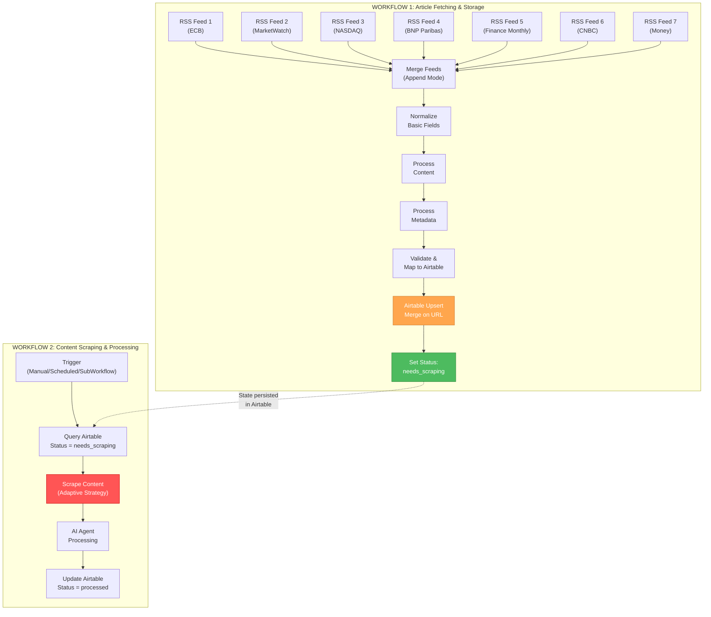
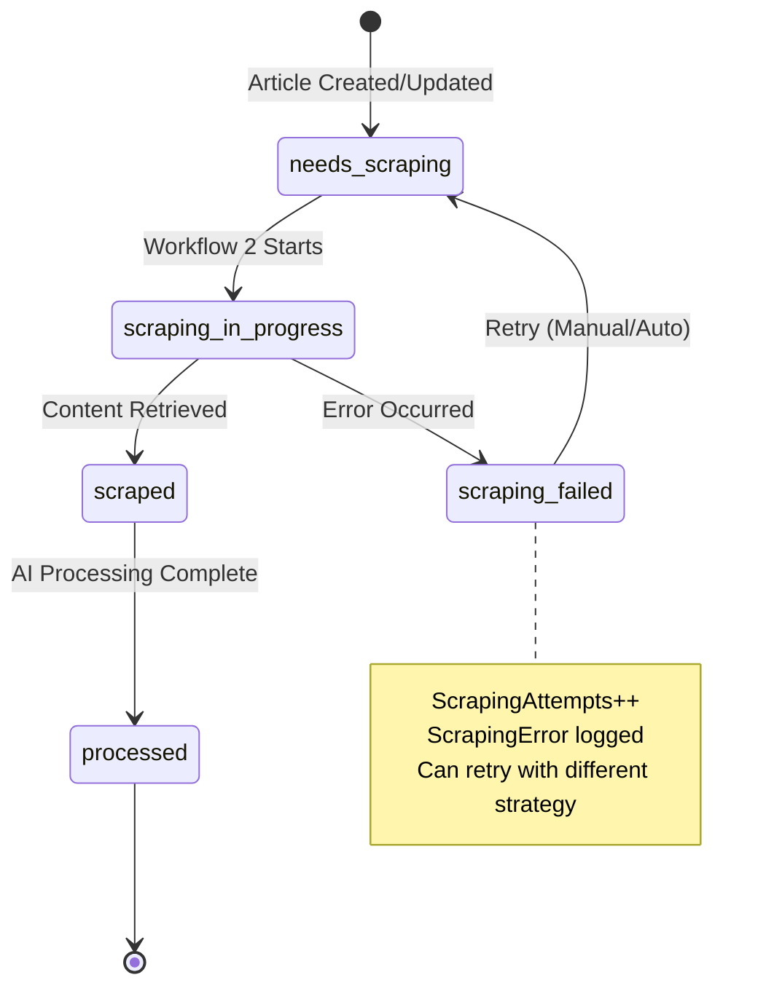
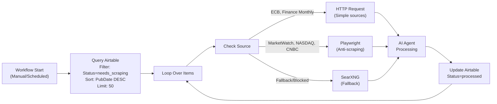
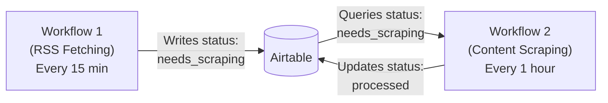
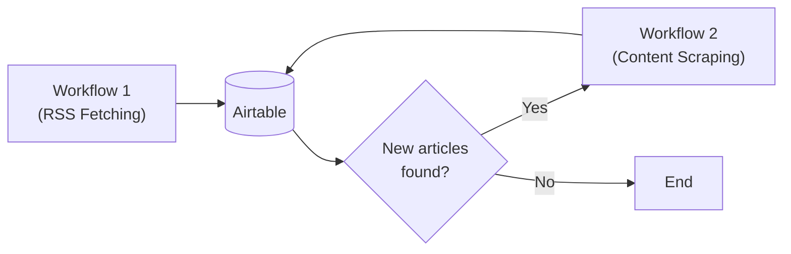
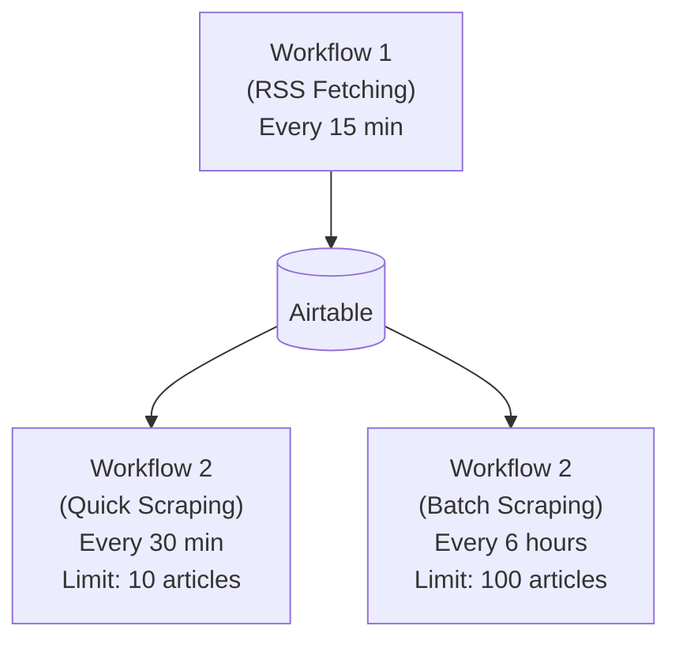

# ADR-001: Separated Article Fetching and Content Scraping Workflows

**Status:** Accepted  
**Date:** 2025-10-25  
**Decision Makers:** Development Team  
**Impact Level:** High - Core Architecture  

---

## 📋 Executive Summary

This ADR documents the critical architectural decision to separate the article fetching/storage pipeline from the content scraping pipeline into two independent workflows. This separation enables resource optimization, improved error handling, flexible execution scheduling, and better scalability.

---

## 🎯 Context and Problem Statement

### The Challenge

The initial monolithic workflow design attempted to perform all operations sequentially:
1. Fetch RSS feeds
2. Normalize and validate articles
3. Check for duplicates
4. **Scrape full article content**
5. Process with AI agents
6. Store results

### Problems Identified

1. **Resource Waste**: Scraping content for articles that already exist in the database wastes:
   - HTTP request quota
   - Processing time
   - Network bandwidth
   - API credits (if using scraping services)

2. **Failure Cascading**: A single scraping failure (CAPTCHA, rate limiting, timeout) could block the entire workflow

3. **Anti-Scraping Challenges**: Different sources require different scraping strategies:
   - Simple HTTP requests
   - Browser automation (Selenium, Playwright)
   - CAPTCHA solving
   - Proxy rotation
   - Alternative content sources (SearXNG)

4. **Scheduling Inflexibility**: All operations must run together, even when:
   - RSS fetching should run every 15 minutes
   - Content scraping could run less frequently
   - Some articles may not need scraping immediately

5. **Error Recovery Complexity**: Failed scraping attempts require re-running the entire workflow

---

## 🎯 Decision: Option 1 - Separated Workflows with State Management

### Architecture Overview



### Core Components

#### Workflow 1: Article Fetching & Storage
**Purpose:** Fetch, normalize, and store article metadata  
**Frequency:** Every 15 minutes (configurable)  
**Duration:** ~30-60 seconds  
**Resource Usage:** Low (RSS feeds only)

**Key Features:**
- Fetches articles from 7 RSS feeds
- Normalizes data structure
- Uses Airtable Upsert to prevent duplicates
- Sets initial status to `needs_scraping`
- No content scraping performed

#### Workflow 2: Content Scraping & Processing
**Purpose:** Scrape full content and process with AI agents  
**Frequency:** On-demand, scheduled, or triggered as sub-workflow  
**Duration:** ~5-15 minutes (depending on volume)  
**Resource Usage:** High (HTTP requests, browser automation, AI processing)

**Key Features:**
- Queries Airtable for articles with `status = needs_scraping`
- Adaptive scraping strategy based on source
- Handles CAPTCHAs and anti-scraping measures
- Processes content with AI agents
- Updates status to `processed` or `scraping_failed`

---

## 🏗️ Implementation Details

### Airtable Schema Enhancement

The `Articles` table requires a new `Status` field to manage workflow state:

```javascript
// Articles Table Schema (Enhanced)
{
  "URL": "text (primary key for upsert)",
  "Title": "text",
  "Source": "single select (ecb, marketwatch, nasdaq, bnpparibas, financemonthly, cnbc, money)",
  "PubDate": "datetime",
  "FetchedAt": "datetime",
  "Creator": "text",
  "Content": "long text",
  "ContentSnippet": "text",
  "Categories": "text",
  "GUID": "text",
  "ContentLength": "number",
  "HasCategories": "checkbox",
  
  // NEW STATUS MANAGEMENT FIELDS
  "Status": "single select (needs_scraping, scraping_in_progress, scraped, scraping_failed, processed)",
  "ScrapingAttempts": "number",
  "LastScrapingAttempt": "datetime",
  "ScrapingError": "long text",
  "ScrapingStrategy": "single select (http, playwright, selenium, searxng)",
  
  // EXISTING PROCESSING FIELDS
  "Processed": "checkbox",
  "RelevanceScore": "number",
  "IncludeInDigest": "checkbox"
}
```

### Status Workflow State Machine



### Workflow 1: Article Fetching Implementation

**Node Configuration Changes:**

```javascript
// Node 18: Airtable Upsert (Updated)
{
  "operation": "upsert",
  "mergeField": "URL",
  "mappings": {
    "URL": "={{$json.airtableData.URL}}",
    "Title": "={{$json.airtableData.Title}}",
    "Source": "={{$json.airtableData.Source}}",
    "PubDate": "={{$json.airtableData.PubDate}}",
    "FetchedAt": "={{$json.airtableData.FetchedAt}}",
    "Creator": "={{$json.airtableData.Creator}}",
    "Content": "={{$json.airtableData.Content}}",
    "ContentSnippet": "={{$json.airtableData.ContentSnippet}}",
    "Categories": "={{$json.airtableData.Categories}}",
    "GUID": "={{$json.airtableData.GUID}}",
    "ContentLength": "={{$json.airtableData.ContentLength}}",
    "HasCategories": "={{$json.airtableData.HasCategories}}",
    
    // NEW STATUS FIELDS
    "Status": "needs_scraping",  // Set initial status
    "ScrapingAttempts": 0,
    "LastScrapingAttempt": null,
    "ScrapingError": null,
    
    // EXISTING FIELDS
    "Processed": false,
    "RelevanceScore": 0,
    "IncludeInDigest": false
  }
}
```

### Workflow 2: Content Scraping Implementation

**Node Structure:**



**Node 1: Query Articles for Scraping**
```javascript
// Airtable List Search
{
  "table": "Articles",
  "filterByFormula": "AND({Status} = 'needs_scraping', {ScrapingAttempts} < 3)",
  "sort": [{"field": "PubDate", "direction": "desc"}],
  "maxRecords": 50,  // Process in batches
  "returnAll": false
}
```

**Node 2: Adaptive Scraping Strategy**
```javascript
// Code Node: Select Scraping Strategy
function selectScrapingStrategy(item) {
  const source = item.Source;
  const attempts = item.ScrapingAttempts || 0;
  
  // Strategy based on source and previous attempts
  const strategies = {
    'ecb': ['http', 'playwright', 'searxng'],
    'marketwatch': ['playwright', 'searxng'],
    'nasdaq': ['playwright', 'http', 'searxng'],
    'bnpparibas': ['http', 'playwright', 'searxng'],
    'financemonthly': ['http', 'playwright', 'searxng'],
    'cnbc': ['playwright', 'searxng'],
    'money': ['playwright', 'http', 'searxng']
  };
  
  const strategyList = strategies[source] || ['http', 'playwright', 'searxng'];
  const strategy = strategyList[Math.min(attempts, strategyList.length - 1)];
  
  return {
    ...item,
    ScrapingStrategy: strategy,
    ScrapingAttempts: attempts + 1,
    LastScrapingAttempt: new Date().toISOString()
  };
}

// Process all items
return $input.all().map(item => ({
  json: selectScrapingStrategy(item.json)
}));
```

**Node 3: HTTP Request Scraper**
```javascript
// HTTP Request Node (Simple sources)
{
  "url": "={{$json.URL}}",
  "method": "GET",
  "headers": {
    "User-Agent": "Mozilla/5.0 (compatible; FinOpinionsBot/1.0)"
  },
  "options": {
    "timeout": 10000,
    "followRedirects": true,
    "maxRedirects": 5
  }
}
```

**Node 4: Playwright Scraper** (For anti-scraping sources)
```javascript
// Execute Command Node - Docker Playwright
{
  "command": "docker",
  "arguments": [
    "run", "--rm",
    "-e", "URL={{$json.URL}}",
    "mcr.microsoft.com/playwright:latest",
    "node", "-e",
    `
    const { chromium } = require('playwright');
    (async () => {
      const browser = await chromium.launch({ headless: true });
      const page = await browser.newPage();
      await page.goto(process.env.URL, { waitUntil: 'networkidle' });
      const content = await page.content();
      console.log(content);
      await browser.close();
    })();
    `
  ]
}
```

**Node 5: SearXNG Fallback**
```javascript
// HTTP Request to SearXNG instance
{
  "url": "http://localhost:8080/search",
  "method": "GET",
  "queryParameters": {
    "q": "={{$json.Title}} {{$json.Source}}",
    "format": "json",
    "engines": "google,bing"
  }
}
```

**Node 6: Update Status**
```javascript
// Airtable Update
{
  "operation": "update",
  "recordId": "={{$json.id}}",
  "fields": {
    "Status": "={{$json.scrapingSuccess ? 'scraped' : 'scraping_failed'}}",
    "ScrapingAttempts": "={{$json.ScrapingAttempts}}",
    "LastScrapingAttempt": "={{$json.LastScrapingAttempt}}",
    "ScrapingError": "={{$json.scrapingError || null}}",
    "ScrapingStrategy": "={{$json.ScrapingStrategy}}",
    "Content": "={{$json.scrapedContent || $json.Content}}"
  }
}
```

---

## ✅ Benefits of This Approach

### 1. **Resource Optimization** 🎯
- **Duplicate Prevention**: Upsert in Workflow 1 prevents scraping duplicates
- **Selective Scraping**: Only new/updated articles are scraped
- **Batch Processing**: Scrape multiple articles efficiently
- **Strategy Adaptation**: Use cheapest strategy first, escalate as needed

**Estimated Savings:**
- **HTTP Requests**: 70-80% reduction (no scraping for duplicates)
- **Processing Time**: 60-70% faster RSS fetching
- **API Costs**: Proportional to articles scraped (not fetched)

### 2. **Improved Error Handling** 🛡️
- **Isolated Failures**: Scraping failures don't affect RSS fetching
- **Retry Logic**: Failed articles remain in `needs_scraping` status
- **Strategy Escalation**: Automatically try different scraping methods
- **Error Visibility**: Each article tracks its scraping attempts and errors

### 3. **Flexible Execution** ⏱️
- **Independent Scheduling**: 
  - Workflow 1: Every 15 minutes (stay current)
  - Workflow 2: Every hour or on-demand (as needed)
- **Manual Triggering**: Run scraping on-demand for specific articles
- **Sub-Workflow Pattern**: Workflow 1 can optionally trigger Workflow 2
- **Priority Processing**: Query can prioritize recent or high-value articles

### 4. **Better Scalability** 📈
- **Horizontal Scaling**: Run multiple scraping workflow instances
- **Load Distribution**: Distribute scraping across time
- **Resource Allocation**: Dedicate more resources to scraping when needed
- **Queue Management**: Airtable status acts as a work queue

### 5. **Enhanced Debugging** 🔍
- **Clear Boundaries**: Each workflow has a specific responsibility
- **State Visibility**: Status field shows exactly where each article is
- **Error Tracking**: ScrapingError field captures detailed failure info
- **Attempt Tracking**: ScrapingAttempts shows retry history

### 6. **Anti-Scraping Resilience** 🔒
- **Strategy Diversity**: HTTP → Playwright → SearXNG escalation
- **CAPTCHA Handling**: Playwright can integrate CAPTCHA solvers
- **Rate Limiting**: Scraping workflow can implement delays
- **IP Rotation**: Easy to add proxy rotation in Workflow 2

---

## ⚖️ Trade-offs and Considerations

### Complexity vs. Benefits
- **Added Complexity**: Two workflows instead of one
- **State Management**: Requires careful status tracking
- **Benefit**: Far outweighs complexity for production use

### Data Consistency
- **Challenge**: Articles stored before content scraped
- **Mitigation**: Status field clearly indicates article state
- **Benefit**: Always have article metadata, content follows

### Workflow Coordination
- **Challenge**: Need to trigger Workflow 2 appropriately
- **Options**: 
  1. Scheduled execution (simple, reliable)
  2. Manual triggering (full control)
  3. Sub-workflow call from Workflow 1 (automated)
  4. Webhook trigger (event-driven)

### Storage Requirements
- **Impact**: More Airtable fields for status management
- **Cost**: Minimal (5 new fields)
- **Benefit**: Complete operational visibility

---

## 🔄 Integration Patterns

### Pattern 1: Fully Independent (Recommended for Initial Implementation)


**Pros:**
- Simplest to implement
- Easy to debug and monitor
- Clear separation of concerns
- Independent failure domains

**Cons:**
- Potential delay between fetching and scraping
- Requires separate scheduling

### Pattern 2: Triggered Sub-Workflow (Advanced)


**Pros:**
- Immediate scraping of new articles
- Single trigger point
- Automated coordination

**Cons:**
- Longer overall execution time
- Failure in W2 could be harder to recover
- More complex error handling

### Pattern 3: Hybrid (Recommended for Production)


**Pros:**
- Balances timeliness and efficiency
- Handles both urgent and batch processing
- Optimal resource utilization

**Cons:**
- More complex scheduling setup
- Need to coordinate batch sizes

---

## 🧪 Testing Strategy

### Unit Tests

#### Workflow 1: Article Fetching
- [ ] RSS feed fetching for each source
- [ ] Field normalization correctness
- [ ] Upsert duplicate handling
- [ ] Status field initialization
- [ ] Error handling for malformed feeds

#### Workflow 2: Content Scraping
- [ ] Query filtering (status = needs_scraping)
- [ ] Strategy selection logic
- [ ] HTTP scraping for simple sources
- [ ] Playwright scraping for complex sources
- [ ] SearXNG fallback mechanism
- [ ] Status update after successful scraping
- [ ] Error logging and retry logic

### Integration Tests
- [ ] End-to-end flow: RSS → Storage → Scraping → AI → Storage
- [ ] Duplicate article handling across workflows
- [ ] Status transitions (needs_scraping → scraped → processed)
- [ ] Error recovery and retry
- [ ] Concurrent workflow execution

### Performance Tests
- [ ] Workflow 1 execution time (target: <60s for 7 feeds)
- [ ] Workflow 2 throughput (articles/minute)
- [ ] Airtable API rate limiting handling
- [ ] Resource usage under load

### Resilience Tests
- [ ] RSS feed timeout/failure
- [ ] Scraping failure (CAPTCHA, 403, timeout)
- [ ] Airtable API failure
- [ ] Network interruption
- [ ] Workflow cancellation/restart

---

## 📊 Monitoring and Observability

### Key Metrics to Track

#### Workflow 1 Metrics
```javascript
{
  "workflow_1_metrics": {
    "execution_frequency": "every 15 minutes",
    "avg_execution_time": "30-60 seconds",
    "articles_fetched_per_run": "10-50",
    "articles_created_per_run": "5-30 (new articles)",
    "articles_updated_per_run": "0-5 (updated articles)",
    "rss_feed_success_rate": "95%+",
    "normalization_success_rate": "99%+",
    "upsert_success_rate": "99%+"
  }
}
```

#### Workflow 2 Metrics
```javascript
{
  "workflow_2_metrics": {
    "execution_frequency": "every 60 minutes",
    "avg_execution_time": "5-15 minutes",
    "articles_scraped_per_run": "10-50",
    "scraping_success_rate_http": "70-80%",
    "scraping_success_rate_playwright": "85-95%",
    "scraping_success_rate_searxng": "60-70%",
    "avg_retry_count": "1.2",
    "articles_requiring_3_attempts": "<5%"
  }
}
```

#### Status Distribution
```javascript
{
  "airtable_status_distribution": {
    "needs_scraping": "10-50 (queue)",
    "scraping_in_progress": "0-10 (active)",
    "scraped": "500+ (success)",
    "scraping_failed": "<10 (needs attention)",
    "processed": "400+ (AI complete)"
  }
}
```

### Alerting Rules
- **Alert**: Workflow 1 fails 3 times consecutively
- **Alert**: Scraping failure rate >30% over 1 hour
- **Alert**: Articles in `needs_scraping` status >100
- **Alert**: Articles with ScrapingAttempts ≥3
- **Alert**: Workflow 2 execution time >20 minutes

---

## 🚀 Migration Plan

### Phase 1: Implement Workflow 1 (Current Priority)
- [x] Design RSS fetching workflow
- [x] Implement post-processing pipeline
- [x] Configure Airtable Upsert
- [ ] Add Status field to Airtable
- [ ] Update Upsert node to set initial status
- [ ] Test end-to-end RSS fetching

### Phase 2: Implement Workflow 2 (Next Sprint)
- [ ] Design scraping workflow architecture
- [ ] Implement Airtable query node
- [ ] Build adaptive scraping strategy logic
- [ ] Configure HTTP Request scraper
- [ ] Set up Playwright Docker container
- [ ] Configure SearXNG integration
- [ ] Implement status update logic
- [ ] Add error handling and retry logic

### Phase 3: Integration and Testing
- [ ] Test both workflows independently
- [ ] Test workflow coordination (Pattern 1)
- [ ] Verify status transitions
- [ ] Validate error handling and retry
- [ ] Performance testing and optimization

### Phase 4: Production Deployment
- [ ] Deploy Workflow 1 (RSS fetching)
- [ ] Monitor for 48 hours
- [ ] Deploy Workflow 2 (scraping)
- [ ] Implement monitoring and alerts
- [ ] Document operational procedures

### Phase 5: Advanced Features
- [ ] Implement sub-workflow triggering (Pattern 2)
- [ ] Add hybrid scheduling (Pattern 3)
- [ ] Implement CAPTCHA solving
- [ ] Add proxy rotation
- [ ] Optimize scraping strategies per source

---

## 📖 Operational Procedures

### Daily Operations

#### Morning Check (5 minutes)
1. Check Workflow 1 execution history (should run every 15 min)
2. Review Airtable status distribution
3. Check for articles in `scraping_failed` status
4. Review monitoring dashboard

#### Manual Intervention Scenarios

**Scenario 1: Many articles in `scraping_failed`**
```javascript
// Airtable formula to reset failed articles
IF(
  AND(
    {Status} = 'scraping_failed',
    {ScrapingAttempts} < 3
  ),
  'needs_scraping',
  {Status}
)
```

**Scenario 2: Workflow 2 taking too long**
- Reduce batch size in query (50 → 20)
- Check for problematic sources
- Increase execution frequency instead

**Scenario 3: Specific source consistently failing**
- Update strategy order for that source
- Consider removing source temporarily
- Investigate source website changes

### Weekly Maintenance
1. Review scraping success rates by source
2. Optimize strategy order based on performance
3. Clear old articles in `scraping_failed` (>7 days)
4. Analyze and document any patterns in failures

---

## 🔮 Future Enhancements

### Short Term (Next 2-4 weeks)
1. **CAPTCHA Solving Integration**
   - Integrate 2captcha or similar service
   - Add to Playwright scraping node
   - Test with challenging sources

2. **Proxy Rotation**
   - Set up rotating proxy service
   - Implement in HTTP and Playwright nodes
   - Monitor IP blocking rates

3. **Content Quality Validation**
   - Add content length checks
   - Verify scraped content quality
   - Flag articles needing manual review

### Medium Term (1-2 months)
1. **Intelligent Retry Logic**
   - ML-based strategy selection
   - Time-based retry delays (exponential backoff)
   - Source-specific retry patterns

2. **Priority Queue**
   - Add priority field to articles
   - Process high-priority articles first
   - User-triggered priority scraping

3. **Alternative Content Sources**
   - Google News API integration
   - NewsAPI.org fallback
   - RSS-to-Email services

### Long Term (3-6 months)
1. **Distributed Scraping**
   - Multiple scraping workers
   - Geographic distribution
   - Load balancing

2. **Machine Learning**
   - Automatic strategy selection
   - Content quality prediction
   - Source reliability scoring

3. **Advanced Caching**
   - Cache scraped content
   - Incremental updates
   - Version control for articles

---

## 📚 References and Related Documentation

### Internal Documentation
- [`fineopinions_diagram.md`](../fineopinions_diagram.md) - System architecture diagrams
- [`fineopinions_node_settings.md`](../fineopinions_node_settings.md) - n8n node configurations
- [`tasks.md`](../tasks.md) - Implementation tasks and progress
- [`docs/implementation-guide.md`](./implementation-guide.md) - Step-by-step implementation

### External Resources
- [n8n Workflow Documentation](https://docs.n8n.io/workflows/)
- [Airtable API Reference](https://airtable.com/developers/web/api/introduction)
- [Playwright Documentation](https://playwright.dev/)
- [SearXNG Documentation](https://docs.searxng.org/)

### Technical References
- [RSS Feed Specifications](https://validator.w3.org/feed/docs/rss2.html)
- [Web Scraping Best Practices](https://developers.google.com/search/docs/advanced/guidelines/qualify-outbound-links)
- [Rate Limiting Strategies](https://www.nginx.com/blog/rate-limiting-nginx/)

---

## ✍️ Change Log

| Date | Version | Author | Changes |
|------|---------|--------|---------|
| 2025-10-25 | 1.0 | Development Team | Initial ADR creation - Separated workflows architecture |

---

## 🎯 Decision Rationale Summary

**Why Option 1 (Separated Workflows) was chosen:**

1. **Resource Efficiency**: Prevents wasting API calls and processing time on duplicate articles
2. **Failure Isolation**: Scraping failures don't block RSS fetching
3. **Flexibility**: Each workflow can be scheduled, scaled, and optimized independently
4. **Operational Control**: Manual triggering and priority processing capabilities
5. **Scalability**: Clear path to distributed scraping and advanced features
6. **Debugging**: Easier to identify and fix issues in isolated workflows
7. **Anti-Scraping Resilience**: Adaptive strategies can be implemented per article

**This decision enables the project to:**
- Start with a simple, reliable RSS fetching pipeline
- Add sophisticated scraping gradually
- Scale each component independently
- Handle errors gracefully
- Maintain operational flexibility

**The separated architecture provides a solid foundation for long-term growth and reliability.**

---

**Status: Accepted and Ready for Implementation**
