# FineOpinions - BUILD Roadmap

**Created:** October 9, 2025  
**Approach:** Modular, iterative, no feature creep  
**Strategy:** Build one, test one, duplicate, repeat

---

## 🗺️ The Modular Build Journey

```mermaid
graph TB
    START[Start BUILD Mode] --> SETUP[Setup:<br/>Airtable + Samples]

    SETUP --> M1[MODULE 1:<br/>Single Feed<br/>Economist Only]
    M1 --> TEST1{Works?}
    TEST1 -->|Yes| M2[MODULE 2:<br/>Duplicate for 4 Feeds<br/>+ Orchestrator]
    TEST1 -->|No| DEBUG1[Debug Module 1]
    DEBUG1 --> M1

    M2 --> TEST2{All Feeds<br/>Work?}
    TEST2 -->|Yes| M3[MODULE 3:<br/>Journalist Agent]
    TEST2 -->|No| DEBUG2[Debug Feeds]
    DEBUG2 --> M2

    M3 --> TEST3{Synthesis<br/>Good?}
    TEST3 -->|Yes| M4[MODULE 4:<br/>Editorial Agent]
    TEST3 -->|No| DEBUG3[Refine Prompt]
    DEBUG3 --> M3

    M4 --> TEST4{Voice<br/>Present?}
    TEST4 -->|Yes| M5[MODULE 5:<br/>Copywriter Agent]
    TEST4 -->|No| DEBUG4[Refine Voice]
    DEBUG4 --> M4

    M5 --> TEST5{Email<br/>Good?}
    TEST5 -->|Yes| M6[MODULE 6:<br/>Orchestrator]
    TEST5 -->|No| DEBUG5[Fix Formatting]
    DEBUG5 --> M5

    M6 --> TEST6{End-to-End<br/>Works?}
    TEST6 -->|Yes| LIVE[GO LIVE! 🎉]
    TEST6 -->|No| DEBUG6[Debug Pipeline]
    DEBUG6 --> M6

    style START fill:#4da6ff,stroke:#0066cc,color:white
    style M1 fill:#ffd700,stroke:#daa520,color:black
    style M3 fill:#ff6b6b,stroke:#c92a2a,color:white
    style M4 fill:#845ec2,stroke:#5a3d8f,color:white
    style M5 fill:#00c9a7,stroke:#00a085,color:white
    style LIVE fill:#4dbb5f,stroke:#36873f,color:white
```

---

## 📦 Module Progression

### 🏗️ MODULE 1: Foundation (6-8 hours)

**What:** Single feed processor (Economist only)  
**Goal:** RSS → Scrape → Desk Reporter → Airtable

**Deliverable:**

- ✅ One working workflow
- ✅ Proven scraping for Economist
- ✅ Desk Reporter tested
- ✅ Airtable integration works

**This is the template for everything else.**

---

### 🔄 MODULE 2: Expansion (2-3 hours)

**What:** Duplicate Module 1 for all 4 feeds  
**Goal:** Orchestrated multi-feed processing

**Deliverable:**

- ✅ 4 feed processors (copy of Module 1)
- ✅ Staggered execution (1-min delays)
- ✅ All feeds populating Airtable

**Foundation complete - now we have data!**

---

### 📰 MODULE 3: Journalist (4-5 hours)

**What:** Synthesize articles into factual narrative  
**Goal:** Airtable → Journalist → Digests table

**Deliverable:**

- ✅ Query + filter logic works
- ✅ FACTS FIRST synthesis tested
- ✅ Wikipedia tool functional
- ✅ Valid JSON in Digests table

**First agent live - facts are flowing!**

---

### ✍️ MODULE 4: Editorial (3-4 hours)

**What:** Add Northern Irish voice and perspective  
**Goal:** Journalist JSON → Editorial → Updated Digest

**Deliverable:**

- ✅ Northern Irish voice present
- ✅ Tone adaptation works
- ✅ Colorful language appropriate
- ✅ Actually fun to read

**Personality injected - it's getting interesting!**

---

### 📧 MODULE 5: Copywriter (3-4 hours)

**What:** Polish into HTML email  
**Goal:** Complete Digest → Copywriter → Email delivery

**Deliverable:**

- ✅ HTML email formatted beautifully
- ✅ Edgy subject line
- ✅ Renders across email clients
- ✅ Email sends successfully

**Almost there - we have a product!**

---

### 🎭 MODULE 6: Orchestration (2-3 hours)

**What:** Chain all agents with schedule  
**Goal:** Automated every-other-day digest

**Deliverable:**

- ✅ Schedule triggers correctly
- ✅ All agents run in sequence
- ✅ Email delivered automatically
- ✅ System is autonomous

**DONE! We're live! 🎉**

---

## 🎯 Focus Areas Per Module

### Module 1: Get Scraping Right

- **Critical:** Content extraction from Economist
- **Test:** Multiple article types (long, short, different topics)
- **Document:** Which HTML selectors work
- **Fallback:** RSS description if scraping fails

### Module 2: Replication & Reliability

- **Critical:** All 4 sources work reliably
- **Test:** Each source's scraping requirements
- **Document:** Source-specific quirks
- **No blockers:** If one source fails, note it and continue

### Module 3: Synthesis Quality

- **Critical:** Journalist produces coherent facts
- **Test:** Wikipedia tool integration
- **Document:** Token usage, processing time
- **Watch for:** Context window issues (25 articles)

### Module 4: Voice Consistency

- **Critical:** Northern Irish voice is present
- **Test:** Multiple market moods (bullish, bearish, uncertain)
- **Document:** Voice quality across different inputs
- **Watch for:** Voice drift or inconsistency

### Module 5: Email Quality

- **Critical:** HTML renders properly
- **Test:** Gmail, Outlook, Apple Mail
- **Document:** Rendering issues per client
- **Watch for:** Broken formatting or missing styles

### Module 6: Automation

- **Critical:** Schedule reliability
- **Test:** Multiple digest cycles
- **Document:** Any timing or sequencing issues
- **Watch for:** Race conditions or data inconsistencies

---

## 📋 Pre-Build Checklist

Before starting Module 1:

- [ ] Airtable account ready
- [ ] Airtable Articles table created (13 minimum fields)
- [ ] Airtable API key obtained
- [ ] n8n can connect to Airtable (test connection)
- [ ] Ollama is running and accessible
- [ ] llama3.2:3b model installed in Ollama
- [ ] qwen2.5:7b model installed in Ollama
- [ ] 5-10 sample Economist articles saved (for testing)
- [ ] Test email address configured

**All checked?** ✅ Ready to start Module 1

---

## 🎯 Stopping Points (When to Pause)

### Good Stopping Points

✅ **After Module 1:** Single feed working end-to-end  
✅ **After Module 2:** All feeds working  
✅ **After Module 3:** Journalist tested  
✅ **After Module 4:** Editorial tested  
✅ **After Module 5:** Email delivery tested  
✅ **After Module 6:** System complete

**Each module is self-contained. Safe to stop after any module.**

### Bad Stopping Points

❌ Mid-module (workflow partially built)  
❌ After scraping but before Desk Reporter  
❌ After one agent but mid-chain

**Finish the current module before stopping.**

---

## 📊 Expected Outputs Per Module

### Module 1 Output

- Working n8n workflow (Economist feed)
- 5-10 articles in Airtable
- Validated Desk Reporter JSON
- Documentation of Economist scraping patterns

### Module 2 Output

- 4 working feed workflows
- Orchestrator workflow
- 30-50 articles in Airtable (from all sources)
- Source-specific scraping notes

### Module 3 Output

- Working Journalist workflow
- 1 test Digest in Airtable (Journalist fields)
- Factual synthesis example
- Token usage benchmarks

### Module 4 Output

- Working Editorial workflow
- Updated Digest (Editorial fields added)
- Northern Irish voice validation
- Tone adaptation examples

### Module 5 Output

- Working Copywriter workflow
- Complete HTML email
- Test email delivered
- Rendering validation report

### Module 6 Output

- Working orchestrator
- Complete end-to-end digest
- Production schedule configured
- First real digest sent

---

## 🚀 Quick Start for Next Session

**To resume BUILD mode:**

1. Read this document (`/memory-bank/build-implementation-plan.md`)
2. Review Module 1 breakdown (Sub-Tasks 1.1-1.7)
3. Complete pre-build checklist
4. Start with Sub-Task 1.1 (Airtable setup)
5. Work through Module 1 sequentially

**Don't skip ahead. Build Module 1 completely before touching Module 2.**

---

**Plan Status:** ✅ CREATIVE PHASE COMPLETE  
**Implementation Strategy:** Modular, tested, no feature creep  
**Ready to Build:** Yes - start with Module 1  
**Estimated Time to First Digest:** 3 weeks (50-75 hours)

**Let's build this one module at a time.** 🔨🍀
