# FineOpinions - System Diagrams

**Last Updated:** October 25, 2025  
**Status:** Separated Workflows Architecture (ADR-001) - Two Independent Workflows

---

## 📚 Documentation Index

This file provides a quick reference to all system architecture diagrams and planning documents for the FineOpinions project.

**📋 Important:** The system uses a **separated workflows architecture** (ADR-001). See the [Separated Workflows Architecture](#-separated-workflows-architecture-adr-001) section below for details.

**📖 Related Documentation:**

- **[ADR-001: Separated Workflows](./docs/architecture-decisions/ADR-001-separated-workflows.md)** - Comprehensive architectural decision documentation

---

## 🏗️ Separated Workflows Architecture (ADR-001)

**Decision Date:** October 25, 2025  
**Status:** Accepted and In Implementation

### Key Architectural Change

The system is split into **two independent workflows** for optimal resource usage and operational flexibility:

```mermaid
graph TB
    subgraph "WORKFLOW 1: Article Fetching & Storage"
        W1_START[⏰ Every 15 minutes]
        W1_RSS[📰 Fetch 7 RSS Feeds]
        W1_PROCESS[🔄 4-Stage Post-Processing]
        W1_UPSERT[💾 Airtable Upsert<br/>Status: needs_scraping]

        W1_START --> W1_RSS
        W1_RSS --> W1_PROCESS
        W1_PROCESS --> W1_UPSERT
    end

    subgraph "WORKFLOW 2: Content Scraping & AI Processing"
        W2_START[⏰ Every 1 hour / Manual]
        W2_QUERY[🔍 Query Articles<br/>Status = needs_scraping]
        W2_SCRAPE[🕷️ Adaptive Scraping<br/>HTTP/Playwright/SearXNG]
        W2_AI[🤖 Multi-Agent AI Pipeline]
        W2_UPDATE[✅ Update Status: processed]

        W2_START --> W2_QUERY
        W2_QUERY --> W2_SCRAPE
        W2_SCRAPE --> W2_AI
        W2_AI --> W2_UPDATE
    end

    W1_UPSERT -.->|State in Airtable| W2_QUERY

    style W1_UPSERT fill:#4dbb5f,stroke:#36873f,color:white
    style W2_SCRAPE fill:#ff5555,stroke:#cc0000,color:white
```



### Why This Architecture?

1. **Resource Optimization** 🎯

   - Duplicate check happens BEFORE scraping (70-80% reduction in HTTP requests)
   - Only new/updated articles are scraped
   - RSS fetching is fast and lightweight (~30-60 seconds)

2. **Failure Isolation** 🛡️

   - Scraping failures (CAPTCHA, rate limits) don't block RSS fetching
   - Each workflow can be debugged independently

3. **Flexible Execution** ⏱️

   - RSS fetching runs frequently (every 15 min) to stay current
   - Content scraping runs less frequently (every hour) or on-demand
   - Can trigger Workflow 2 manually or as sub-workflow

4. **Better Scalability** 📈
   - Each workflow can be scaled independently
   - Adaptive scraping strategies per source (HTTP → Playwright → SearXNG)

### Status Management

Articles transition through these states:

- **needs_scraping**: New article, ready for content scraping
- **scraping_in_progress**: Currently being scraped
- **scraped**: Content successfully retrieved
- **scraping_failed**: Error occurred (will retry with different strategy)
- **processed**: AI processing complete

**📖 Full Documentation:** See [ADR-001](./docs/architecture-decisions/ADR-001-separated-workflows.md) for complete implementation details, testing strategy, and operational procedures.

---

## 🎯 Quick Reference: High-Level System Flow

```mermaid
graph TB
    %% Main Entry Point - Updated to match actual workflow
    START[⏰ Schedule Trigger<br/>Every 5 hours] --> NOOP[No Operation]
    NOOP --> FEED1[📰 ECB RSS]
    NOOP --> FEED2[📰 MarketWatch RSS]
    NOOP --> FEED3[📰 NASDAQ RSS]
    NOOP --> FEED4[📰 BNP Paribas RSS]
    NOOP --> FEED5[📰 Finance Monthly RSS]
    NOOP --> FEED6[📰 CNBC RSS]
    NOOP --> FEED7[📰 Money RSS]

    %% RSS Post-Processing Pipeline (4-Stage)
    FEED1 & FEED2 & FEED3 & FEED4 & FEED5 & FEED6 & FEED7 --> MERGE[🔄 Merge RSS<br/>Append Mode]
    MERGE --> NORMALIZE[🔧 Basic Field Normalizer<br/>Extract source, normalize dates]
    NORMALIZE --> CONTENTPROC[📄 Content Processor<br/>Clean HTML, extract snippet]
    CONTENTPROC --> METADATA[🏷️ Metadata Processor<br/>Create/categories, generate URLHash]
    METADATA --> MAPPER[✅ Field Validator & Mapper<br/>Validate & map to Airtable schema]
    MAPPER --> AIRTABLE[💾 Airtable Upsert<br/>URLHash merge, IF/ELSE logic]

    %% Completion
    AIRTABLE --> COMPLETE[✅ Workflow Complete<br/>Status: needs_scraping]

    style START fill:#4da6ff,stroke:#0066cc,color:white
    style NOOP fill:#90EE90,stroke:#228B22,color:black
    style FEED1 fill:#FFE4B5,stroke:#D2691E,color:black
    style FEED2 fill:#FFE4B5,stroke:#D2691E,color:black
    style FEED3 fill:#FFE4B5,stroke:#D2691E,color:black
    style FEED4 fill:#FFE4B5,stroke:#D2691E,color:black
    style FEED5 fill:#FFE4B5,stroke:#D2691E,color:black
    style FEED6 fill:#FFE4B5,stroke:#D2691E,color:black
    style FEED7 fill:#FFE4B5,stroke:#D2691E,color:black
    style MERGE fill:#80bfff,stroke:#4da6ff,color:white
    style NORMALIZE fill:#d971ff,stroke:#a33bc2,color:white
    style CONTENTPROC fill:#d971ff,stroke:#a33bc2,color:white
    style METADATA fill:#d971ff,stroke:#a33bc2,color:white
    style MAPPER fill:#d971ff,stroke:#a33bc2,color:white
    style AIRTABLE fill:#4dbb5f,stroke:#36873f,color:white
    style COMPLETE fill:#4dbb5f,stroke:#36873f,color:white
```



---

## 🎯 RSS Post-Processing Architecture Detail

```mermaid
graph TD
    %% Input Sources
    RSS1[📰 ECB RSS] --> MERGE
    RSS2[📰 MarketWatch RSS] --> MERGE
    RSS3[📰 NASDAQ RSS] --> MERGE
    RSS4[📰 BNP Paribas RSS] --> MERGE
    RSS5[📰 Finance Monthly RSS] --> MERGE
    RSS6[📰 CNBC RSS] --> MERGE
    RSS7[📰 Money RSS] --> MERGE

    %% Post-Processing Pipeline (No Tagging Strategy)
    MERGE[🔄 Merge Node<br/>Append Mode] --> STAGE1[🔧 Stage 1: Basic Normalizer<br/>• Extract source from URL<br/>• Normalize dates (ISO 8601)<br/>• Handle missing fields]

    STAGE1 --> STAGE2[📄 Stage 2: Content Processor<br/>• Strip HTML tags<br/>• Extract contentSnippet<br/>• Clean encoding issues]

    STAGE2 --> STAGE3[🏷️ Stage 3: Metadata Processor<br/>• Extract creator<br/>• Parse categories array<br/>• Generate URLHash (djb2)]

    STAGE3 --> STAGE4[✅ Stage 4: Validator & Mapper<br/>• Validate required fields<br/>• Map to Airtable schema<br/>• Format dates correctly]

    %% Airtable Upsert with IF/ELSE Logic
    STAGE4 --> AIRTABLE[💾 Airtable Upsert<br/>Merge Field: URLHash<br/>IF exists: Update FetchedAt<br/>ELSE: Create with Status = needs_scraping]

    %% Output
    AIRTABLE --> OUTPUT[✅ Articles Stored<br/>Ready for Workflow 2]

    %% Format Examples
    RSS1 -.-> FORMAT1["`ECB Format:
    • title, link, pubDate
    • No creator field
    • Minimal content`"]

    RSS5 -.-> FORMAT2["`Finance Monthly:
    • content:encoded (long)
    • categories array
    • dc:creator field`"]

    RSS6 -.-> FORMAT3["`CNBC Format:
    • contentSnippet
    • Standard creator
    • GUID numeric`"]

    style MERGE fill:#80bfff,stroke:#4da6ff,color:white
    style STAGE1 fill:#e6b3ff,stroke:#d971ff,color:black
    style STAGE2 fill:#e6b3ff,stroke:#d971ff,color:black
    style STAGE3 fill:#e6b3ff,stroke:#d971ff,color:black
    style STAGE4 fill:#e6b3ff,stroke:#d971ff,color:black
    style AIRTABLE fill:#4dbb5f,stroke:#36873f,color:white
    style OUTPUT fill:#4dbb5f,stroke:#36873f,color:white
```

---

## 📋 Workflow 1: Detailed Node Breakdown

**Node-by-Node Flow:**

1. **Schedule Trigger** - Runs every 5 hours
2. **7 RSS Feed Nodes** - Fetch articles from: ECB, MarketWatch, NASDAQ, BNP Paribas, Finance Monthly, CNBC, Money
3. **Merge Node** - Combines all 7 feeds using "Append" mode
4. **Basic Field Normalizer** - Extracts source from URL, normalizes dates
5. **Content Processor** - Strips HTML, extracts content snippets
6. **Metadata Processor** - Processes creator/categories, generates URLHash
7. **Field Validator & Mapper** - Validates fields, maps to Airtable schema
8. **Airtable Upsert** - Uses URLHash for deduplication, sets Status = needs_scraping

**📖 For detailed node configurations:** See [fineopinions_node_settings.md](./fineopinions_node_settings.md)  
**📖 For Workflow 2 (Content Scraping & AI):** See [ADR-001](./docs/architecture-decisions/ADR-001-separated-workflows.md)

---

## 📊 Airtable Schema Reference

### Table: Articles (Enhanced for Separated Workflows Architecture)

| Field Name              | Type              | Description                                                                                   |
| ----------------------- | ----------------- | --------------------------------------------------------------------------------------------- |
| ArticleID               | Auto Number       | Primary key                                                                                   |
| URL                     | URL               | Article link (unique, used for Upsert merge)                                                  |
| Title                   | Single Line Text  | Article title                                                                                 |
| Source                  | Single Select     | ecb, marketwatch, nasdaq, bnpparibas, financemonthly, cnbc, money                             |
| PubDate                 | Date              | Publication date/time                                                                         |
| FetchedAt               | Date              | When RSS was fetched                                                                          |
| **Status**              | **Single Select** | **Workflow state: needs_scraping, scraping_in_progress, scraped, scraping_failed, processed** |
| **ScrapingAttempts**    | **Number**        | **Number of scraping attempts (retry logic)**                                                 |
| **LastScrapingAttempt** | **Date**          | **Timestamp of last scraping attempt**                                                        |
| **ScrapingError**       | **Long Text**     | **Error message if scraping failed**                                                          |
| **ScrapingStrategy**    | **Single Select** | **Strategy used: http, playwright, selenium, searxng**                                        |
| ProcessedAt             | Date              | When AI processed                                                                             |
| Summary                 | Long Text         | AI-generated summary                                                                          |
| KeyPoints               | Long Text         | Bullet points (JSON array)                                                                    |
| Sentiment               | Single Select     | positive, neutral, negative                                                                   |
| RelevanceScore          | Number            | 1-10 score                                                                                    |
| Tags                    | Multiple Select   | Topic tags                                                                                    |
| MainTopics              | Multiple Select   | Primary topics                                                                                |
| FullText                | Long Text         | Complete article content (scraped)                                                            |
| ProcessedBy             | Single Line Text  | Model used                                                                                    |
| TokenCount              | Number            | Tokens used                                                                                   |
| IncludeInDigest         | Checkbox          | Based on relevance (>= 5)                                                                     |
| LinkedDigest            | Link to Table     | Links to DailyDigests (future)                                                                |

**Note:** Fields in **bold** are new additions for the separated workflows architecture (ADR-001). These fields enable state management across the two independent workflows.

**Deprecated Fields:**

- `ScrapingStatus`: Replaced by granular `Status` field with full workflow state tracking

---

## 🔄 Data Flow Summary


---

**Last Updated:** October 25, 2025
