# FineOpinions - System Diagrams

**Last Updated:** October 9, 2025  
**Status:** Planning Phase Complete

---

## 📚 Documentation Index

This file provides a quick reference to all system architecture diagrams and planning documents for the FineOpinions project.

---

## 🎯 Quick Reference: High-Level System Flow

```mermaid
graph TB
    %% Main Entry Point
    START[⏰ Scheduled Trigger<br/>2x Daily: 7AM & 7PM] --> ORCHESTRATOR[🎭 Feed Orchestrator<br/>Staggered Execution]

    %% Feed Processing
    ORCHESTRATOR -->|T+0min| FEED1[📰 Economist Feed]
    ORCHESTRATOR -->|T+1min| FEED2[📰 Bloomberg Feed]
    ORCHESTRATOR -->|T+2min| FEED3[📰 Reuters Feed]
    ORCHESTRATOR -->|T+3min| FEED4[📰 MarketWatch Feed]

    %% Merge Point
    FEED1 & FEED2 & FEED3 & FEED4 --> MERGE[🔄 Merge Articles]

    %% Deduplication
    MERGE --> DEDUP[🔍 Deduplication Check<br/>Against Database]

    %% Processing Pipeline
    DEDUP --> LOOP[🔁 Loop Each Article URL]
    LOOP --> SCRAPE[🌐 Content Scraper Module]
    SCRAPE --> VALIDATE[✅ Content Validation]
    VALIDATE --> AGENT[🤖 AI Agent Review]
    AGENT --> STORE[💾 Airtable Ingest]

    %% Error Handling
    SCRAPE -.->|Scraping Failed| ERROR[⚠️ Error Handler]
    VALIDATE -.->|Invalid Content| ERROR
    ERROR --> RETRY{Retry?}
    RETRY -->|Yes, < 3 attempts| SCRAPE
    RETRY -->|No, Log & Continue| STORE

    %% Completion
    STORE --> COMPLETE[✅ Batch Complete]

    style START fill:#4da6ff,stroke:#0066cc,color:white
    style ORCHESTRATOR fill:#ffa64d,stroke:#cc7a30,color:white
    style AGENT fill:#d971ff,stroke:#a33bc2,color:white
    style STORE fill:#4dbb5f,stroke:#36873f,color:white
    style ERROR fill:#ff5555,stroke:#cc0000,color:white
```

---

## 📋 Detailed Architecture Documentation

**Primary Documentation:**  
📄 `/memory-bank/rss-feed-architecture.md`

This comprehensive document contains:

1. **System Architecture - High Level**

   - Complete workflow overview
   - Component interactions
   - Error handling strategies

2. **Component 1: RSS XML Retrieval**

   - Cache checking logic
   - HTTP request handling
   - XML parsing and validation
   - Output schema definition

3. **Component 2: Article Loop & Deduplication**

   - Feed merging strategy
   - Deduplication logic (by URL)
   - Date filtering (24-hour window)
   - Metadata enrichment

4. **Component 3: Content Scraping Module**

   - Scraping strategy selection (HTTP vs Browser)
   - HTML parsing heuristics
   - Content extraction rules
   - Fallback strategies (including SearXNG)

5. **Component 4: AI Agent Review & Condensation**

   - Prompt engineering structure
   - Model selection criteria
   - Relevance scoring (1-10 scale)
   - JSON output validation

6. **Component 5: Airtable Ingest**

   - Database schema design
   - Upsert logic
   - Field mapping
   - Data retention policy

7. **Complete End-to-End Flow**
   - Full workflow integration
   - Metrics and monitoring
   - Success criteria

---

## 🗂️ Component Diagrams Available

All detailed component diagrams are available in `/memory-bank/rss-feed-architecture.md`:

| Component                    | Description                       | Complexity |
| ---------------------------- | --------------------------------- | ---------- |
| RSS XML Retrieval            | Feed fetching, caching, parsing   | Medium     |
| Article Loop & Deduplication | Feed merging, URL deduplication   | Medium     |
| Content Scraping Module      | Multi-strategy web scraping       | High       |
| AI Agent Review              | Article analysis and condensation | High       |
| Airtable Ingest              | Database storage and relations    | Medium     |
| End-to-End Flow              | Complete pipeline integration     | High       |
| Dependencies & Integration   | External service connections      | Medium     |

---

## 🎨 Creative Phase Components

The following components require design decisions in **CREATIVE MODE**:

1. **Prompt Engineering** (High Priority)

   - AI Agent prompts for article analysis
   - Output schema definition
   - Model-specific optimizations

2. **Content Extraction Heuristics** (Medium Priority)

   - Site-specific extraction rules
   - Fallback strategies hierarchy

3. **Relevance Scoring Algorithm** (Medium Priority)
   - Scoring criteria and weights
   - Topic classification system

---

## 📊 Airtable Schema Reference

**Table: Articles**

| Field Name      | Type             | Description                                |
| --------------- | ---------------- | ------------------------------------------ |
| ArticleID       | Auto Number      | Primary key                                |
| URL             | URL              | Article link (unique)                      |
| Title           | Single Line Text | Article title                              |
| Source          | Single Select    | economist, bloomberg, reuters, marketwatch |
| PubDate         | Date             | Publication date/time                      |
| FetchedAt       | Date             | When RSS was fetched                       |
| ProcessedAt     | Date             | When AI processed                          |
| Summary         | Long Text        | AI-generated summary                       |
| KeyPoints       | Long Text        | Bullet points (JSON array)                 |
| Sentiment       | Single Select    | positive, neutral, negative                |
| RelevanceScore  | Number           | 1-10 score                                 |
| Tags            | Multiple Select  | Topic tags                                 |
| MainTopics      | Multiple Select  | Primary topics                             |
| FullText        | Long Text        | Complete article content                   |
| ProcessedBy     | Single Line Text | Model used                                 |
| TokenCount      | Number           | Tokens used                                |
| ScrapingStatus  | Single Select    | success, failed, fallback                  |
| IncludeInDigest | Checkbox         | Based on relevance (>= 5)                  |
| LinkedDigest    | Link to Table    | Links to DailyDigests (future)             |

---

## 🔄 Data Flow Summary

---

## 📈 Success Metrics

| Metric                        | Target   | Phase   |
| ----------------------------- | -------- | ------- |
| RSS Fetch Success Rate        | > 95%    | Phase 1 |
| Article Scraping Success Rate | > 85%    | Phase 2 |
| AI Processing Success Rate    | > 90%    | Phase 3 |
| Deduplication Accuracy        | > 99%    | Phase 1 |
| Airtable Ingest Success Rate  | > 98%    | Phase 4 |
| End-to-End Processing Time    | < 10 min | Phase 4 |
| Average Articles per Run      | 20-50    | Phase 4 |

---

## 🔗 Related Documentation

- **Project Brief:** `/memory-bank/projectbrief.md`
- **Product Context:** `/memory-bank/productContext.md`
- **Technical Context:** `/memory-bank/techContext.md`
- **System Patterns:** `/memory-bank/systemPatterns.md`
- **Active Context:** `/memory-bank/activeContext.md`
- **Progress Tracking:** `/memory-bank/progress.md`
- **Task List:** `/tasks.md`
- **Node Settings:** `/fineopinions_node_settings.md` (to be created)

---

## 🎯 Current Project Status

**Phase:** Planning Complete  
**Mode:** Transitioning to CREATIVE MODE  
**Next Steps:**

1. Prompt Engineering (AI Agent)
2. Content Extraction Strategy
3. Begin BUILD MODE implementation

**Last Updated:** October 9, 2025
