# FineOpinions - System Diagrams

**Last Updated:** October 25, 2025  
**Status:** Separated Workflows Architecture (ADR-001) - Two Independent Workflows

---

## 📚 Documentation Index

This file provides a quick reference to all system architecture diagrams and planning documents for the FineOpinions project.

**📋 Important:** The system uses a **separated workflows architecture** (ADR-001). See the [Separated Workflows Architecture](#-separated-workflows-architecture-adr-001) section below for details.

**📖 Related Documentation:**

- **[ADR-001: Separated Workflows](./docs/architecture-decisions/ADR-001-separated-workflows.md)** - Comprehensive architectural decision documentation

---

## 🏗️ Separated Workflows Architecture (ADR-001)

**Decision Date:** October 25, 2025  
**Status:** Accepted and In Implementation

### Key Architectural Change

The system is split into **two independent workflows** for optimal resource usage and operational flexibility:

```mermaid
graph TB
    subgraph "WORKFLOW 1: Article Fetching & Storage"
        W1_START[⏰ Every 15 minutes]
        W1_RSS[📰 Fetch 7 RSS Feeds]
        W1_PROCESS[🔄 4-Stage Post-Processing]
        W1_UPSERT[💾 Airtable Upsert<br/>Status: needs_scraping]

        W1_START --> W1_RSS
        W1_RSS --> W1_PROCESS
        W1_PROCESS --> W1_UPSERT
    end

    subgraph "WORKFLOW 2: Content Scraping & AI Processing"
        W2_START[⏰ Every 1 hour / Manual]
        W2_QUERY[🔍 Query Articles<br/>Status = needs_scraping]
        W2_SCRAPE[🕷️ Adaptive Scraping<br/>HTTP/Playwright/SearXNG]
        W2_AI[🤖 Multi-Agent AI Pipeline]
        W2_UPDATE[✅ Update Status: processed]

        W2_START --> W2_QUERY
        W2_QUERY --> W2_SCRAPE
        W2_SCRAPE --> W2_AI
        W2_AI --> W2_UPDATE
    end

    W1_UPSERT -.->|State in Airtable| W2_QUERY

    style W1_UPSERT fill:#4dbb5f,stroke:#36873f,color:white
    style W2_SCRAPE fill:#ff5555,stroke:#cc0000,color:white
```

### Why This Architecture?

1. **Resource Optimization** 🎯

   - Duplicate check happens BEFORE scraping (70-80% reduction in HTTP requests)
   - Only new/updated articles are scraped
   - RSS fetching is fast and lightweight (~30-60 seconds)

2. **Failure Isolation** 🛡️

   - Scraping failures (CAPTCHA, rate limits) don't block RSS fetching
   - Each workflow can be debugged independently

3. **Flexible Execution** ⏱️

   - RSS fetching runs frequently (every 15 min) to stay current
   - Content scraping runs less frequently (every hour) or on-demand
   - Can trigger Workflow 2 manually or as sub-workflow

4. **Better Scalability** 📈
   - Each workflow can be scaled independently
   - Adaptive scraping strategies per source (HTTP → Playwright → SearXNG)

### Status Management

Articles transition through these states:

- **needs_scraping**: New article, ready for content scraping
- **scraping_in_progress**: Currently being scraped
- **scraped**: Content successfully retrieved
- **scraping_failed**: Error occurred (will retry with different strategy)
- **processed**: AI processing complete

**📖 Full Documentation:** See [ADR-001](./docs/architecture-decisions/ADR-001-separated-workflows.md) for complete implementation details, testing strategy, and operational procedures.

---

## 🎯 Quick Reference: High-Level System Flow

---

## 🎯 RSS Post-Processing Architecture Detail

```mermaid
graph TD
    %% Input Sources
    RSS1[📰 ECB RSS] --> MERGE
    RSS2[📰 MarketWatch RSS] --> MERGE
    RSS3[📰 NASDAQ RSS] --> MERGE
    RSS4[📰 BNP Paribas RSS] --> MERGE
    RSS5[📰 Finance Monthly RSS] --> MERGE
    RSS6[📰 CNBC RSS] --> MERGE
    RSS7[📰 Money RSS] --> MERGE

    %% Post-Processing Pipeline
    MERGE[🔄 n8n Merge Node<br/>Combine All Feeds] --> STAGE1[🔧 Stage 1: Basic Normalizer<br/>Core fields, GUID, dates]
    STAGE1 --> STAGE2[📄 Stage 2: Content Processor<br/>HTML cleaning, snippets]
    STAGE2 --> STAGE3[🏷️ Stage 3: Metadata Processor<br/>Creator, categories]
    STAGE3 --> STAGE4[✅ Stage 4: Validator & Mapper<br/>Airtable schema compliance]

    %% Output
    STAGE4 --> OUTPUT[📊 Normalized Data<br/>Ready for Airtable]

    %% Format Examples
    RSS1 -.-> FORMAT1["`ECB Format:
    • title, link, pubDate
    • No creator field
    • Minimal content`"]

    RSS5 -.-> FORMAT2["`Finance Monthly:
    • content:encoded (long)
    • categories array
    • dc:creator field`"]

    RSS6 -.-> FORMAT3["`CNBC Format:
    • contentSnippet
    • Standard creator
    • GUID numeric`"]

    style MERGE fill:#80bfff,stroke:#4da6ff,color:white
    style STAGE1 fill:#e6b3ff,stroke:#d971ff,color:black
    style STAGE2 fill:#e6b3ff,stroke:#d971ff,color:black
    style STAGE3 fill:#e6b3ff,stroke:#d971ff,color:black
    style STAGE4 fill:#e6b3ff,stroke:#d971ff,color:black
    style OUTPUT fill:#4dbb5f,stroke:#36873f,color:white
```

---

## 📋 Detailed Architecture Documentation

**Primary Documentation:**  
📄 `/memory-bank/rss-feed-architecture.md`

This comprehensive document contains:

1. **System Architecture - High Level**

   - Complete workflow overview
   - Component interactions
   - Error handling strategies

2. **Component 1: RSS XML Retrieval**

   - Cache checking logic
   - HTTP request handling
   - XML parsing and validation
   - Output schema definition

3. **Component 2: RSS Post-Processing Pipeline** (NEW)

   - Multi-stage normalization approach
   - Field mapping strategies
   - Content cleaning and validation
   - Airtable schema compliance

4. **Component 3: Article Loop & Deduplication**

   - Feed merging strategy
   - Deduplication logic (by URL)
   - Date filtering (24-hour window)
   - Metadata enrichment

5. **Component 4: Content Scraping Module**

   - Scraping strategy selection (HTTP vs Browser)
   - HTML parsing heuristics
   - Content extraction rules
   - Fallback strategies (including SearXNG)

6. **Component 5: AI Agent Review & Condensation**

   - Prompt engineering structure
   - Model selection criteria
   - Relevance scoring (1-10 scale)
   - JSON output validation

7. **Component 6: Airtable Ingest**

   - Database schema design
   - Upsert logic
   - Field mapping
   - Data retention policy

8. **Complete End-to-End Flow**
   - Full workflow integration
   - Metrics and monitoring
   - Success criteria

---

## 🗂️ Component Diagrams Available

All detailed component diagrams are available in `/memory-bank/rss-feed-architecture.md`:

| Component                    | Description                       | Complexity |
| ---------------------------- | --------------------------------- | ---------- |
| RSS XML Retrieval            | Feed fetching, caching, parsing   | Medium     |
| RSS Post-Processing Pipeline | Format normalization & validation | Medium     |
| Article Loop & Deduplication | Feed merging, URL deduplication   | Medium     |
| Content Scraping Module      | Multi-strategy web scraping       | High       |
| AI Agent Review              | Article analysis and condensation | High       |
| Airtable Ingest              | Database storage and relations    | Medium     |
| End-to-End Flow              | Complete pipeline integration     | High       |
| Dependencies & Integration   | External service connections      | Medium     |

---

## 🎨 Creative Phase Components

The following components require design decisions in **CREATIVE MODE**:

1. **RSS Post-Processing Architecture** ✅ (Complete)

   - Multi-stage normalization pipeline
   - Field mapping and content cleaning
   - Airtable schema compliance

2. **Prompt Engineering** (High Priority)

   - AI Agent prompts for article analysis
   - Output schema definition
   - Model-specific optimizations

3. **Content Extraction Heuristics** (Medium Priority)

   - Site-specific extraction rules
   - Fallback strategies hierarchy

4. **Relevance Scoring Algorithm** (Medium Priority)
   - Scoring criteria and weights
   - Topic classification system

---

## 📊 Airtable Schema Reference

### Table: Articles (Enhanced for Separated Workflows Architecture)

| Field Name              | Type              | Description                                                                                   |
| ----------------------- | ----------------- | --------------------------------------------------------------------------------------------- |
| ArticleID               | Auto Number       | Primary key                                                                                   |
| URL                     | URL               | Article link (unique, used for Upsert merge)                                                  |
| Title                   | Single Line Text  | Article title                                                                                 |
| Source                  | Single Select     | ecb, marketwatch, nasdaq, bnpparibas, financemonthly, cnbc, money                             |
| PubDate                 | Date              | Publication date/time                                                                         |
| FetchedAt               | Date              | When RSS was fetched                                                                          |
| **Status**              | **Single Select** | **Workflow state: needs_scraping, scraping_in_progress, scraped, scraping_failed, processed** |
| **ScrapingAttempts**    | **Number**        | **Number of scraping attempts (retry logic)**                                                 |
| **LastScrapingAttempt** | **Date**          | **Timestamp of last scraping attempt**                                                        |
| **ScrapingError**       | **Long Text**     | **Error message if scraping failed**                                                          |
| **ScrapingStrategy**    | **Single Select** | **Strategy used: http, playwright, selenium, searxng**                                        |
| ProcessedAt             | Date              | When AI processed                                                                             |
| Summary                 | Long Text         | AI-generated summary                                                                          |
| KeyPoints               | Long Text         | Bullet points (JSON array)                                                                    |
| Sentiment               | Single Select     | positive, neutral, negative                                                                   |
| RelevanceScore          | Number            | 1-10 score                                                                                    |
| Tags                    | Multiple Select   | Topic tags                                                                                    |
| MainTopics              | Multiple Select   | Primary topics                                                                                |
| FullText                | Long Text         | Complete article content (scraped)                                                            |
| ProcessedBy             | Single Line Text  | Model used                                                                                    |
| TokenCount              | Number            | Tokens used                                                                                   |
| IncludeInDigest         | Checkbox          | Based on relevance (>= 5)                                                                     |
| LinkedDigest            | Link to Table     | Links to DailyDigests (future)                                                                |

**Note:** Fields in **bold** are new additions for the separated workflows architecture (ADR-001). These fields enable state management across the two independent workflows.

**Deprecated Fields:**

- `ScrapingStatus`: Replaced by granular `Status` field with full workflow state tracking

---

## 🔄 Data Flow Summary

---

## 📈 Success Metrics

| Metric                        | Target   | Phase   |
| ----------------------------- | -------- | ------- |
| RSS Fetch Success Rate        | > 95%    | Phase 1 |
| RSS Post-Processing Success   | > 98%    | Phase 1 |
| Article Scraping Success Rate | > 85%    | Phase 2 |
| AI Processing Success Rate    | > 90%    | Phase 3 |
| Deduplication Accuracy        | > 99%    | Phase 1 |
| Airtable Ingest Success Rate  | > 98%    | Phase 4 |
| End-to-End Processing Time    | < 15 min | Phase 4 |
| Average Articles per Run      | 35-70    | Phase 4 |

---

## 🔗 Related Documentation

- **Project Brief:** `/memory-bank/projectbrief.md`
- **Product Context:** `/memory-bank/productContext.md`
- **Technical Context:** `/memory-bank/techContext.md`
- **System Patterns:** `/memory-bank/systemPatterns.md`
- **Active Context:** `/memory-bank/activeContext.md`
- **Progress Tracking:** `/memory-bank/progress.md`
- **Task List:** `/tasks.md`
- **Node Settings:** `/fineopinions_node_settings.md`

---

## 🎯 Current Project Status

**Phase:** Creative Phase Complete (RSS Post-Processing)  
**Mode:** IMPLEMENT MODE  
**Next Steps:**

1. Build RSS post-processing pipeline
2. Prompt Engineering (AI Agent)
3. Content Extraction Strategy
4. Full BUILD MODE implementation

**Last Updated:** October 25, 2025
