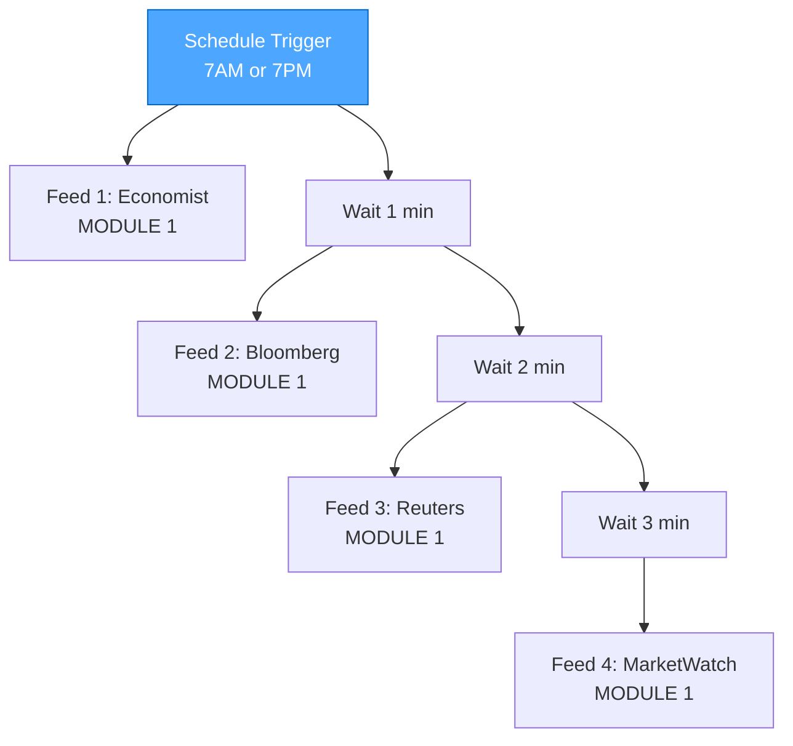
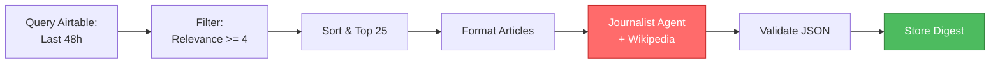
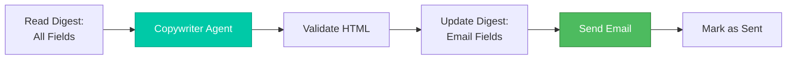
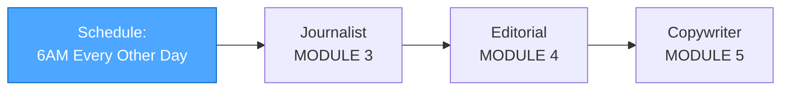

# BUILD Mode Implementation Plan - CREATIVE PHASE

**Created:** October 9, 2025  
**Mode:** CREATIVE (Planning BUILD Implementation)  
**Approach:** Modular, Small Steps, No Feature Creep  
**Philosophy:** Build one workflow, test it, duplicate it, repeat

---

## 🎯 Core Implementation Strategy

### The Modular Approach

**Build in small, testable modules:**

1. ✅ One workflow at a time
2. ✅ Test thoroughly before moving on
3. ✅ Duplicate and adapt (not rebuild)
4. ✅ Each module is self-contained
5. ✅ No feature creep - stick to the plan

**Benefits:**

- Easier to debug (small, focused workflows)
- Faster validation (test one thing at a time)
- Less overwhelming (incremental progress)
- Reusable (duplicate working workflows)

---

## 📦 Module Breakdown

### MODULE 1: Single Feed Processor (FOUNDATION)

**Goal:** RSS → Scrape → Airtable for ONE feed  
**Time:** 6-8 hours  
**Complexity:** Medium


**What it does:**

1. Reads RSS feed (Economist only)
2. Checks if article already exists (URL hash)
3. Scrapes full article content (HTTP Request)
4. Processes through Desk Reporter (AI Agent)
5. Validates JSON output
6. Stores in Airtable Articles table

**Success criteria:**

- ✅ Can fetch Economist RSS
- ✅ Deduplication works (skips existing articles)
- ✅ Scraping retrieves full text (>100 chars)
- ✅ Desk Reporter returns valid JSON
- ✅ Article stored in Airtable with all fields

**Test with:** 5 Economist articles (varied topics)

---

### MODULE 2: Multi-Feed Orchestrator (EXPANSION)

**Goal:** Run Module 1 for all 4 feeds with stagger  
**Time:** 2-3 hours  
**Complexity:** Low



**What it does:**

1. Schedule trigger fires (7AM or 7PM)
2. Calls Feed 1 workflow (Economist)
3. Waits 1 minute
4. Calls Feed 2 workflow (Bloomberg)
5. Waits 1 minute
6. Calls Feed 3 workflow (Reuters)
7. Waits 1 minute
8. Calls Feed 4 workflow (MarketWatch)

**Implementation:**

- Duplicate Module 1 workflow 4 times
- Change RSS URL for each
- Main orchestrator calls sub-workflows with stagger

**Success criteria:**

- ✅ All 4 feeds process successfully
- ✅ Staggered execution (1-min delays)
- ✅ No rate limiting issues
- ✅ All articles stored in Airtable

**Test with:** Live RSS feeds, one complete run

---

### MODULE 3: Journalist Agent (SYNTHESIS)

**Goal:** Read Airtable → Synthesize → Store  
**Time:** 4-5 hours  
**Complexity:** Medium



**What it does:**

1. Queries Airtable for articles from past 48 hours
2. Filters by relevance >= 4
3. Sorts by relevance + recency
4. Takes top 25 articles
5. Formats articles for LLM (JavaScript function)
6. Processes through Journalist Agent (with Wikipedia tool)
7. Validates JSON output
8. Creates new record in Digests table (Journalist fields only)

**Success criteria:**

- ✅ Query returns correct articles (48-hour window)
- ✅ Filtering works (only relevance >= 4)
- ✅ Journalist produces valid synthesis
- ✅ Wikipedia tool accessible (if needed)
- ✅ Digest record created in Airtable

**Test with:** Manually populate Airtable with 30 test articles

---

### MODULE 4: Editorial Agent (CHARACTER)

**Goal:** Add perspective and voice  
**Time:** 3-4 hours  
**Complexity:** Medium


**What it does:**

1. Reads Journalist output from Digests table
2. Processes through Editorial Agent
3. Validates JSON output (voice guide adherence)
4. Updates Digest record with Editorial fields

**Success criteria:**

- ✅ Editorial receives Journalist JSON
- ✅ Northern Irish voice is present
- ✅ Tone adapts to market mood
- ✅ Colorful language appears appropriately
- ✅ Digest updated with Editorial fields

**Test with:** Sample Journalist output (create realistic example)

---

### MODULE 5: Copywriter Agent (POLISH)

**Goal:** Format to HTML and send email  
**Time:** 3-4 hours  
**Complexity:** Medium



**What it does:**

1. Reads complete Digest (Journalist + Editorial)
2. Processes through Copywriter Agent
3. Validates HTML output
4. Updates Digest with email fields
5. Sends HTML email (n8n Send Email node)
6. Marks Digest as "sent"

**Success criteria:**

- ✅ Copywriter receives both JSON inputs
- ✅ HTML email is valid and well-formatted
- ✅ Subject line is edgy (matches voice)
- ✅ Email sends successfully
- ✅ Renders correctly in email client

**Test with:** Sample Editorial output, send to test email

---

### MODULE 6: Digest Orchestrator (INTEGRATION)

**Goal:** Chain all digest agents (6AM trigger)  
**Time:** 2-3 hours  
**Complexity:** Low



**What it does:**

1. Triggers at 6AM on digest days (Mon/Wed/Fri or Tue/Thu/Sat)
2. Calls Journalist workflow
3. Calls Editorial workflow
4. Calls Copywriter workflow
5. Email sent automatically

**Success criteria:**

- ✅ Schedule triggers on correct days
- ✅ All agents run in sequence
- ✅ Email delivered successfully
- ✅ Digest marked complete

**Test with:** Manual trigger, full 48-hour cycle simulation

---

## 🗓️ Implementation Timeline

### Week 1: Foundation Modules

**Day 1-2: Setup (6 hours)**

- Create Airtable tables (Articles + Digests)
- Set up API connection in n8n
- Create 10 sample articles for testing
- Verify Ollama models available

**Day 3-4: Module 1 (8 hours)**

- Build single feed processor (Economist)
- Test RSS fetch → Scrape → Desk Reporter → Airtable
- Debug and refine
- Document any issues

**Day 5: Module 2 (3 hours)**

- Duplicate Module 1 for other feeds
- Build orchestrator with stagger
- Test all 4 feeds
- Validate deduplication

**WEEK 1 GOAL:** ✅ All feeds processing into Airtable

---

### Week 2: Agent Integration

**Day 6-7: Module 3 (5 hours)**

- Build Journalist workflow
- Test with sample 25-article batch
- Test Wikipedia tool integration
- Validate JSON output

**Day 8-9: Module 4 (4 hours)**

- Build Editorial workflow
- Test Northern Irish voice
- Validate tone adaptation
- Check colorful language output

**Day 10: Module 5 (4 hours)**

- Build Copywriter workflow
- Test HTML generation
- Send test emails
- Validate rendering

**WEEK 2 GOAL:** ✅ All agents working independently

---

### Week 3: Integration & Testing

**Day 11-12: Module 6 (3 hours)**

- Build digest orchestrator
- Chain all agents
- Test end-to-end flow

**Day 13-14: Testing (8 hours)**

- Run complete 48-hour cycle simulation
- Test with live RSS feeds
- Validate email output quality
- Performance optimization

**Day 15: Go Live (2 hours)**

- Set production schedule
- Configure monitoring
- Send first real digest
- Monitor and adjust

**WEEK 3 GOAL:** ✅ Production-ready system

---

## 🎯 MODULE 1 Detailed Breakdown (Start Here!)

### Sub-Task 1.1: Airtable Setup (1 hour)

**Create Articles Table:**

Required fields (minimum viable):

1. ArticleID (Auto Number)
2. URL (URL, unique)
3. URLHash (Single Line Text)
4. Source (Single Select: economist, bloomberg, reuters, marketwatch)
5. PubDate (Date)
6. FetchedAt (Date)
7. ProcessedAt (Date)
8. Headline (Single Line Text)
9. KeyFacts (Long Text - JSON)
10. RelevanceScore (Number)
11. FullText (Long Text)
12. ProcessedBy (Single Line Text)
13. ScrapingStatus (Single Select: success, failed, fallback)

**Start simple:** Add other fields as needed during testing

**Test:** Create 1 record manually, verify all fields work

---

### Sub-Task 1.2: n8n Workflow - RSS Fetch (30 min)

**Nodes:**

1. **Schedule Trigger** (manual for testing)
2. **RSS Feed Read** (Economist URL)

**Configuration:**

```javascript
RSS Feed Read Node:
- URL: https://www.economist.com/the-world-in-brief/rss.xml
- Max Items: 10 (for testing)
- Options: Include full content
```

**Test:** Run manually, inspect output (should see titles + URLs)

**Success:** ✅ Returns 5-10 articles with URLs

---

### Sub-Task 1.3: Generate Hashes (15 min)

**Node:** Function Node

**Code:**

```javascript
const crypto = require("crypto");

return items.map((item) => {
  const url = item.json.link || item.json.url;
  const urlHash = crypto.createHash("md5").update(url).digest("hex");

  const titleClean = (item.json.title || "")
    .toLowerCase()
    .replace(/[^\w\s]/g, "")
    .replace(/\s+/g, " ")
    .trim();

  return {
    ...item.json,
    url: url,
    urlHash: urlHash,
    titleClean: titleClean,
    source: "economist",
    fetchedAt: new Date().toISOString(),
  };
});
```

**Test:** Run, verify urlHash and titleClean are populated

**Success:** ✅ All articles have hash values

---

### Sub-Task 1.4: Deduplication Check (30 min)

**Nodes:**

1. **Airtable** (Search)
2. **IF** (Check if exists)

**Airtable Node:**

```javascript
Operation: Search
Table: Articles
Filter: {URLHash} = '{{ $json.urlHash }}'
```

**IF Node:**

```javascript
Conditions:
- If search returns 0 results → Continue
- If search returns > 0 results → Skip (already exists)
```

**Test:**

1. Run with new article → should continue
2. Run same article again → should skip

**Success:** ✅ Duplicates are skipped

---

### Sub-Task 1.5: Content Scraping (2 hours)

**Nodes:**

1. **HTTP Request** (fetch article)
2. **HTML Extract** (extract content)
3. **Function** (clean text)

**HTTP Request Node:**

```javascript
Method: GET
URL: {{ $json.url }}
Options:
  - Timeout: 10000ms
  - Follow Redirects: true
  - Headers:
      User-Agent: Mozilla/5.0 (compatible; FineOpinions/1.0)
```

**HTML Extract Node:**

```javascript
Selectors:
- article (tag)
- .article-content (class)
- main (tag)
- #article-body (id)

Extract: text
```

**Function Node (Clean):**

```javascript
const html = $json.article || "";

// Remove scripts, styles, ads
let cleanText = html
  .replace(/<script\b[^<]*(?:(?!<\/script>)<[^<]*)*<\/script>/gi, "")
  .replace(/<style\b[^<]*(?:(?!<\/style>)<[^<]*)*<\/style>/gi, "")
  .replace(/<[^>]+>/g, " ")
  .replace(/\s+/g, " ")
  .trim();

const wordCount = cleanText.split(/\s+/).length;

return {
  ...items[0].json,
  fullText: cleanText,
  wordCount: wordCount,
  scrapingStatus: cleanText.length >= 100 ? "success" : "failed",
};
```

**Test:** Try scraping 3-5 Economist articles

**Success:** ✅ Retrieves full article text (>500 words typically)

**If fails:** Document which selectors work for Economist

---

### Sub-Task 1.6: Desk Reporter Integration (2 hours)

**Nodes:**

1. **Function** (model selection)
2. **AI Agent** (Desk Reporter)
3. **Function** (parse & validate JSON)

**Model Selection Function:**

```javascript
const wordCount = $json.wordCount || 0;
const model = wordCount >= 1000 ? "qwen2.5:7b" : "llama3.2:3b";

return {
  ...items[0].json,
  selectedModel: model,
};
```

**AI Agent Node:**

- **Model:** `{{ $json.selectedModel }}`
- **System Message:** (Copy from `/prompts/desk_reporter.md` - System Message Field section)
- **User Message:** (Copy from `/prompts/desk_reporter.md` - User Message Field section)

**Validation Function:**

````javascript
let analysis;
try {
  // Parse AI output (remove markdown code blocks if present)
  let output = $json.output || $json.text;
  output = output
    .replace(/```json\n?/g, "")
    .replace(/```\n?/g, "")
    .trim();

  analysis = JSON.parse(output);

  // Validate required fields
  const isValid =
    analysis.headline &&
    analysis.keyFacts &&
    Array.isArray(analysis.keyFacts) &&
    analysis.keyFacts.length >= 3 &&
    analysis.relevanceScore >= 1 &&
    analysis.relevanceScore <= 10 &&
    analysis.mainTopic;

  return {
    ...items[0].json,
    ...analysis,
    validationStatus: isValid ? "valid" : "invalid",
    processedAt: new Date().toISOString(),
  };
} catch (e) {
  return {
    ...items[0].json,
    validationStatus: "error",
    validationError: e.message,
    // Use minimal fallback
    headline: items[0].json.title,
    relevanceScore: 0,
    mainTopic: "Unknown",
  };
}
````

**Test:** Process 5 sample articles, validate JSON

**Success:** ✅ Valid JSON with all required fields

---

### Sub-Task 1.7: Airtable Storage (1 hour)

**Node:** Airtable (Create)

**Configuration:**

```javascript
Operation: Create;
Table: Articles;

Fields: URL: {
  {
    $json.url;
  }
}
URLHash: {
  {
    $json.urlHash;
  }
}
TitleClean: {
  {
    $json.titleClean;
  }
}
Source: {
  {
    $json.source;
  }
}
PubDate: {
  {
    $json.pubDate;
  }
}
FetchedAt: {
  {
    $json.fetchedAt;
  }
}
ProcessedAt: {
  {
    $json.processedAt;
  }
}

Headline: {
  {
    $json.headline;
  }
}
KeyFacts: {
  {
    JSON.stringify($json.keyFacts);
  }
}
MainTopic: {
  {
    $json.mainTopic;
  }
}
SubTopics: {
  {
    JSON.stringify($json.subTopics);
  }
}
EntitiesJSON: {
  {
    JSON.stringify($json.entities);
  }
}
DataPoints: {
  {
    JSON.stringify($json.dataPoints);
  }
}
SentimentJSON: {
  {
    JSON.stringify($json.sentiment);
  }
}
RelevanceScore: {
  {
    $json.relevanceScore;
  }
}
MarketImpact: {
  {
    $json.marketImpact;
  }
}
Urgency: {
  {
    $json.urgency;
  }
}
Tags: {
  {
    $json.tags;
  }
}

FullText: {
  {
    $json.fullText;
  }
}
WordCount: {
  {
    $json.wordCount;
  }
}
ProcessedBy: {
  {
    $json.selectedModel;
  }
}
ScrapingStatus: {
  {
    $json.scrapingStatus;
  }
}
```

**Test:** Run complete Module 1, check Airtable

**Success:** ✅ Article appears in Airtable with all fields

---

### MODULE 1 Complete Workflow Structure

```
[Schedule Trigger (Manual for testing)]
    ↓
[RSS Feed Read: Economist]
    ↓
[Function: Generate Hashes]
    ↓
[Airtable: Search by URLHash]
    ↓
[IF: Article Exists?]
    ├── Yes → [Stop This Branch]
    └── No → [HTTP Request: Fetch Article]
                ↓
            [HTML Extract: Get Content]
                ↓
            [Function: Clean Text]
                ↓
            [IF: Content Valid?]
                ├── No → [Function: Use RSS Description as Fallback]
                └── Yes → [Continue]
                            ↓
                        [Function: Select Model]
                            ↓
                        [AI Agent: Desk Reporter]
                            ↓
                        [Function: Parse & Validate JSON]
                            ↓
                        [IF: Relevance >= 4?]
                            ├── Yes → [Airtable: Create Record]
                            └── No → [Airtable: Create with ExclusionReason]
                                        ↓
                                    [End]
```

**Total Nodes:** ~15 nodes  
**Estimated Time:** 6-8 hours to build and test

---

## 🎯 Build Order (Strict Sequence)

### Phase 1: Foundation (Week 1)

1. ✅ **Setup** (Day 1) - Airtable + Sample Data
2. ✅ **Module 1** (Day 2-3) - Single feed processor
3. ✅ **Module 2** (Day 4) - Multi-feed orchestrator
4. ✅ **Test** (Day 5) - Validate all feeds work

**Checkpoint:** All RSS feeds processing into Airtable successfully

---

### Phase 2: Agents (Week 2)

5. ✅ **Module 3** (Day 6-7) - Journalist agent
6. ✅ **Module 4** (Day 8-9) - Editorial agent
7. ✅ **Module 5** (Day 10) - Copywriter agent

**Checkpoint:** All agents tested independently

---

### Phase 3: Integration (Week 3)

8. ✅ **Module 6** (Day 11) - Digest orchestrator
9. ✅ **Testing** (Day 12-14) - End-to-end validation
10. ✅ **Go Live** (Day 15) - Production deployment

**Checkpoint:** First real digest sent successfully

---

## ⚠️ Anti-Feature-Creep Rules

### NOT Building Yet

❌ Weekly report agent (future)  
❌ Data retention automation (future)  
❌ Browser automation (only if HTTP fails)  
❌ Advanced error handling (basic retry only)  
❌ Monitoring dashboard (future)  
❌ Multiple recipients (future)  
❌ Custom styling per user (future)

### ONLY Building

✅ RSS fetch (4 feeds)  
✅ Content scraping (HTTP only, fallback to RSS description)  
✅ Desk Reporter (basic validation)  
✅ Deduplication (URL hash only for now)  
✅ Journalist (with Wikipedia)  
✅ Editorial (Northern Irish voice)  
✅ Copywriter (HTML email)  
✅ Email delivery (single recipient)

**Rule:** If it's not in the "ONLY Building" list, DON'T BUILD IT YET.

---

## 📋 Success Criteria Per Module

### Module 1 Success

- [ ] Economist RSS fetches successfully (>90% success rate)
- [ ] Deduplication works (skips existing articles)
- [ ] Scraping retrieves full text (>500 words for Economist)
- [ ] Desk Reporter returns valid JSON (100% of test articles)
- [ ] Articles stored in Airtable with all required fields
- [ ] Can process 5-10 articles in <5 minutes

### Module 2 Success

- [ ] All 4 feeds process successfully
- [ ] Staggered execution works (1-min delays)
- [ ] No rate limiting or blocking
- [ ] 30-50 articles processed per cycle
- [ ] All stored in Airtable correctly

### Module 3 Success

- [ ] Queries correct articles (48-hour window)
- [ ] Filters by relevance >= 4
- [ ] Journalist produces coherent synthesis
- [ ] Wikipedia tool works when invoked
- [ ] Output is 500-700 words of facts
- [ ] Valid JSON stored in Digests table

### Module 4 Success

- [ ] Editorial adds Northern Irish voice
- [ ] Tone adapts to market mood
- [ ] Colorful language present appropriately
- [ ] Analysis provides real perspective
- [ ] Questions are thought-provoking
- [ ] Output is engaging and fun

### Module 5 Success

- [ ] HTML email is valid and renders properly
- [ ] Subject line is edgy and under 60 chars
- [ ] Magazine-style structure flows well
- [ ] Word count is 750-1000 words
- [ ] Email delivers successfully
- [ ] Renders in Gmail, Outlook, Apple Mail

### Module 6 Success

- [ ] Triggers on correct schedule (every other day, 6AM)
- [ ] All agents run in sequence
- [ ] Complete digest generated in <20 minutes
- [ ] Email delivered successfully
- [ ] Digest marked as "sent" in Airtable

---

## 🛠️ Testing Strategy

### Unit Testing (Per Module)

- Test each module in isolation
- Use sample data
- Validate outputs manually
- Document any issues

### Integration Testing (After Each Phase)

- Test modules working together
- Use real RSS feeds
- Validate data flow
- Check for errors

### End-to-End Testing (Final)

- Run complete 48-hour cycle
- Monitor all steps
- Validate final email quality
- Check performance metrics

---

## 📊 Progress Tracking

### Daily Checklist Template

**Date:** \***\*\_\_\_\*\***  
**Module:** \***\*\_\_\_\*\***  
**Time Spent:** \***\*\_\_\_\*\***

**Completed:**

- [ ] Task 1
- [ ] Task 2
- [ ] Task 3

**Issues Encountered:**

- Issue 1: \***\*\_\_\_\*\***
- Resolution: \***\*\_\_\_\*\***

**Next Session:**

- Start with: \***\*\_\_\_\*\***

---

## 🎯 Key Principles for BUILD Mode

1. **One module at a time** - Don't start Module 2 until Module 1 works
2. **Test thoroughly** - Every module gets validated before moving on
3. **Document issues** - Keep notes on what works/doesn't per source
4. **No feature creep** - Stick to the modules defined here
5. **Ask questions** - If something's unclear, pause and clarify
6. **Iterate** - Refine prompts based on actual outputs

---

**Plan Status:** ✅ COMPLETE  
**Ready to Begin:** MODULE 1 - Single Feed Processor  
**Start With:** Airtable setup (Sub-Task 1.1)  
**Estimated Time to First Working Module:** 6-8 hours

---

**This is the plan. Small steps. Test thoroughly. Build it right.** 🔨
