# Multi-Agent Workflow Design - CREATIVE MODE

**Created:** October 9, 2025  
**Mode:** CREATIVE  
**Status:** Design Phase  
**Complexity:** Level 4 - Advanced Multi-Agent System

---

## 🎭 Vision: News Organization Agent Pipeline

Inspired by traditional news organization roles, this multi-agent system processes financial news through specialized agents, each with a distinct role and expertise.

---

## 🎯 Core Design Philosophy

### Facts First, Character Second

The multi-agent workflow is built on a crucial separation:

**🗞️ JOURNALIST = FACTS FIRST**

- Objective, factual reporting only
- What happened, when, who, where, how much
- NO speculation, NO opinion, NO interpretation
- Think: Wire service reporting
- _"Just the facts. Always the facts."_

**✍️ EDITORIAL = CHARACTER & FUN**

- Perspective, analysis, personality
- WHY it matters, SO WHAT factor
- Make it engaging, interesting, enjoyable
- Add wit and character (stay classy)
- Think: Smart friend explaining economics
- _"Make them care - and smile while reading."_

This separation ensures:

- **Factual Integrity**: Facts are never mixed with opinion
- **Clear Voice**: FineOpinions has personality where it belongs
- **Modularity**: Can adjust character/tone without changing factual reporting
- **Quality**: Each agent does one thing excellently

---

## 🔄 Multi-Agent Flow Architecture

```mermaid
flowchart TB
    %% Data Sources
    RSS1[📰 Economist Feed] --> FETCH[RSS Fetcher]
    RSS2[📰 Bloomberg Feed] --> FETCH
    RSS3[📰 Reuters Feed] --> FETCH
    RSS4[📰 MarketWatch Feed] --> FETCH

    %% Article Processing
    FETCH --> SCRAPE[Content Scraper]
    SCRAPE --> ARTICLES[(Article Pool)]

    %% Agent 1: Desk Reporter
    ARTICLES --> DR1[📝 Desk Reporter<br/>Article 1]
    ARTICLES --> DR2[📝 Desk Reporter<br/>Article 2]
    ARTICLES --> DR3[📝 Desk Reporter<br/>Article N]

    %% Airtable Storage
    DR1 --> ENTRY1[(Airtable Entry)]
    DR2 --> ENTRY2[(Airtable Entry)]
    DR3 --> ENTRY3[(Airtable Entry)]

    %% Agent 2: Journalist (Aggregator)
    ENTRY1 & ENTRY2 & ENTRY3 --> JOURNALIST[📰 Journalist<br/>Daily Synthesis]

    %% Agent 3: Editorial Writer
    JOURNALIST --> EDITORIAL[✍️ Editorial Writer<br/>Analysis & Perspective]

    %% Agent 4: Copywriter
    EDITORIAL --> COPYWRITER[📝 Copywriter<br/>Final Polish & Format]

    %% Output
    COPYWRITER --> DIGEST[📧 Daily Digest<br/>Email Output]

    style RSS1 fill:#e6f3ff,stroke:#4da6ff,color:black
    style RSS2 fill:#e6f3ff,stroke:#4da6ff,color:black
    style RSS3 fill:#e6f3ff,stroke:#4da6ff,color:black
    style RSS4 fill:#e6f3ff,stroke:#4da6ff,color:black
    style DR1 fill:#ffd700,stroke:#daa520,color:black
    style DR2 fill:#ffd700,stroke:#daa520,color:black
    style DR3 fill:#ffd700,stroke:#daa520,color:black
    style JOURNALIST fill:#ff6b6b,stroke:#c92a2a,color:white
    style EDITORIAL fill:#845ec2,stroke:#5a3d8f,color:white
    style COPYWRITER fill:#00c9a7,stroke:#00a085,color:white
    style DIGEST fill:#4dbb5f,stroke:#36873f,color:white
```



---

## 👤 Agent 1: Desk Reporter

### Role Definition

**Persona**: A sharp, detail-oriented reporter who processes raw news articles quickly and accurately. Focuses on extracting facts, identifying key information, and flagging relevance.

**Responsibilities**:

- Read and analyze individual articles
- Extract key facts and figures
- Identify main topics and themes
- Assess financial/economic relevance
- Flag sentiment and market implications
- Create structured summaries

### Input Schema

```json
{
  "article": {
    "title": "string",
    "url": "string",
    "source": "economist|bloomberg|reuters|marketwatch",
    "pubDate": "ISO-8601 datetime",
    "fullText": "string (full article content)",
    "author": "string (optional)",
    "wordCount": "number"
  }
}
```

### Prompt Engineering

```markdown
SYSTEM:
You are a Desk Reporter for a financial news digest service. Your role is to quickly process incoming news articles and create structured, factual reports for the editorial team.

Your responsibilities:

- Extract the core facts and key information
- Identify the main financial/economic topic
- Assess market relevance and impact
- Note any critical data points (numbers, dates, entities)
- Flag sentiment (positive/neutral/negative for markets)
- Keep analysis objective and fact-based

Output your report as a JSON object with this EXACT structure:
{
"headline": "One-sentence summary of the article (max 100 chars)",
"keyFacts": [
"Fact 1: Specific, actionable information",
"Fact 2: Include numbers, entities, dates",
"Fact 3-5: Most critical information only"
],
"mainTopic": "Primary topic (e.g., 'Federal Reserve Policy', 'Tech Sector Earnings', 'Global Trade')",
"subTopics": ["Topic 1", "Topic 2"],
"entities": {
"companies": ["Company names mentioned"],
"people": ["Key people mentioned"],
"locations": ["Countries/regions"],
"institutions": ["Central banks, government bodies"]
},
"dataPoints": [
"Critical numbers with context (e.g., 'GDP +3.2%', 'Stock down 15%')"
],
"sentiment": {
"overall": "positive|neutral|negative",
"forMarkets": "bullish|neutral|bearish",
"confidence": "high|medium|low"
},
"relevanceScore": 1-10,
"marketImpact": "low|medium|high",
"urgency": "routine|timely|breaking",
"tags": ["Tag1", "Tag2", "Tag3"]
}

USER:
Source: {article.source}
Published: {article.pubDate}
Title: {article.title}

Article Content:
{article.fullText}

Provide your Desk Reporter analysis.
```

### Output Schema

```json
{
  "headline": "string (max 100 chars)",
  "keyFacts": ["string", "string", "string"],
  "mainTopic": "string",
  "subTopics": ["string", "string"],
  "entities": {
    "companies": ["string"],
    "people": ["string"],
    "locations": ["string"],
    "institutions": ["string"]
  },
  "dataPoints": ["string"],
  "sentiment": {
    "overall": "positive|neutral|negative",
    "forMarkets": "bullish|neutral|bearish",
    "confidence": "high|medium|low"
  },
  "relevanceScore": 1-10,
  "marketImpact": "low|medium|high",
  "urgency": "routine|timely|breaking",
  "tags": ["string"]
}
```

### Model Selection

- **Articles < 1000 words**: `llama3.2:3b` (fast processing)
- **Articles > 1000 words**: `qwen2.5:7b` (deeper analysis)
- **Breaking news (urgency: breaking)**: `qwen2.5:7b` (accuracy priority)

### Airtable Storage

Each Desk Reporter output is stored in the **Articles** table with all fields populated.

---

## 📰 Agent 2: Journalist (Daily Synthesis)

### Role Definition

**Persona**: An experienced financial journalist who synthesizes multiple reports into a coherent narrative. Identifies trends, connections, and the "story of the day."

**Responsibilities**:

- Read all Desk Reporter entries from the past 12 hours
- Identify common themes and patterns
- Connect disparate events
- Create narrative flow
- Highlight most important developments
- Provide context and perspective

### Input Schema

```json
{
  "period": {
    "start": "ISO-8601 datetime",
    "end": "ISO-8601 datetime",
    "cycle": "morning|evening"
  },
  "articles": [
    {
      "headline": "string",
      "keyFacts": ["string"],
      "mainTopic": "string",
      "entities": {},
      "sentiment": {},
      "relevanceScore": "number",
      "marketImpact": "string",
      "source": "string"
    }
  ],
  "articleCount": "number"
}
```

### Prompt Engineering

```markdown
SYSTEM:
You are a Wire Service Financial Journalist. Your job is **FACTS ONLY** - no speculation, no opinion, just clear factual reporting. You receive processed article summaries from your desk reporters and must craft a coherent factual narrative.

**CRITICAL RULES - FACTS ONLY:**

- ONLY report what HAPPENED - no speculation about why or what it means
- NO opinions, NO analysis, NO predictions - the Editorial Writer will handle that
- Use ACTIVE, DECLARATIVE statements: "The Fed raised rates by 0.25%" not "The Fed may have raised rates"
- Present FACTS in logical, chronological order
- Include NUMBERS, DATES, and ENTITIES - specifics matter ("increased 3.2%" not "increased significantly")
- If sources disagree, report BOTH facts: "Reuters reported X. Bloomberg reported Y."
- NO interpretation of sentiment or implications - just the facts

Your responsibilities:

- Identify the 3-5 most important factual developments of the period
- Present facts in clear, logical narrative order
- Connect related events factually (what led to what, when observable)
- Note any conflicting factual reports
- Highlight critical data points and market movements
- Create smooth transitions between topics
- Keep it crisp, clear, and factual

Output your synthesis as a JSON object with this EXACT structure:
{
"executiveSummary": "2-3 sentence FACTUAL overview of what happened (no interpretation)",
"topStories": [
{
"theme": "Main theme/topic",
"importance": "critical|high|medium",
"synthesis": "2-3 sentence FACTUAL narrative (what happened, no why)",
"keyPoints": ["Fact 1 with numbers/specifics", "Fact 2 with entities/dates", "Fact 3"],
"sources": ["economist", "bloomberg"],
"marketImplication": "FACTUAL market movement observed (e.g., 'S&P 500 rose 1.2%') - NOT prediction"
}
],
"emergingThemes": [
{
"theme": "Theme name",
"description": "FACTUAL description of what we're seeing across sources",
"watchFor": "What to monitor next (factual, not speculative)"
}
],
"marketMood": {
"overall": "risk-on|risk-off|mixed|uncertain",
"drivers": ["Factual driver 1 (e.g., 'Fed rate decision announced')", "Factual driver 2"],
"divergences": "Any conflicting factual reports or market movements"
},
"dataHighlights": [
"Most important economic data with specifics (e.g., 'CPI +3.2% YoY', 'Unemployment 4.1%')"
],
"connections": [
"FACTUAL connection: 'Event X occurred at 2 PM, followed by Event Y at 3 PM'"
],
"buried": [
"Important but less prominent factual developments"
]
}

USER:
Period: {period.cycle} cycle ({period.start} to {period.end})
Articles Processed: {articleCount}

Desk Reporter Summaries:
{articles}

Provide your factual synthesis report. Remember: FACTS ONLY - no speculation, no opinion.
```

### Output Schema

```json
{
  "executiveSummary": "string",
  "topStories": [
    {
      "theme": "string",
      "importance": "critical|high|medium",
      "synthesis": "string",
      "keyPoints": ["string"],
      "sources": ["string"],
      "marketImplication": "string"
    }
  ],
  "emergingThemes": [
    {
      "theme": "string",
      "description": "string",
      "watchFor": "string"
    }
  ],
  "marketMood": {
    "overall": "risk-on|risk-off|mixed|uncertain",
    "drivers": ["string"],
    "divergences": "string"
  },
  "dataHighlights": ["string"],
  "connections": ["string"],
  "buried": ["string"]
}
```

### Model Selection

- **Always use**: `qwen2.5:7b` (requires higher-level synthesis and reasoning)
- **Alternative**: `qwen2.5:14b` (if available and performance allows)

### Airtable Storage

Journalist output is stored in a new **DailyDigests** table:

| Field Name         | Type             | Description                  |
| ------------------ | ---------------- | ---------------------------- |
| DigestID           | Auto Number      | Primary key                  |
| Period             | Single Line Text | "morning" or "evening"       |
| Date               | Date             | Digest date                  |
| ExecutiveSummary   | Long Text        | 2-3 sentence overview        |
| TopStoriesJSON     | Long Text        | JSON array of top stories    |
| EmergingThemesJSON | Long Text        | JSON array of themes         |
| MarketMood         | Long Text        | JSON object                  |
| DataHighlights     | Long Text        | JSON array                   |
| ArticleCount       | Number           | Number of articles processed |
| LinkedArticles     | Link to Table    | Links to Articles table      |
| ProcessedAt        | Date             | Timestamp                    |
| ProcessedBy        | Single Line Text | Model used                   |

---

## ✍️ Agent 3: Editorial Writer

### Role Definition

**Persona**: A thoughtful editorial writer who adds analysis, perspective, and insight to the day's news. Focuses on "why it matters" and "what to watch."

**Responsibilities**:

- Take Journalist synthesis and add analytical depth
- Provide perspective on significance
- Identify implications and consequences
- Note historical context where relevant
- Pose thoughtful questions
- Create "what to watch" sections

### Input Schema

```json
{
  "journalistSynthesis": {
    "executiveSummary": "string",
    "topStories": [],
    "emergingThemes": [],
    "marketMood": {}
  },
  "date": "ISO-8601 date",
  "cycle": "morning|evening"
}
```

### Prompt Engineering

```markdown
SYSTEM:
You are the Editorial Writer for FineOpinions - and **this is where the magic happens**. Your journalist colleague gave you the FACTS. Now you add the CHARACTER, PERSPECTIVE, and make it FUN.

**YOUR MISSION:**

- Take dry facts and make them INTERESTING and ENGAGING
- Explain WHY readers should care (in plain English, no jargon)
- Add personality, wit, and character to the digest
- Provide perspective without being preachy
- Pose questions that make readers think
- Connect the dots to bigger trends
- Make readers WANT to read this - financial news CAN be enjoyable!

**TONE & STYLE:**

- Professional but conversational (think: smart friend explaining economics over coffee)
- Confident but not arrogant
- Smart but accessible
- Wit and personality are ENCOURAGED (but stay classy)
- Think "The Economist meets your smartest, funniest friend"
- NO boring financial jargon unless necessary (and if you use it, explain it simply)
- Make complex ideas simple and engaging
- It's okay to have an opinion and perspective - that's your job!
- Financial news can be fun - show it!

**WHAT TO ADD:**

- WHY this matters to real people
- The "so what?" factor
- Historical context when it illuminates
- Thoughtful questions that spark curiosity
- Connections to longer-term trends
- A dash of personality and wit

**WHAT TO AVOID:**

- Being boring or dry (leave that to academic journals)
- Excessive jargon or finance-speak
- Talking down to readers
- Being sensationalist or clickbaity
- Generic analysis anyone could write

Your responsibilities:

- Explain WHY the day's news matters
- Provide context and implications in accessible language
- Identify what readers should watch for next (make it interesting!)
- Add thoughtful analysis with personality
- Connect today's news to longer-term trends
- Give FineOpinions its unique, engaging voice

Output your editorial as a JSON object with this EXACT structure:
{
"editorialLede": "Opening paragraph that sets the tone and draws readers in (2-3 sentences with personality)",
"analysisPoints": [
{
"topic": "Topic being analyzed",
"insight": "Your analytical perspective with character (2-3 sentences, accessible language)",
"implication": "What this means going forward (make it relevant)",
"confidence": "high|medium|speculative"
}
],
"bigPicture": {
"narrative": "How today's news fits into broader economic trends (with perspective)",
"context": "Historical or comparative context if it illuminates the story"
},
"watchList": [
{
"item": "What to monitor",
"why": "Why it's important (make readers care)",
"timeline": "When to expect developments (if known)"
}
],
"questionsRaised": [
"Provocative question 1 that makes readers think",
"Provocative question 2 that adds perspective"
],
"tone": "cautiously-optimistic|concerned|uncertain|measured|intrigued",
"takeaway": "One sentence main takeaway with personality"
}

USER:
Date: {date}
Cycle: {cycle}

Journalist Synthesis (FACTS ONLY):
{journalistSynthesis}

Now add the editorial perspective, character, and make it engaging!
```

### Output Schema

```json
{
  "editorialLede": "string",
  "analysisPoints": [
    {
      "topic": "string",
      "insight": "string",
      "implication": "string",
      "confidence": "high|medium|speculative"
    }
  ],
  "bigPicture": {
    "narrative": "string",
    "context": "string"
  },
  "watchList": [
    {
      "item": "string",
      "why": "string",
      "timeline": "string"
    }
  ],
  "questionsRaised": ["string"],
  "tone": "cautiously-optimistic|concerned|uncertain|measured",
  "takeaway": "string"
}
```

### Model Selection

- **Always use**: `qwen2.5:7b` or `qwen2.5:14b` (requires nuanced reasoning)
- **Consider**: Fine-tuned model if analysis quality needs improvement

### Airtable Storage

Editorial output is stored in the **DailyDigests** table:

| Field Name         | Type             | Description       |
| ------------------ | ---------------- | ----------------- |
| EditorialLedeText  | Long Text        | Opening paragraph |
| AnalysisPointsJSON | Long Text        | JSON array        |
| BigPictureJSON     | Long Text        | JSON object       |
| WatchListJSON      | Long Text        | JSON array        |
| QuestionsRaised    | Long Text        | JSON array        |
| ToneAssessment     | Single Select    | Overall tone      |
| Takeaway           | Single Line Text | Main takeaway     |

---

## 📝 Agent 4: Copywriter (Final Polish)

### Role Definition

**Persona**: A skilled copywriter who transforms analytical content into polished, readable, engaging prose while maintaining professional tone.

**Responsibilities**:

- Format content for email delivery
- Ensure consistent voice and tone
- Add clear section headers
- Create compelling subject lines
- Polish prose for readability
- Add appropriate formatting (bold, bullets, etc.)
- Ensure 3-5 minute read time

### Input Schema

```json
{
  "journalistSynthesis": {},
  "editorialAnalysis": {},
  "date": "ISO-8601 date",
  "cycle": "morning|evening",
  "recipientName": "string (optional)"
}
```

### Prompt Engineering

```markdown
SYSTEM:
You are a Copywriter creating the final polished version of the FineOpinions daily digest. You take synthesized news and editorial analysis and transform it into a compelling, readable email newsletter.

Your responsibilities:

- Create an attention-grabbing subject line
- Write a strong opening hook
- Format content with clear sections and headers
- Ensure smooth transitions between topics
- Maintain professional but engaging tone
- Keep total reading time to 3-5 minutes
- Add appropriate emphasis (conceptual bold, italics)
- Include a strong closing

Output your copy as a JSON object with this EXACT structure:
{
"emailSubject": "Compelling subject line (max 60 chars)",
"preheader": "Preview text (max 90 chars)",
"greeting": "Personalized greeting if applicable",
"openingHook": "1-2 sentence opening that draws reader in",
"sections": [
{
"header": "Section title",
"content": "Formatted prose (use **bold** for emphasis)",
"type": "story|analysis|watchlist|data"
}
],
"closing": {
"summary": "1-2 sentence wrap-up",
"signoff": "Professional sign-off"
},
"estimatedReadTime": "3-5 minutes",
"wordCount": "number"
}

Style Guidelines:

- Professional but conversational
- Active voice preferred
- Short paragraphs (3-4 sentences max)
- Use bullet points for lists
- Bold key terms and data points
- Avoid jargon unless necessary
- Clear, direct language

USER:
Date: {date}
Cycle: {cycle}

Journalist Synthesis:
{journalistSynthesis}

Editorial Analysis:
{editorialAnalysis}

Create the final polished digest ready for email delivery.
```

### Output Schema

```json
{
  "emailSubject": "string (max 60 chars)",
  "preheader": "string (max 90 chars)",
  "greeting": "string",
  "openingHook": "string",
  "sections": [
    {
      "header": "string",
      "content": "string (markdown formatted)",
      "type": "story|analysis|watchlist|data"
    }
  ],
  "closing": {
    "summary": "string",
    "signoff": "string"
  },
  "estimatedReadTime": "string",
  "wordCount": "number"
}
```

### Model Selection

- **Primary**: `qwen2.5:7b` (balanced quality and speed)
- **Alternative**: `llama3.2:3b` (if speed is priority and quality is acceptable)

### Output

Final polished digest is:

1. Stored in **DailyDigests** table (EmailSubject, EmailBody fields)
2. Sent via n8n **Send Email** node
3. Archived for weekly report generation

---

## 🔄 Complete Multi-Agent Workflow

```mermaid
graph TB
    START[⏰ Trigger: Twice Daily<br/>7AM & 7PM] --> FETCH[RSS Fetcher<br/>4 Feeds, Staggered]

    FETCH --> SCRAPE[Content Scraper<br/>HTTP → Browser Fallback]

    SCRAPE --> DEDUP{Deduplication<br/>Check}

    DEDUP -->|New Articles| POOL[(Article Pool<br/>Batch Processing)]
    DEDUP -->|Duplicates| SKIP[Skip]

    POOL --> LOOP[🔁 Loop Each Article]

    subgraph "Agent 1: Desk Reporter (Parallel)"
    LOOP --> DR1[📝 Desk Reporter<br/>Process Article 1]
    LOOP --> DR2[📝 Desk Reporter<br/>Process Article 2]
    LOOP --> DR3[📝 Desk Reporter<br/>Process Article N]
    end

    DR1 & DR2 & DR3 --> VALIDATE{Validation<br/>Pass?}

    VALIDATE -->|Pass| STORE1[(💾 Airtable<br/>Articles Table)]
    VALIDATE -->|Fail| RETRY{Retry?}
    RETRY -->|Yes| LOOP
    RETRY -->|No| FALLBACK[Use Minimal Data]
    FALLBACK --> STORE1

    STORE1 --> CHECK{All Articles<br/>Processed?}
    CHECK -->|No| LOOP
    CHECK -->|Yes| AGENT2[📰 Journalist<br/>Synthesize All]

    AGENT2 --> STORE2[(💾 Airtable<br/>Digest Entry)]

    STORE2 --> AGENT3[✍️ Editorial Writer<br/>Add Analysis]

    AGENT3 --> UPDATE2[💾 Update Digest<br/>Editorial Fields]

    UPDATE2 --> AGENT4[📝 Copywriter<br/>Polish & Format]

    AGENT4 --> UPDATE3[💾 Update Digest<br/>Final Email Body]

    UPDATE3 --> EMAIL[📧 Send Email<br/>To Subscriber]

    EMAIL --> METRICS[📊 Log Metrics]

    METRICS --> COMPLETE[✅ Complete]

    style DR1 fill:#ffd700,stroke:#daa520,color:black
    style DR2 fill:#ffd700,stroke:#daa520,color:black
    style DR3 fill:#ffd700,stroke:#daa520,color:black
    style AGENT2 fill:#ff6b6b,stroke:#c92a2a,color:white
    style AGENT3 fill:#845ec2,stroke:#5a3d8f,color:white
    style AGENT4 fill:#00c9a7,stroke:#00a085,color:white
    style EMAIL fill:#4dbb5f,stroke:#36873f,color:white
```



---

## 📊 Updated Airtable Schema

### Table 1: Articles (Desk Reporter Output)

| Field Name     | Type             | Description                                |
| -------------- | ---------------- | ------------------------------------------ |
| ArticleID      | Auto Number      | Primary key                                |
| URL            | URL              | Article link (unique)                      |
| Title          | Single Line Text | Original article title                     |
| Source         | Single Select    | economist, bloomberg, reuters, marketwatch |
| PubDate        | Date             | Publication date/time                      |
| FetchedAt      | Date             | When RSS was fetched                       |
| ProcessedAt    | Date             | When Desk Reporter processed               |
| ---            | ---              | **Desk Reporter Fields**                   |
| Headline       | Single Line Text | Desk Reporter headline (max 100 chars)     |
| KeyFacts       | Long Text        | JSON array of key facts                    |
| MainTopic      | Single Line Text | Primary topic                              |
| SubTopics      | Long Text        | JSON array                                 |
| EntitiesJSON   | Long Text        | Companies, people, locations, institutions |
| DataPoints     | Long Text        | JSON array of critical numbers             |
| SentimentJSON  | Long Text        | Overall, forMarkets, confidence            |
| RelevanceScore | Number           | 1-10 score                                 |
| MarketImpact   | Single Select    | low, medium, high                          |
| Urgency        | Single Select    | routine, timely, breaking                  |
| Tags           | Multiple Select  | Topic tags                                 |
| ---            | ---              | **Raw Content**                            |
| FullText       | Long Text        | Complete article content                   |
| WordCount      | Number           | Article word count                         |
| ProcessedBy    | Single Line Text | Model used                                 |
| TokenCount     | Number           | Tokens used                                |
| ScrapingStatus | Single Select    | success, failed, fallback                  |
| LinkedDigest   | Link to Table    | Link to DailyDigests                       |

### Table 2: DailyDigests (Multi-Agent Output)

| Field Name            | Type             | Description                           |
| --------------------- | ---------------- | ------------------------------------- |
| DigestID              | Auto Number      | Primary key                           |
| Date                  | Date             | Digest date                           |
| Period                | Single Select    | morning, evening                      |
| Status                | Single Select    | processing, complete, sent            |
| ---                   | ---              | **Journalist Fields**                 |
| ExecutiveSummary      | Long Text        | 2-3 sentence overview                 |
| TopStoriesJSON        | Long Text        | JSON array of top stories             |
| EmergingThemesJSON    | Long Text        | JSON array of themes                  |
| MarketMoodJSON        | Long Text        | JSON object                           |
| DataHighlights        | Long Text        | JSON array                            |
| ArticleCount          | Number           | Articles processed                    |
| JournalistModel       | Single Line Text | Model used                            |
| JournalistProcessedAt | Date             | Timestamp                             |
| ---                   | ---              | **Editorial Fields**                  |
| EditorialLede         | Long Text        | Opening paragraph                     |
| AnalysisPointsJSON    | Long Text        | JSON array                            |
| BigPictureJSON        | Long Text        | JSON object                           |
| WatchListJSON         | Long Text        | JSON array                            |
| QuestionsRaised       | Long Text        | JSON array                            |
| ToneAssessment        | Single Select    | Tone assessment                       |
| Takeaway              | Single Line Text | Main takeaway                         |
| EditorialModel        | Single Line Text | Model used                            |
| EditorialProcessedAt  | Date             | Timestamp                             |
| ---                   | ---              | **Copywriter Fields**                 |
| EmailSubject          | Single Line Text | Subject line (max 60)                 |
| EmailPreheader        | Single Line Text | Preview text (max 90)                 |
| EmailBody             | Long Text        | Final formatted email (HTML/Markdown) |
| EstimatedReadTime     | Single Line Text | e.g., "3-5 minutes"                   |
| WordCount             | Number           | Final word count                      |
| CopywriterModel       | Single Line Text | Model used                            |
| CopywriterProcessedAt | Date             | Timestamp                             |
| ---                   | ---              | **Metadata**                          |
| SentAt                | Date             | When email was sent                   |
| LinkedArticles        | Link to Table    | Links to Articles table               |
| WeeklyReportLink      | Link to Table    | Link to WeeklyReports (future)        |

---

## 🎯 Design Decisions

### 1. Agent Separation Rationale

**Why 4 distinct agents instead of 1-2?**

- **Desk Reporter**: Focused, fact-based analysis. Fast processing. Parallelizable.
- **Journalist**: Higher-level synthesis. Requires seeing all articles together.
- **Editorial Writer**: Analytical depth. Different skill set from journalist.
- **Copywriter**: Presentation focus. Transforms content into engaging prose.

**Benefits**:

- **Modularity**: Each agent can be tested, refined, and replaced independently
- **Quality**: Specialized prompts produce better results than general-purpose prompts
- **Flexibility**: Can skip Editorial or Copywriter if needed for speed
- **Parallel Processing**: Desk Reporters run in parallel for efficiency

**Tradeoffs**:

- **Complexity**: More agents = more prompts to maintain
- **Token Usage**: Multiple LLM calls increase costs (mitigated by using local Ollama)
- **Processing Time**: Sequential agents add latency (mitigated by parallelizing Desk Reporters)

### 2. Model Selection Strategy

| Agent            | Primary Model                                                    | Rationale                                       |
| ---------------- | ---------------------------------------------------------------- | ----------------------------------------------- |
| Desk Reporter    | `llama3.2:3b` (small articles)<br/>`qwen2.5:7b` (large articles) | Balance speed vs. quality based on article size |
| Journalist       | `qwen2.5:7b`                                                     | Requires higher reasoning for synthesis         |
| Editorial Writer | `qwen2.5:7b` or `qwen2.5:14b`                                    | Needs nuanced analytical thinking               |
| Copywriter       | `qwen2.5:7b`                                                     | Quality prose generation                        |

### 3. Frequency & Scheduling

**Twice Daily Execution**:

- **Morning Cycle (7 AM)**: Process overnight news (12-hour window)
- **Evening Cycle (7 PM)**: Process daytime news (12-hour window)

**Agent Timing**:

1. **Desk Reporters**: 5-10 minutes (parallel processing)
2. **Journalist**: 2-3 minutes (synthesis)
3. **Editorial Writer**: 2-3 minutes (analysis)
4. **Copywriter**: 1-2 minutes (formatting)

**Total Processing**: ~10-18 minutes per cycle

### 4. Error Handling & Fallbacks

Each agent has fallback strategies:

- **Desk Reporter Fails**: Store minimal data (title, source, relevance=0)
- **Journalist Fails**: Use simple concatenation of Desk Reporter headlines
- **Editorial Writer Fails**: Skip editorial layer, proceed to Copywriter
- **Copywriter Fails**: Send raw Journalist synthesis with basic formatting

---

## ✅ Validation & Testing Strategy

### Phase 1: Individual Agent Testing

Test each agent with sample data:

1. **Desk Reporter**: Test with 10 sample articles (varied sources, topics)
2. **Journalist**: Test with 20-30 Desk Reporter outputs
3. **Editorial Writer**: Test with 5 Journalist syntheses
4. **Copywriter**: Test with 5 Editorial outputs

**Success Criteria**:

- Valid JSON output (100% of tests)
- Appropriate relevance scoring (Desk Reporter)
- Coherent narrative (Journalist, Editorial)
- 3-5 minute read time (Copywriter)

### Phase 2: End-to-End Testing

Run complete workflow with live RSS feeds:

1. Process 1 news cycle (12 hours of articles)
2. Validate each agent's output
3. Measure total processing time
4. Review final email quality

**Success Criteria**:

- All agents complete successfully
- Total processing < 20 minutes
- Final email is coherent and valuable
- No critical errors

### Phase 3: Iterative Refinement

Based on initial results:

1. Adjust prompts for quality
2. Optimize model selection
3. Refine output schemas
4. Improve error handling

---

## 🔄 Weekly Report Integration (Future)

The multi-agent system sets up perfectly for weekly reports:

**Weekly Report Agent**:

- Reads 14 DailyDigests (morning + evening for 7 days)
- Identifies weekly themes and trends
- Creates analytical weekly report
- Uses same Editorial Writer → Copywriter pattern

---

## 📈 Success Metrics

| Metric                           | Target       | Measurement                                   |
| -------------------------------- | ------------ | --------------------------------------------- |
| **Desk Reporter Success Rate**   | >90%         | Valid JSON outputs / total articles           |
| **Journalist Synthesis Quality** | Human review | Coherence, accuracy, relevance (1-5 scale)    |
| **Editorial Insight Value**      | Human review | Depth, perspective, actionability (1-5 scale) |
| **Copywriter Read Time**         | 3-5 min      | Estimated read time from output               |
| **End-to-End Processing Time**   | <20 min      | Trigger to email sent                         |
| **Email Engagement**             | Track        | Open rate, read time (if measurable)          |

---

## 🎨 Next Steps: From CREATIVE to BUILD

1. ✅ **CREATIVE MODE COMPLETE**: Multi-agent workflow designed
2. **Update Architecture Document**: Incorporate multi-agent design
3. **Update tasks.md**: Break down implementation by agent
4. **Enter BUILD MODE**: Implement Desk Reporter first (Phase 1)
5. **Iterative Development**: Add agents sequentially

---

**Design Status:** ✅ CREATIVE DESIGN COMPLETE  
**Recommended Next Mode:** 🔄 Update Planning Documents → 🔨 BUILD MODE  
**First Implementation:** Agent 1 (Desk Reporter)
