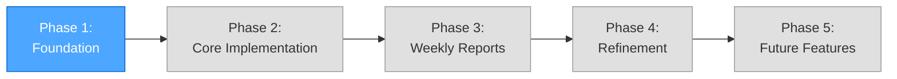

# Progress Tracking: FineOpinions

**Last Updated:** October 9, 2025  
**Project Start Date:** October 8, 2025  
**Current Phase:** Phase 1 - Foundation (Planning & Setup)

---

## Project Phases Overview

**Current Status:** Phase 1 (In Progress)

---

## Phase 1: Foundation (Planning & Setup)

**Status:** 🔄 In Progress  
**Start Date:** October 8, 2025  
**Target Completion:** TBD  
**Progress:** 75%

### Milestones

#### M1.1: Memory Bank Initialization ✅ COMPLETE

**Completed:** October 8, 2025

- ✅ Create memory-bank/ folder structure
- ✅ Initialize projectbrief.md
- ✅ Create productContext.md
- ✅ Create systemPatterns.md
- ✅ Create techContext.md
- ✅ Create activeContext.md
- ✅ Create progress.md

**Outcome:** Complete Memory Bank structure established with all foundational context documents.

#### M1.2: Task Management Setup ✅ COMPLETE

**Completed:** October 8, 2025

- ✅ Create tasks.md in root directory
- ✅ Establish task tracking structure
- ✅ Document future features section
- ✅ Initialize active tasks list

**Outcome:** Single source of truth for task tracking established.

#### M1.3: Architecture Planning ✅ COMPLETE

**Completed:** October 9, 2025  
**Progress:** 100%

- ✅ Design high-level data flow architecture
- ✅ Document component patterns
- ✅ Create retention policy structure
- ✅ Define database schema (Airtable selected)
- ✅ Create comprehensive RSS feed retrieval architecture
- ✅ Design 7 detailed mermaid flow diagrams
- ✅ Document 5 major system components:
  - RSS XML Retrieval
  - Article Loop & Deduplication
  - Content Scraping Module
  - AI Agent Review & Condensation
  - Airtable Ingest
- ✅ Create end-to-end workflow diagram
- ✅ Document challenges and mitigations
- ✅ Define success metrics and targets
- ✅ Create implementation checklist (5 phases)
- ✅ Identify creative phase components

**Documents Created:**

- `/memory-bank/rss-feed-architecture.md` (comprehensive planning document)
- `/fineopinions_diagram.md` (diagram index and quick reference)

**Outcome:** Complete system architecture documented with detailed technical specifications. Ready for CREATIVE MODE.

#### M1.4: Prompt Engineering Strategy 🎨 CREATIVE MODE REQUIRED

**Start Date:** October 9, 2025 (Ready to begin)  
**Target Completion:** TBD  
**Priority:** HIGH

- ⏳ Design AI Agent prompt for article analysis
  - Define exact prompt structure (SYSTEM + USER)
  - Create JSON output schema
  - Design model selection criteria (llama3.2:3b vs qwen2.5:7b)
  - Develop few-shot examples for consistency
  - Design relevance scoring criteria (1-10 scale)
  - Create tag/topic taxonomy
- ⏳ Design Daily Digest Agent prompt structure (Future)
- ⏳ Design Weekly Report Agent prompt structure (Future)
- ⏳ Create prompt testing methodology

**Dependencies:** Architecture planning complete ✅

#### M1.5: Technical Planning 🔄 IN PROGRESS

**Start Date:** October 9, 2025  
**Target Completion:** TBD  
**Progress:** 60%

- ✅ Finalize scraping strategy (HTTP with browser fallback)
- ✅ Plan detailed Ollama model integration
- ✅ Design AI Agent node configurations
- ✅ Document native node usage patterns
- ⏳ Set up n8n workflow template
- ⏳ Configure Airtable workspace and schema
- ⏳ Test Ollama API connectivity from n8n
- ⏳ Create testing strategy

**Dependencies:** Architecture planning complete ✅

### Phase 1 Completion Criteria

- [x] All Memory Bank files complete and consistent
- [x] Database selection made and documented (Airtable)
- [x] Workflow architecture fully designed
- [ ] Prompt engineering strategy defined (CREATIVE MODE)
- [ ] Testing approach documented
- [ ] Ready to begin implementation

---

## Phase 2: Core Implementation (Not Started)

**Status:** ⏳ Not Started  
**Start Date:** TBD (After CREATIVE MODE completion)  
**Target Completion:** TBD  
**Progress:** 0%

### Planned Milestones

#### M2.1: RSS Retrieval & Basic Storage ⏳ NOT STARTED

**Planned Implementation:**

- ⏳ Set up scheduled trigger (7AM/7PM)
- ⏳ Configure RSS Feed Read nodes for 4 sources
- ⏳ Implement staggered execution (1-minute delays)
- ⏳ Create Airtable "Articles" table with schema
- ⏳ Implement RSS parsing and XML validation
- ⏳ Test deduplication logic against Airtable
- ⏳ Implement error logging
- ⏳ Test end-to-end RSS retrieval

**Target Success Rate:** >95% RSS fetch success

#### M2.2: Content Scraping Implementation ⏳ NOT STARTED

**Prerequisites:** Complete CREATIVE MODE for HTML extraction strategy

- ⏳ Implement HTTP Request scraping (primary)
- ⏳ Test HTTP scraping against each news source
- ⏳ Implement browser automation fallback
- ⏳ Implement SearXNG integration (optional)
- ⏳ Add content validation logic (min 100 chars)
- ⏳ Implement retry logic (max 3 attempts)
- ⏳ Test scraping success rates per source
- ⏳ Document scraping patterns and issues

**Target Success Rate:** >85% article scraping success

#### M2.3: AI Agent Integration ⏳ NOT STARTED

**Prerequisites:** Complete CREATIVE MODE for prompt engineering

- ⏳ Configure Ollama integration in n8n
- ⏳ Implement AI Agent nodes with designed prompts
- ⏳ Implement model selection logic
- ⏳ Test with sample articles from each source
- ⏳ Implement JSON output validation
- ⏳ Implement retry logic for malformed outputs
- ⏳ Test relevance scoring accuracy
- ⏳ Optimize prompt based on results
- ⏳ Benchmark token usage and processing time

**Target Success Rate:** >90% AI processing success

#### M2.4: Full Pipeline Integration ⏳ NOT STARTED

- ⏳ Connect all components end-to-end
- ⏳ Implement comprehensive error handling
- ⏳ Add retry logic with exponential backoff
- ⏳ Test with live RSS feeds (all 4 sources)
- ⏳ Monitor performance and success rates
- ⏳ Optimize for efficiency
- ⏳ Implement workflow metrics tracking
- ⏳ Create admin summary email

**Target Processing Time:** <10 minutes per execution

### Phase 2 Completion Criteria

- [ ] Database operational and tested
- [ ] RSS feeds ingesting twice daily (>95% success)
- [ ] Articles being scraped successfully (>85% success)
- [ ] AI processing working reliably (>90% success)
- [ ] End-to-end processing <10 minutes
- [ ] All workflows error-tolerant
- [ ] Metrics tracking operational

---

## Phase 3: Weekly Reports (Not Started)

**Status:** ⏳ Not Started  
**Start Date:** TBD  
**Target Completion:** TBD  
**Progress:** 0%

### Planned Milestones

#### M3.1: Daily Digest Agent ⏳ NOT STARTED

- ⏳ Configure AI Agent node for daily digest
- ⏳ Implement Daily Digest prompt
- ⏳ Create digest generation workflow
- ⏳ Test with sample articles
- ⏳ Refine prompt for coherent output

#### M3.2: Weekly Report Agent ⏳ NOT STARTED

- ⏳ Configure AI Agent node for weekly analysis
- ⏳ Implement Weekly Report prompt
- ⏳ Create weekly report workflow
- ⏳ Test with sample digests
- ⏳ Refine prompt for analytical output

#### M3.3: Email Delivery ⏳ NOT STARTED

- ⏳ Configure SMTP credentials in n8n
- ⏳ Design email template (HTML/markdown)
- ⏳ Implement Send Email node
- ⏳ Test email delivery
- ⏳ Set up weekly cron trigger

#### M3.4: Data Retention Automation ⏳ NOT STARTED

- ⏳ Create data retention workflow
- ⏳ Implement 30-day FullText purge
- ⏳ Implement 90-day archive strategy
- ⏳ Set up daily cron trigger
- ⏳ Test retention logic

### Phase 3 Completion Criteria

- [ ] Daily digests generating (3-5 min read time)
- [ ] Weekly reports with analytical insights
- [ ] Email delivery working reliably
- [ ] Data retention running automatically
- [ ] System fully autonomous
- [ ] MVP feature complete

---

## Phase 4: Refinement (Not Started)

**Status:** ⏳ Not Started  
**Start Date:** TBD  
**Target Completion:** TBD  
**Progress:** 0%

### Planned Milestones

#### M4.1: Advanced Scraping ⏳ NOT STARTED

- ⏳ Optimize browser automation where needed
- ⏳ Handle paywalled content gracefully
- ⏳ Improve content extraction quality

#### M4.2: Error Handling Enhancement ⏳ NOT STARTED

- ⏳ Comprehensive retry logic
- ⏳ Graceful degradation patterns
- ⏳ Error notification system

#### M4.3: Performance Optimization ⏳ NOT STARTED

- ⏳ Optimize Ollama model parameters
- ⏳ Improve workflow execution times
- ⏳ Database query optimization

#### M4.4: Prompt Refinement ⏳ NOT STARTED

- ⏳ Refine article analysis prompts based on usage
- ⏳ Refine Daily Digest prompts
- ⏳ Refine Weekly Report prompts
- ⏳ Optimize for chosen Ollama models

### Phase 4 Completion Criteria

- [ ] System robust and error-tolerant
- [ ] Performance meets all targets
- [ ] Prompts producing consistent quality
- [ ] Production-ready

---

## Phase 5: Future Features (Deferred)

**Status:** ⏳ Deferred  
**Evaluation Date:** After Phase 4 completion

### Deferred Features

- Social Media Monitoring (explicitly out of scope for now)
- Interactive Dashboard
- Multi-user Support
- Real-time Alerts
- Additional RSS sources
- Advanced analytics and trend analysis

**Rationale:** Focus on core functionality first, evaluate after MVP proves value.

---

## Metrics & KPIs

### Current Status (Phase 1)

- **Planning Completion:** 75%
- **Memory Bank Completeness:** 100%
- **Architecture Design:** 100% ✅
- **Prompt Engineering:** 0% (CREATIVE MODE next)
- **Technical Setup:** 60%

### Target Metrics (Phase 2+)

**Operational Metrics:**

- RSS Fetch Success Rate: >95%
- Article Scraping Success Rate: >85%
- AI Processing Success Rate: >90%
- Deduplication Accuracy: >99%
- Airtable Ingest Success Rate: >98%
- End-to-End Processing Time: <10 minutes
- Uptime: 99%+ successful scheduled runs

**Quality Metrics:**

- Digest Reading Time: 3-5 minutes
- Weekly Report Coherence: Identifiable themes
- User Satisfaction: Actionable insights delivered

**Efficiency Metrics:**

- Model Performance: Successful processing with Ollama
- Storage Growth: Sustainable with retention policies
- Manual Intervention: Zero required

---

## Blockers & Risks

### Current Blockers

**None currently** - Architecture planning complete, ready for CREATIVE MODE

### Identified Risks

#### Risk 1: Ollama Model Performance

- **Impact:** High (affects core functionality)
- **Probability:** Medium
- **Mitigation:** Evaluate multiple models in Creative Mode (llama3.2:3b vs qwen2.5:7b)
- **Status:** To be addressed in M1.4 (CREATIVE MODE)

#### Risk 2: Article Scraping Failures

- **Impact:** Medium (affects content quality)
- **Probability:** High (paywalls, anti-scraping)
- **Mitigation:** Multi-tier fallback: HTTP → Browser → SearXNG → RSS description
- **Status:** Architecture includes comprehensive fallback strategy ✅

#### Risk 3: Data Volume Growth

- **Impact:** Medium (affects sustainability)
- **Probability:** Medium
- **Mitigation:** 30-day FullText retention, 90-day archive policy
- **Status:** Architecture includes retention automation ✅

#### Risk 4: AI Output Quality/Consistency

- **Impact:** High (affects digest value)
- **Probability:** Medium
- **Mitigation:** Structured prompts, JSON validation, few-shot examples
- **Status:** To be addressed in M1.4 (CREATIVE MODE)

---

## Timeline

### Actual Timeline

| Date        | Phase   | Milestone                        | Status      |
| ----------- | ------- | -------------------------------- | ----------- |
| Oct 8, 2025 | Phase 1 | M1.1 Memory Bank Init            | ✅ Complete |
| Oct 8, 2025 | Phase 1 | M1.2 Task Management             | ✅ Complete |
| Oct 8, 2025 | Phase 1 | M1.3 Architecture Planning Start | 🔄 Started  |
| Oct 9, 2025 | Phase 1 | M1.3 RSS Architecture Complete   | ✅ Complete |
| Oct 9, 2025 | Phase 1 | M1.4 Prompt Engineering Start    | 🎨 Ready    |

### Planned Timeline (TBD)

_To be filled in as CREATIVE MODE completes and BUILD MODE timelines are established_

---

## Weekly Progress Summary

### Week of October 6-12, 2025

**Achievements:**

- ✅ Project initialization complete
- ✅ Memory Bank structure established
- ✅ Task tracking system created
- ✅ High-level architecture documented
- ✅ Technical patterns defined
- ✅ **RSS Feed Retrieval Architecture Complete (Oct 9)**
  - 7 comprehensive mermaid diagrams created
  - 5 major components fully specified
  - Airtable schema designed (18 fields)
  - End-to-end workflow documented
  - Success metrics defined
  - Implementation checklist created (5 phases)
  - Creative phase components identified

**Challenges:**

- None encountered this week

**Next Week Focus:**

- Enter CREATIVE MODE for prompt engineering
- Design AI Agent prompts for article analysis
- Design content extraction heuristics
- Begin BUILD MODE (Phase 1: RSS Retrieval)

**Blockers:**

- None

---

## Mode Transition History

| Date        | From Mode | To Mode  | Reason                                |
| ----------- | --------- | -------- | ------------------------------------- |
| Oct 8, 2025 | -         | VAN      | Project initialization                |
| Oct 8, 2025 | VAN       | PLAN     | Complexity Level 4 detected           |
| Oct 9, 2025 | PLAN      | CREATIVE | Architecture complete, prompts needed |

**Current Mode:** CREATIVE (transitioning)  
**Mode Duration:** PLAN mode lasted 1 day  
**Next Tasks:** Prompt Engineering (High Priority), Content Extraction Strategy (Medium Priority)

---

## Quick Status Dashboard

```mermaid
graph TD
    subgraph "Phase 1: Foundation"
    MB[Memory Bank<br>100%] --> TS[Task Setup<br>100%]
    TS --> ARCH[Architecture<br>100%]
    ARCH --> PROMPT[Prompts<br>0%]
    PROMPT --> TECH[Technical<br>60%]
    end

    subgraph "Phase 2: Core Implementation"
    RSS[RSS Retrieval<br>0%] --> SCRAPE[Scraping<br>0%]
    SCRAPE --> AI[AI Agent<br>0%]
    AI --> PIPELINE[Pipeline<br>0%]
    end

    subgraph "Phase 3: Reports & Automation"
    DAILY[Daily Digest<br>0%] --> WEEKLY[Weekly Report<br>0%]
    WEEKLY --> EMAIL[Email<br>0%]
    EMAIL --> RETENTION[Retention<br>0%]
    end

    style MB fill:#10b981,stroke:#059669,color:white
    style TS fill:#10b981,stroke:#059669,color:white
    style ARCH fill:#10b981,stroke:#059669,color:white
    style PROMPT fill:#d971ff,stroke:#a33bc2,color:white
    style TECH fill:#fbbf24,stroke:#f59e0b,color:black
    style RSS fill:#e0e0e0,stroke:#999
    style SCRAPE fill:#e0e0e0,stroke:#999
    style AI fill:#e0e0e0,stroke:#999
    style PIPELINE fill:#e0e0e0,stroke:#999
    style DAILY fill:#e0e0e0,stroke:#999
    style WEEKLY fill:#e0e0e0,stroke:#999
    style EMAIL fill:#e0e0e0,stroke:#999
    style RETENTION fill:#e0e0e0,stroke:#999
```

---

## Notes

### Success Indicators

- Memory Bank structure working excellently for context preservation
- Clear separation of planning phases preventing scope creep
- Comprehensive architecture planning completed in 1 day
- Mermaid diagrams provide excellent visual communication
- Creative phase components clearly identified

### Lessons Learned

- Taking time for thorough planning pays off for complex systems
- Memory Bank separate from docs provides good organization
- Detailed mermaid diagrams (7 total) significantly improve understanding
- Component-based planning approach scales well
- Identifying CREATIVE MODE requirements upfront prevents delays

### Process Improvements

- Architecture planning was very successful - template for future components
- Consider creating prompt engineering templates during CREATIVE MODE
- Plan for iterative prompt refinement during BUILD MODE
- Document decision rationale consistently (working well)

### Key Decisions Made

| Date        | Decision                        | Rationale                                 |
| ----------- | ------------------------------- | ----------------------------------------- |
| Oct 9, 2025 | Airtable for database           | Simplicity, rapid setup, structured data  |
| Oct 9, 2025 | Multi-tier scraping fallback    | Robustness against anti-scraping measures |
| Oct 9, 2025 | Model selection by article size | Balance speed (3b) vs quality (7b)        |
| Oct 9, 2025 | 30-day FullText retention       | Balance storage with analysis capability  |
| Oct 9, 2025 | Relevance threshold >= 5        | Filter noise while preserving context     |

---

**Last Planning Session:** October 9, 2025  
**Documents Updated:** 3 (rss-feed-architecture.md, fineopinions_diagram.md, tasks.md)  
**Diagrams Created:** 7 comprehensive mermaid diagrams  
**Ready For:** CREATIVE MODE - Prompt Engineering
