# RSS Feed Retrieval Architecture - Planning Document

**Created:** October 9, 2025  
**Mode:** PLAN  
**Complexity:** Level 4  
**Status:** Planning Phase

---

## 📋 Overview

This document outlines the comprehensive architecture for the RSS feed retrieval and processing system for FineOpinions. The system follows a multi-stage pipeline: RSS XML retrieval → Article URL iteration → Content scraping → AI agent processing → Data storage.

---

## 🎯 System Architecture - High Level

```mermaid
graph TB
    %% Main Entry Point
    START[⏰ Scheduled Trigger<br/>2x Daily: 7AM & 7PM] --> ORCHESTRATOR[🎭 Feed Orchestrator<br/>Staggered Execution]

    %% Feed Processing
    ORCHESTRATOR -->|T+0min| FEED1[📰 Economist Feed]
    ORCHESTRATOR -->|T+1min| FEED2[📰 Bloomberg Feed]
    ORCHESTRATOR -->|T+2min| FEED3[📰 Reuters Feed]
    ORCHESTRATOR -->|T+3min| FEED4[📰 MarketWatch Feed]

    %% Merge Point
    FEED1 & FEED2 & FEED3 & FEED4 --> MERGE[🔄 Merge Articles]

    %% Deduplication
    MERGE --> DEDUP[🔍 Deduplication Check<br/>Against Database]

    %% Processing Pipeline
    DEDUP --> LOOP[🔁 Loop Each Article URL]
    LOOP --> SCRAPE[🌐 Content Scraper Module]
    SCRAPE --> VALIDATE[✅ Content Validation]
    VALIDATE --> AGENT[🤖 AI Agent Review]
    AGENT --> STORE[💾 Airtable Ingest]

    %% Error Handling
    SCRAPE -.->|Scraping Failed| ERROR[⚠️ Error Handler]
    VALIDATE -.->|Invalid Content| ERROR
    ERROR --> RETRY{Retry?}
    RETRY -->|Yes, < 3 attempts| SCRAPE
    RETRY -->|No, Log & Continue| STORE

    %% Completion
    STORE --> COMPLETE[✅ Batch Complete]

    style START fill:#4da6ff,stroke:#0066cc,color:white
    style ORCHESTRATOR fill:#ffa64d,stroke:#cc7a30,color:white
    style AGENT fill:#d971ff,stroke:#a33bc2,color:white
    style STORE fill:#4dbb5f,stroke:#36873f,color:white
    style ERROR fill:#ff5555,stroke:#cc0000,color:white
```



---

## 📥 Component 1: RSS XML Retrieval

```mermaid
graph TD
    %% Entry Point
    START[🎯 RSS Feed URL] --> CHECK_CACHE{Check Last<br/>Fetch Time?}

    %% Cache Logic
    CHECK_CACHE -->|< 30 min ago| SKIP[⏭️ Skip Feed<br/>Too Recent]
    CHECK_CACHE -->|> 30 min ago| FETCH[📡 HTTP Request Node<br/>GET RSS XML]

    %% HTTP Request
    FETCH --> HTTP_STATUS{HTTP<br/>Status?}
    HTTP_STATUS -->|200 OK| PARSE[📄 Parse XML]
    HTTP_STATUS -->|304 Not Modified| SKIP
    HTTP_STATUS -->|4xx/5xx Error| RETRY{Retry<br/>Count?}

    %% Retry Logic
    RETRY -->|< 3| WAIT[⏱️ Wait 30s]
    WAIT --> FETCH
    RETRY -->|>= 3| LOG_ERROR[📝 Log Error<br/>Alert Admin]

    %% Parse XML
    PARSE --> VALIDATE_XML{Valid<br/>XML?}
    VALIDATE_XML -->|Yes| EXTRACT[🔧 Extract Fields:<br/>- Title<br/>- URL<br/>- PubDate<br/>- Description]
    VALIDATE_XML -->|No| LOG_ERROR

    %% Extract Fields
    EXTRACT --> COUNT{Article<br/>Count?}
    COUNT -->|0 Articles| LOG_WARN[⚠️ Log Warning<br/>Empty Feed]
    COUNT -->|> 0 Articles| OUTPUT[✅ Output Article Array]

    %% Completion
    OUTPUT --> NEXT[➡️ Next Component:<br/>Article Loop]
    LOG_WARN --> COMPLETE[🏁 Complete]
    LOG_ERROR --> COMPLETE
    SKIP --> COMPLETE

    style START fill:#4da6ff,stroke:#0066cc,color:white
    style FETCH fill:#80bfff,stroke:#4da6ff,color:black
    style PARSE fill:#ffa64d,stroke:#cc7a30,color:white
    style OUTPUT fill:#4dbb5f,stroke:#36873f,color:white
    style LOG_ERROR fill:#ff5555,stroke:#cc0000,color:white
    style LOG_WARN fill:#ffcc00,stroke:#cc9900,color:black
```



### RSS XML Retrieval - Technical Details

**n8n Nodes Required:**

- **Schedule Trigger Node**: Initiates workflow at 7AM and 7PM
- **HTTP Request Node**: Fetches RSS XML from feed URLs
- **XML Node**: Parses XML into structured data
- **Item Lists Node**: Splits XML items into individual article objects

**Key Considerations:**

- Implement cache checking to avoid redundant fetches
- Handle HTTP errors gracefully with retry logic
- Validate XML structure before parsing
- Log all errors for monitoring

**Output Schema:**

```json
{
  "feedSource": "economist|bloomberg|reuters|marketwatch",
  "articles": [
    {
      "title": "string",
      "url": "string",
      "pubDate": "ISO-8601 datetime",
      "description": "string",
      "guid": "string (unique identifier)"
    }
  ],
  "fetchedAt": "ISO-8601 datetime"
}
```

---

## 🔁 Component 2: Article Loop & Deduplication

```mermaid
graph TD
    %% Input
    INPUT[📥 Article Array<br/>from RSS Feeds] --> MERGE[🔀 Merge All Feeds]

    %% Deduplication
    MERGE --> SORT[📊 Sort by PubDate<br/>Newest First]
    SORT --> LOOP_START[🔁 Start Loop<br/>Split Items]

    LOOP_START --> ARTICLE[📄 Current Article]

    %% Dedup Check
    ARTICLE --> CHECK_DB{Check<br/>Airtable<br/>for URL?}
    CHECK_DB -->|Exists| SKIP[⏭️ Skip Article<br/>Already Processed]
    CHECK_DB -->|Not Found| CHECK_PUBDATE{PubDate<br/>within 24h?}

    %% Date Filtering
    CHECK_PUBDATE -->|No, Too Old| SKIP
    CHECK_PUBDATE -->|Yes, Recent| ENRICH[📝 Enrich Metadata]

    %% Enrichment
    ENRICH --> ADD_META["➕ Add Metadata:<br/>- processedAt: timestamp<br/>- source: feed name<br/>- scrapingStatus: pending"]

    ADD_META --> QUEUE[📬 Add to Processing Queue]

    %% Loop Control
    QUEUE --> MORE{More<br/>Articles?}
    SKIP --> MORE
    MORE -->|Yes| ARTICLE
    MORE -->|No| OUTPUT[✅ Output Queue<br/>Unique Articles Only]

    OUTPUT --> NEXT[➡️ Next Component:<br/>Content Scraper]

    style INPUT fill:#4da6ff,stroke:#0066cc,color:white
    style MERGE fill:#80bfff,stroke:#4da6ff,color:black
    style ENRICH fill:#ffa64d,stroke:#cc7a30,color:white
    style OUTPUT fill:#4dbb5f,stroke:#36873f,color:white
    style SKIP fill:#cccccc,stroke:#999999,color:black
```



### Article Loop - Technical Details

**n8n Nodes Required:**

- **Merge Node**: Combines articles from all RSS feeds
- **Sort Node**: Orders by publication date
- **Airtable Node**: Queries existing articles by URL
- **IF Node**: Deduplication and date filtering logic
- **Set Node**: Enriches article metadata

**Deduplication Strategy:**

1. Query Airtable by article URL (exact match)
2. Check publication date (only process articles < 24 hours old)
3. Use GUID/URL as unique identifier
4. Skip duplicates silently (log count for monitoring)

**Performance Optimization:**

- Batch database queries where possible
- Implement early filtering to reduce processing load
- Cache recent article URLs in memory (optional n8n feature)

---

## 🌐 Component 3: Content Scraping Module

```mermaid
graph TD
    %% Entry Point
    START[📥 Article URL] --> STRATEGY{Scraping<br/>Strategy?}

    %% Strategy Selection
    STRATEGY -->|Method 1| HTTP[🔧 HTTP Request<br/>Simple GET]
    STRATEGY -->|Method 2| BROWSER[🌐 Browser Automation<br/>Playwright/Puppeteer]

    %% HTTP Method
    HTTP --> HTTP_CHECK{Response<br/>Status?}
    HTTP_CHECK -->|200 OK| EXTRACT_HTTP[📄 Extract HTML]
    HTTP_CHECK -->|Blocked/403/etc| FALLBACK[🔄 Fallback to Browser]
    FALLBACK --> BROWSER

    %% Browser Method
    BROWSER --> WAIT_LOAD[⏱️ Wait for Page Load]
    WAIT_LOAD --> EXTRACT_BROWSER[📄 Extract Rendered HTML]

    %% Content Extraction
    EXTRACT_HTTP & EXTRACT_BROWSER --> PARSE[🔍 Parse HTML]

    %% HTML Parsing
    PARSE --> IDENTIFY{Identify<br/>Article<br/>Content?}

    %% Content Identification Strategies
    IDENTIFY -->|Strategy 1| ARTICLE_TAG[🏷️ Find &lt;article&gt; tag]
    IDENTIFY -->|Strategy 2| MAIN_CONTENT[🏷️ Find main/content class]
    IDENTIFY -->|Strategy 3| HEURISTIC[🧠 Content Heuristic<br/>Largest text block]

    ARTICLE_TAG --> CLEAN
    MAIN_CONTENT --> CLEAN
    HEURISTIC --> CLEAN

    %% Content Cleaning
    CLEAN[🧹 Clean Content:<br/>- Remove scripts/styles<br/>- Strip ads/nav<br/>- Extract text only]

    CLEAN --> VALIDATE{Content<br/>Valid?}

    %% Validation
    VALIDATE -->|Length < 100 chars| ERROR[❌ Scraping Failed]
    VALIDATE -->|Length >= 100 chars| METADATA[📊 Extract Metadata]

    %% Metadata Extraction
    METADATA --> EXTRACT_META["➕ Extract:<br/>- Author<br/>- Published Date<br/>- Image URL<br/>- Word Count"]

    EXTRACT_META --> SUCCESS[✅ Scraping Success]

    %% Error Handling
    ERROR --> RETRY{Retry<br/>Attempt?}
    RETRY -->|< 3| STRATEGY
    RETRY -->|>= 3| LOG_FAIL[📝 Log Failure<br/>Mark as Failed]
    LOG_FAIL --> CONTINUE[➡️ Continue to Next]

    %% Output
    SUCCESS --> OUTPUT[📤 Output:<br/>Full Article Content]
    OUTPUT --> NEXT[➡️ Next Component:<br/>AI Agent]

    style START fill:#4da6ff,stroke:#0066cc,color:white
    style HTTP fill:#80bfff,stroke:#4da6ff,color:black
    style BROWSER fill:#ffa64d,stroke:#cc7a30,color:white
    style CLEAN fill:#d971ff,stroke:#a33bc2,color:white
    style SUCCESS fill:#4dbb5f,stroke:#36873f,color:white
    style ERROR fill:#ff5555,stroke:#cc0000,color:white
```



### Content Scraping - Technical Details

**n8n Nodes Required:**

- **HTTP Request Node**: Primary scraping method
- **HTML Extract Node**: Parse and extract content
- **Code Node** (if necessary): Advanced HTML parsing logic
- **Browser Node** (if available): Fallback for JavaScript-heavy sites

**Scraping Strategies:**

1. **Method 1: HTTP Request (Preferred)**

   - Fastest, lowest resource usage
   - Works for static HTML sites
   - May fail on JavaScript-rendered content

2. **Method 2: Browser Automation (Fallback)**
   - Handles JavaScript-rendered content
   - Slower, higher resource usage
   - Required for sites with anti-scraping measures

**Content Extraction Heuristics:**

- Look for semantic HTML tags: `<article>`, `<main>`, `[role="main"]`
- Identify content by class names: `.article-content`, `.story-body`, `.post-content`
- Use text density analysis: Find largest continuous text block
- Remove common non-content elements: nav, footer, sidebar, ads

**Fallback Strategy:**
If scraping fails after 3 attempts:

- Store article with "scraping_failed" status
- Use RSS description as fallback content
- Log for manual review/alternative approach

**Third-Party Option: SearXNG**

- **Advantage**: Aggregates multiple search engines, can fetch article previews
- **Implementation**: Use SearXNG API as alternative scraping method
- **Consideration**: May not provide full article text, depends on configuration

---

## 🤖 Component 4: AI Agent Review & Condensation

```mermaid
graph TD
    %% Input
    INPUT[📥 Full Article Content] --> PREP[📝 Prepare Prompt]

    %% Prompt Preparation
    PREP --> BUILD_PROMPT["🔧 Build Prompt:<br/>SYSTEM: Role & Instructions<br/>USER: Article + Metadata"]

    BUILD_PROMPT --> MODEL_SELECT{Select<br/>Ollama Model}

    %% Model Selection
    MODEL_SELECT -->|Small Article| SMALL[🤖 llama3.2:3b<br/>Fast, Efficient]
    MODEL_SELECT -->|Large Article| LARGE[🤖 qwen2.5:7b<br/>Higher Quality]

    %% Agent Processing
    SMALL & LARGE --> AGENT[🧠 AI Agent Node<br/>Process Article]

    AGENT --> GENERATE[⚙️ Generate:<br/>- Summary (2-3 sentences)<br/>- Key Points (bullets)<br/>- Sentiment (positive/neutral/negative)<br/>- Relevance Score (1-10)<br/>- Tags/Categories]

    GENERATE --> VALIDATE{Output<br/>Valid?}

    %% Validation
    VALIDATE -->|No/Malformed| RETRY_AGENT{Retry?}
    RETRY_AGENT -->|< 2| AGENT
    RETRY_AGENT -->|>= 2| FALLBACK[📋 Use Fallback:<br/>First 200 chars<br/>+ metadata]

    VALIDATE -->|Yes| PARSE_OUTPUT[📊 Parse JSON Output]

    %% Output Parsing
    PARSE_OUTPUT --> ENRICH["➕ Enrich Record:<br/>- processedBy: model name<br/>- processedAt: timestamp<br/>- tokenCount: usage stats"]

    FALLBACK --> ENRICH

    ENRICH --> FILTER{Relevance<br/>Score?}

    %% Relevance Filtering
    FILTER -->|< 5| DISCARD[🗑️ Mark as Low Relevance<br/>Store but Don't Include]
    FILTER -->|>= 5| INCLUDE[✅ Include in Digest]

    INCLUDE & DISCARD --> OUTPUT[📤 Output:<br/>Processed Article]

    OUTPUT --> NEXT[➡️ Next Component:<br/>Airtable Ingest]

    style INPUT fill:#4da6ff,stroke:#0066cc,color:white
    style AGENT fill:#d971ff,stroke:#a33bc2,color:white
    style GENERATE fill:#ffa64d,stroke:#cc7a30,color:white
    style INCLUDE fill:#4dbb5f,stroke:#36873f,color:white
    style DISCARD fill:#cccccc,stroke:#999999,color:black
    style FALLBACK fill:#ffcc00,stroke:#cc9900,color:black
```

### AI Agent - Technical Details

**n8n Nodes Required:**

- **AI Agent Node**: Core processing (uses Ollama)
- **Set Node**: Prompt building and metadata enrichment
- **IF Node**: Validation and filtering logic
- **Function Node** (if needed): JSON parsing and error handling

**Prompt Engineering Structure:**

```markdown
SYSTEM:
You are a financial news analyst AI. Your task is to analyze and summarize financial and economic news articles concisely and accurately.

Output your analysis as a JSON object with the following structure:
{
"summary": "2-3 sentence summary",
"keyPoints": ["bullet point 1", "bullet point 2", ...],
"sentiment": "positive|neutral|negative",
"relevanceScore": 1-10,
"tags": ["tag1", "tag2", ...],
"mainTopics": ["topic1", "topic2"]
}

USER:
Title: {article.title}
Source: {article.source}
Date: {article.pubDate}
Content: {article.fullText}

Analyze this article.
```

**Model Selection Criteria:**

- **llama3.2:3b**: Articles < 1000 words, faster processing
- **qwen2.5:7b**: Articles > 1000 words, complex analysis needed
- **Fallback**: If model fails, store raw article with error flag

**Relevance Scoring:**

- **1-4**: Off-topic, not financial/economic
- **5-6**: Tangentially related, background context
- **7-8**: Directly relevant financial news
- **9-10**: Critical, high-impact economic events

**Quality Control:**

- Validate JSON output structure
- Check for required fields
- Ensure summary length is reasonable (< 500 chars)
- Retry on malformed output (max 2 attempts)

---

## 💾 Component 5: Airtable Ingest

```mermaid
graph TD
    %% Input
    INPUT[📥 Processed Article] --> CHECK_TABLE{Airtable<br/>Table Exists?}

    %% Table Check
    CHECK_TABLE -->|No| CREATE_TABLE[🏗️ Create Table Schema]
    CHECK_TABLE -->|Yes| PREP_RECORD[📝 Prepare Record]

    CREATE_TABLE --> PREP_RECORD

    %% Record Preparation
    PREP_RECORD --> MAP_FIELDS["🔧 Map Fields:<br/>→ Title<br/>→ URL (unique)<br/>→ Source<br/>→ PubDate<br/>→ Summary<br/>→ KeyPoints<br/>→ Sentiment<br/>→ RelevanceScore<br/>→ Tags<br/>→ FullText<br/>→ ProcessedAt<br/>→ ProcessedBy"]

    MAP_FIELDS --> UPSERT{Record<br/>Exists?}

    %% Upsert Logic
    UPSERT -->|No| CREATE[➕ Create New Record]
    UPSERT -->|Yes| UPDATE[🔄 Update Existing Record]

    CREATE --> VERIFY
    UPDATE --> VERIFY

    %% Verification
    VERIFY{Write<br/>Success?}
    VERIFY -->|Yes| RELATE[🔗 Create Relations]
    VERIFY -->|No| RETRY{Retry?}

    RETRY -->|< 3| PREP_RECORD
    RETRY -->|>= 3| LOG_ERROR[📝 Log Error<br/>Alert Admin]

    %% Relations
    RELATE --> LINK_DIGEST[🔗 Link to Daily Digest<br/>If Applicable]
    LINK_DIGEST --> METRICS[📊 Update Metrics]

    %% Metrics
    METRICS --> COUNT["📈 Increment Counts:<br/>- Total Articles<br/>- Articles by Source<br/>- Articles by Date"]

    COUNT --> SUCCESS[✅ Ingest Complete]
    SUCCESS --> NEXT[➡️ Next: Loop or Finish]

    LOG_ERROR --> NEXT

    style INPUT fill:#4da6ff,stroke:#0066cc,color:white
    style CREATE fill:#4dbb5f,stroke:#36873f,color:white
    style UPDATE fill:#ffa64d,stroke:#cc7a30,color:white
    style SUCCESS fill:#00cc66,stroke:#009944,color:white
    style LOG_ERROR fill:#ff5555,stroke:#cc0000,color:white
```



### Airtable Ingest - Technical Details

**n8n Nodes Required:**

- **Airtable Node**: Create/Update records
- **Set Node**: Field mapping and data transformation
- **IF Node**: Upsert logic
- **Code Node** (if needed): Complex field transformations

**Airtable Schema Design:**

**Table: Articles**
| Field Name | Type | Description | Unique |
|------------|------|-------------|--------|
| ArticleID | Auto Number | Primary key | Yes |
| URL | URL | Article link | Yes |
| Title | Single Line Text | Article title | No |
| Source | Single Select | economist, bloomberg, reuters, marketwatch | No |
| PubDate | Date | Publication date/time | No |
| FetchedAt | Date | When RSS was fetched | No |
| ProcessedAt | Date | When AI processed | No |
| Summary | Long Text | AI-generated summary | No |
| KeyPoints | Long Text | Bullet points (JSON array) | No |
| Sentiment | Single Select | positive, neutral, negative | No |
| RelevanceScore | Number | 1-10 score | No |
| Tags | Multiple Select | Topic tags | No |
| MainTopics | Multiple Select | Primary topics | No |
| FullText | Long Text | Complete article content | No |
| ProcessedBy | Single Line Text | Model used | No |
| TokenCount | Number | Tokens used | No |
| ScrapingStatus | Single Select | success, failed, fallback | No |
| IncludeInDigest | Checkbox | Based on relevance | No |
| LinkedDigest | Link to Table | Links to DailyDigests | No |

**Upsert Logic:**

1. Query by URL (unique field)
2. If exists: Update ProcessedAt, Summary, and AI fields
3. If not exists: Create new record with all fields
4. Handle errors with retry (max 3 attempts)

**Data Retention Policy:**

- Keep raw FullText for 30 days
- Retain Summary, KeyPoints, Tags indefinitely
- Archive old records to separate table after 90 days

---

## 🔄 Complete End-to-End Flow

```mermaid
graph TB
    %% Trigger
    TRIGGER[⏰ Schedule Trigger<br/>7AM & 7PM Daily] --> INIT[🎬 Initialize Workflow]

    INIT --> FEED_LOOP[🔁 For Each Feed URL]

    %% Feed Processing
    FEED_LOOP --> RSS[📡 Fetch RSS XML]
    RSS --> PARSE[📄 Parse XML]
    PARSE --> VALIDATE_RSS{Valid<br/>RSS?}

    VALIDATE_RSS -->|No| ERROR_RSS[⚠️ Log Error]
    VALIDATE_RSS -->|Yes| EXTRACT[🔧 Extract Articles]

    ERROR_RSS --> NEXT_FEED{More<br/>Feeds?}
    EXTRACT --> NEXT_FEED

    NEXT_FEED -->|Yes| WAIT[⏱️ Wait 1 Minute]
    WAIT --> FEED_LOOP
    NEXT_FEED -->|No| MERGE[🔀 Merge All Articles]

    %% Deduplication
    MERGE --> DEDUP[🔍 Deduplicate vs Airtable]
    DEDUP --> FILTER_DATE[📅 Filter Last 24h]
    FILTER_DATE --> ARTICLE_LOOP[🔁 For Each Article]

    %% Article Processing
    ARTICLE_LOOP --> SCRAPE[🌐 Scrape Full Content]
    SCRAPE --> VALIDATE_CONTENT{Content<br/>Valid?}

    VALIDATE_CONTENT -->|No| RETRY_SCRAPE{Retry<br/>< 3?}
    RETRY_SCRAPE -->|Yes| SCRAPE
    RETRY_SCRAPE -->|No| USE_FALLBACK[📋 Use RSS Description]

    VALIDATE_CONTENT -->|Yes| AI_PROCESS[🤖 AI Agent Processing]
    USE_FALLBACK --> AI_PROCESS

    %% AI Processing
    AI_PROCESS --> VALIDATE_AI{AI Output<br/>Valid?}
    VALIDATE_AI -->|No| RETRY_AI{Retry<br/>< 2?}
    RETRY_AI -->|Yes| AI_PROCESS
    RETRY_AI -->|No| MINIMAL[📝 Store Minimal Data]

    VALIDATE_AI -->|Yes| RELEVANCE{Relevance<br/>>= 5?}
    RELEVANCE -->|No| STORE_LOW[💾 Store, Don't Include]
    RELEVANCE -->|Yes| STORE_HIGH[💾 Store, Include in Digest]

    MINIMAL & STORE_LOW & STORE_HIGH --> MORE_ARTICLES{More<br/>Articles?}

    MORE_ARTICLES -->|Yes| ARTICLE_LOOP
    MORE_ARTICLES -->|No| SUMMARY[📊 Generate Summary]

    %% Completion
    SUMMARY --> METRICS["📈 Update Metrics:<br/>- Total Processed<br/>- Success Rate<br/>- Errors"]

    METRICS --> NOTIFY[📧 Send Summary Email<br/>To Admin]
    NOTIFY --> COMPLETE[✅ Workflow Complete]

    style TRIGGER fill:#4da6ff,stroke:#0066cc,color:white
    style AI_PROCESS fill:#d971ff,stroke:#a33bc2,color:white
    style STORE_HIGH fill:#4dbb5f,stroke:#36873f,color:white
    style COMPLETE fill:#00cc66,stroke:#009944,color:white
    style ERROR_RSS fill:#ff5555,stroke:#cc0000,color:white
```



---

## 🎨 Creative Phase Components Identified

The following components require **CREATIVE mode** for detailed design:

### 1. **Prompt Engineering** (High Priority)

- **Component**: AI Agent prompts for article analysis
- **Decisions Needed**:
  - Exact prompt structure and formatting
  - Output schema definition
  - Model-specific optimizations
  - Few-shot examples for consistency
- **Complexity**: Medium-High
- **Recommendation**: Dedicated CREATIVE phase

### 2. **Content Extraction Heuristics** (Medium Priority)

- **Component**: HTML parsing and content identification
- **Decisions Needed**:
  - Site-specific extraction rules
  - Fallback strategies hierarchy
  - Content quality metrics
- **Complexity**: Medium
- **Recommendation**: CREATIVE phase after initial testing

### 3. **Relevance Scoring Algorithm** (Medium Priority)

- **Component**: AI-based relevance filtering
- **Decisions Needed**:
  - Scoring criteria and weights
  - Topic classification system
  - Threshold optimization
- **Complexity**: Medium
- **Recommendation**: CREATIVE phase with iterative refinement

### 4. **Error Handling & Retry Logic** (Low-Medium Priority)

- **Component**: Failure recovery strategies
- **Decisions Needed**:
  - Retry backoff algorithms
  - Error classification system
  - Alerting thresholds
- **Complexity**: Low-Medium
- **Recommendation**: Can be implemented in BUILD mode

---

## 📊 Dependencies & Integration Points

```mermaid
graph LR
    %% External Dependencies
    EXT_RSS[📡 RSS Feed URLs] --> SYSTEM
    EXT_OLLAMA[🤖 Ollama API] --> SYSTEM
    EXT_AIRTABLE[💾 Airtable API] --> SYSTEM
    EXT_SEARXNG[🔍 SearXNG<br/>Optional] -.-> SYSTEM

    %% System Components
    SYSTEM[🎯 n8n Workflow] --> COMP1[RSS Retrieval]
    SYSTEM --> COMP2[Article Loop]
    SYSTEM --> COMP3[Content Scraper]
    SYSTEM --> COMP4[AI Agent]
    SYSTEM --> COMP5[Airtable Ingest]

    %% Component Dependencies
    COMP1 --> COMP2
    COMP2 --> COMP3
    COMP3 --> COMP4
    COMP4 --> COMP5

    %% Data Flow
    COMP5 --> DATA[📚 Article Database]
    DATA --> DIGEST[📰 Daily Digest Agent<br/>Future Component]

    style EXT_RSS fill:#e6f3ff,stroke:#4da6ff,color:black
    style EXT_OLLAMA fill:#f0e6ff,stroke:#d971ff,color:black
    style EXT_AIRTABLE fill:#e6ffe6,stroke:#4dbb5f,color:black
    style SYSTEM fill:#ffa64d,stroke:#cc7a30,color:white
```



### Integration Requirements:

1. **RSS Feed Sources**: Reliable access to 4 feed URLs
2. **Ollama Instance**: Running locally, accessible to n8n
3. **Airtable Workspace**: Configured with proper API key
4. **n8n Nodes**: RSS, HTTP, AI Agent, Airtable nodes available
5. **Optional**: SearXNG instance for enhanced scraping

---

## ⚠️ Challenges & Mitigations

| Challenge                                | Impact | Mitigation Strategy                                                       |
| ---------------------------------------- | ------ | ------------------------------------------------------------------------- |
| **RSS feeds return only summaries**      | High   | Implement robust content scraping with fallback strategies                |
| **Anti-scraping measures on news sites** | High   | Use browser automation as fallback, consider SearXNG                      |
| **Rate limiting from news sources**      | Medium | Implement staggered execution, respect robots.txt                         |
| **AI model hallucination/errors**        | Medium | Validate output structure, implement retry logic, use fallback content    |
| **Duplicate articles across feeds**      | Medium | Deduplication by URL before processing                                    |
| **Airtable API rate limits**             | Low    | Batch operations where possible, implement exponential backoff            |
| **Variable article quality/relevance**   | Medium | AI-based relevance scoring with threshold filtering                       |
| **Large article processing time**        | Low    | Model selection based on article size, parallel processing where possible |

---

## ✅ Implementation Checklist

### Phase 1: RSS Retrieval & Basic Storage

- [ ] Set up scheduled trigger (7AM/7PM)
- [ ] Configure RSS Feed Read nodes for 4 sources
- [ ] Implement staggered execution (1-minute delays)
- [ ] Create basic Airtable schema
- [ ] Test RSS parsing and deduplication
- [ ] Implement error logging

### Phase 2: Content Scraping

- [ ] **CREATIVE MODE**: Design HTML extraction strategy
- [ ] Implement HTTP Request scraping
- [ ] Test against each news source
- [ ] Implement browser automation fallback
- [ ] Add content validation logic
- [ ] Test scraping success rates

### Phase 3: AI Agent Integration

- [ ] **CREATIVE MODE**: Design article analysis prompts
- [ ] Configure Ollama integration in n8n
- [ ] Implement AI Agent nodes
- [ ] Test with sample articles
- [ ] Implement output validation
- [ ] Test relevance scoring
- [ ] Optimize prompt for quality

### Phase 4: Full Pipeline Integration

- [ ] Connect all components end-to-end
- [ ] Implement comprehensive error handling
- [ ] Add retry logic throughout
- [ ] Test with live RSS feeds
- [ ] Monitor performance and success rates
- [ ] Optimize for efficiency

### Phase 5: Monitoring & Refinement

- [ ] Set up workflow monitoring
- [ ] Create admin summary email
- [ ] Implement metrics tracking
- [ ] Test data retention policy
- [ ] Document final workflow
- [ ] Create runbook for maintenance

---

## 📈 Success Metrics

| Metric                            | Target   | Measurement                         |
| --------------------------------- | -------- | ----------------------------------- |
| **RSS Fetch Success Rate**        | > 95%    | Successful fetches / total attempts |
| **Article Scraping Success Rate** | > 85%    | Successful scrapes / total articles |
| **AI Processing Success Rate**    | > 90%    | Valid AI outputs / total articles   |
| **Deduplication Accuracy**        | > 99%    | Correct dedup / total articles      |
| **Airtable Ingest Success Rate**  | > 98%    | Successful writes / total attempts  |
| **End-to-End Processing Time**    | < 10 min | Time from trigger to completion     |
| **Average Articles per Run**      | 20-50    | Articles processed per execution    |

---

## 🔄 Next Steps

1. **Update tasks.md** with detailed implementation tasks
2. **Enter CREATIVE MODE** for:
   - Prompt engineering (AI Agent)
   - Content extraction strategy
3. **Begin BUILD MODE** after creative decisions are finalized
4. **Set up testing environment** with sample RSS feeds
5. **Create n8n workflow template** with basic structure

---

**Document Status:** ✅ Planning Complete  
**Recommended Next Mode:** 🎨 CREATIVE MODE (Prompt Engineering)
