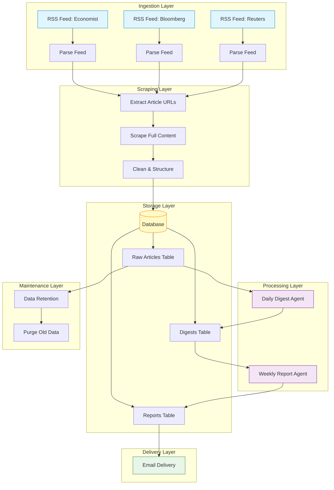
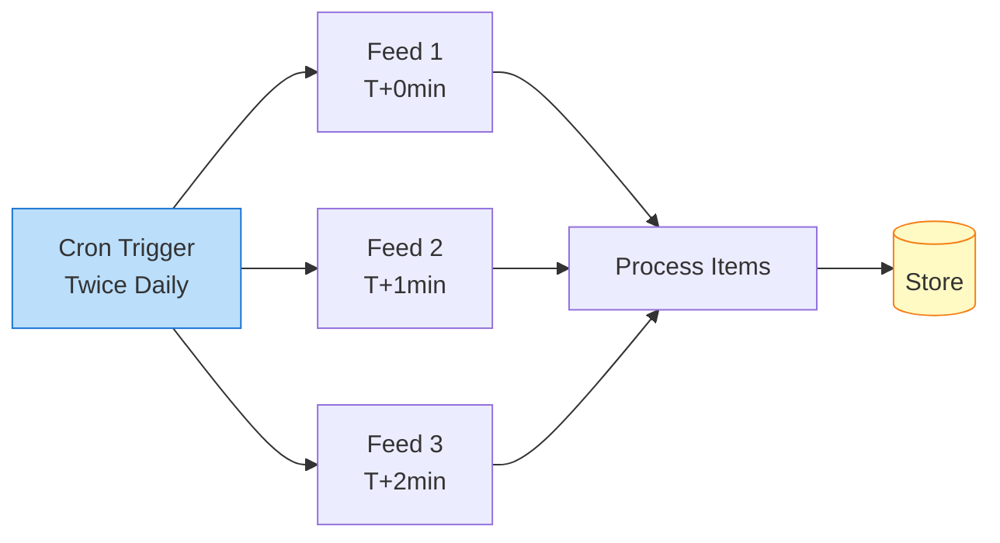
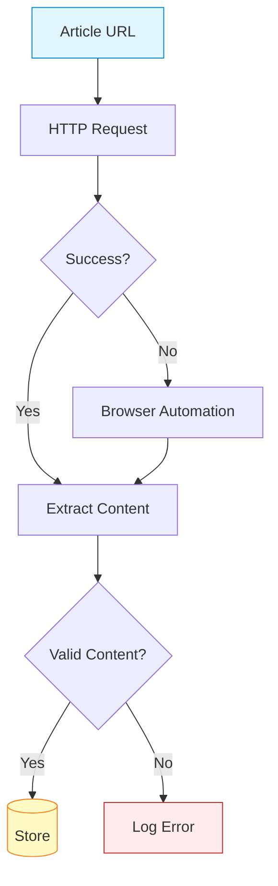
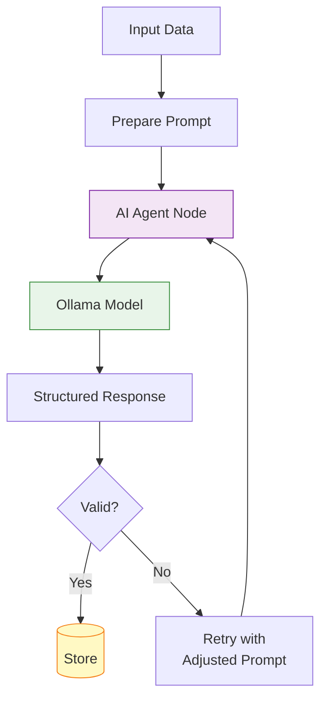
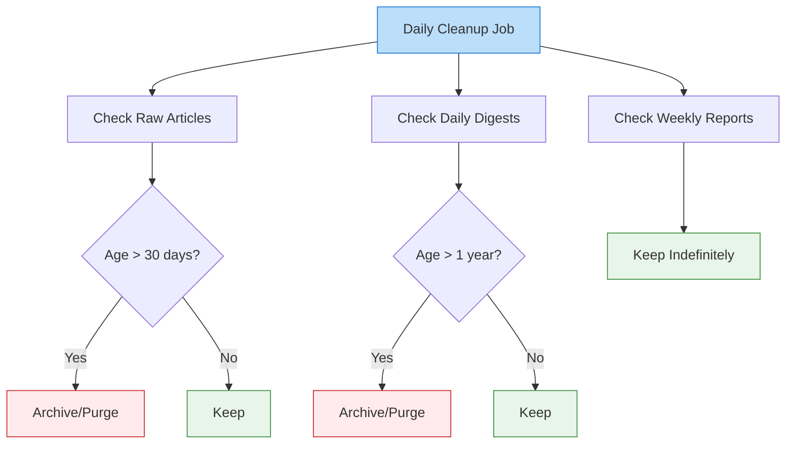
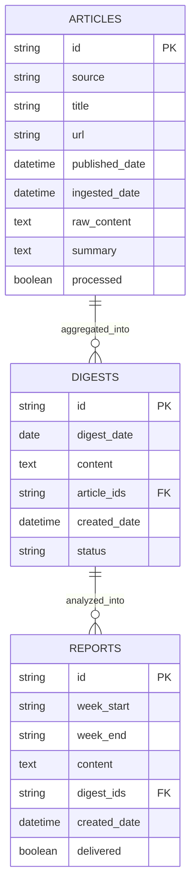
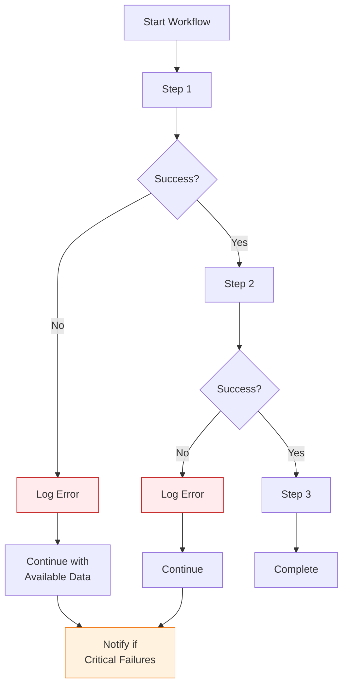
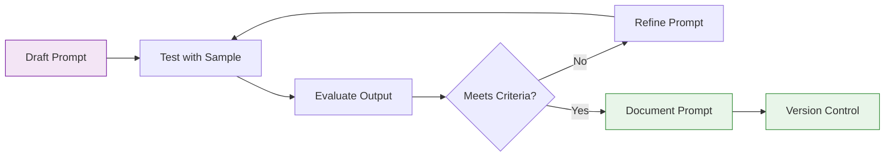
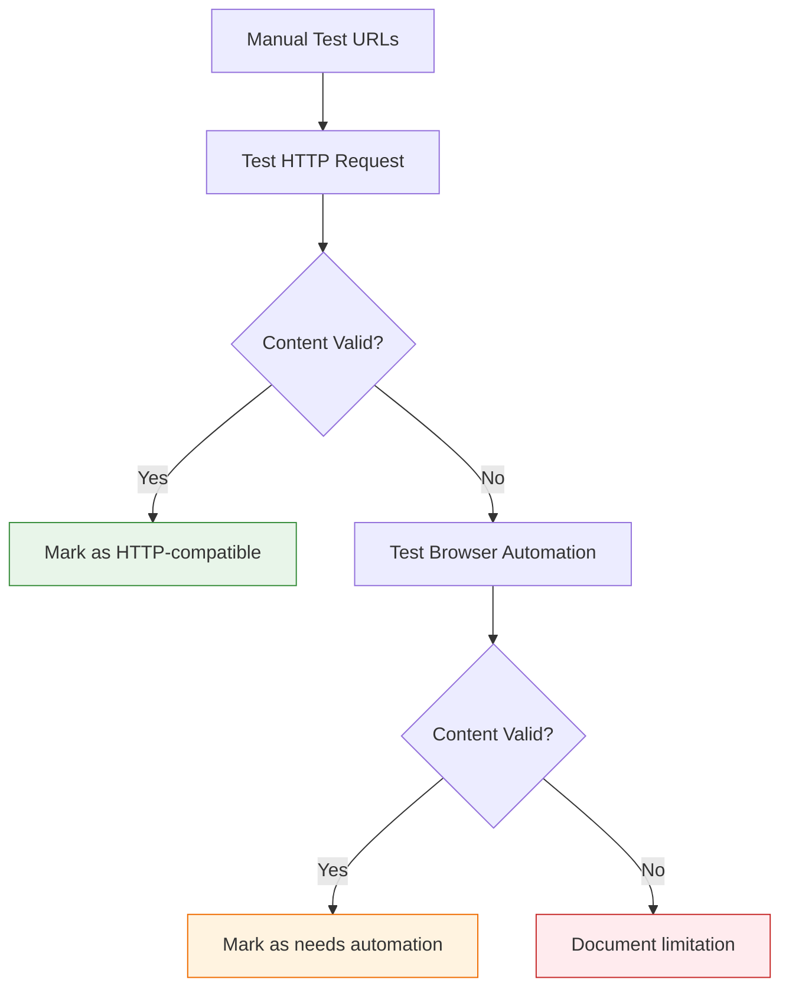
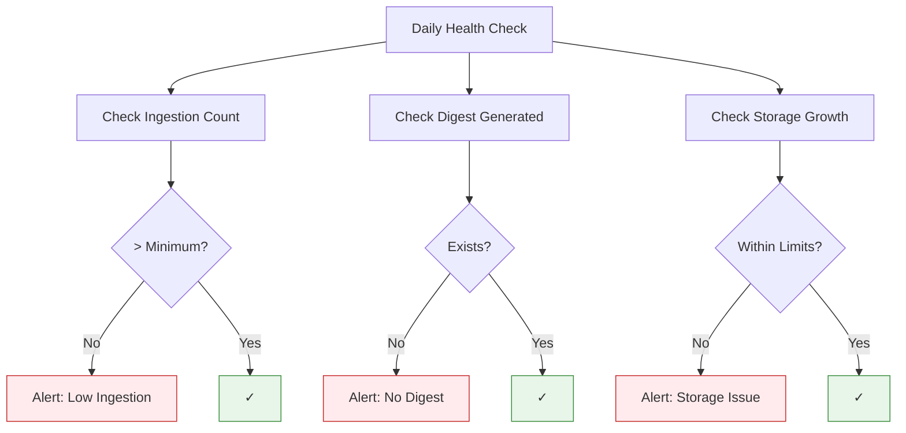

# System Patterns: FineOpinions

**Last Updated:** October 8, 2025

---

## Architectural Principles

### 1. n8n Native-First Architecture

**Principle:** Maximize use of n8n native nodes, minimize custom code  
**Rationale:**

- Maintainability: Native nodes are tested and supported
- Reliability: Less custom code = fewer bugs
- Upgradability: Easier to upgrade n8n versions

**Pattern:**

```
✅ DO: Use RSS Feed Read Node → HTTP Request Node → AI Agent Node
❌ AVOID: Custom JavaScript/Python scraping scripts
```

### 2. AI Agent Node Pattern

**Principle:** Use AI Agent nodes for all LLM interactions  
**Rationale:**

- Provider Independence: Not locked to specific LLM providers
- Flexibility: Easy to swap Ollama models
- Consistency: Uniform interface for all agents

**Pattern:**

```
✅ DO: AI Agent Node (with Ollama model selector)
❌ AVOID: OpenAI Node, Anthropic Node (provider-specific)
```

### 3. Low-Power LLM Design

**Principle:** Design prompts and workflows for efficient local models  
**Rationale:**

- Cost: Zero API costs
- Privacy: Data stays local
- Control: Full model control

**Pattern:**

- Chunk large articles into digestible segments
- Use structured prompts for consistent output
- Design for smaller context windows
- Leverage retrieval rather than full-text processing

### 4. Separation of Concerns

**Principle:** Distinct workflows for distinct functions  
**Rationale:**

- Debuggability: Easier to isolate issues
- Scalability: Can scale components independently
- Maintainability: Changes contained to specific workflows

**Pattern:**

```
Workflow 1: RSS Ingestion → Storage
Workflow 2: Content Scraping → Storage
Workflow 3: Daily Digest Generation
Workflow 4: Weekly Report Generation
Workflow 5: Data Retention Management
```

---

## Data Flow Architecture



---

## Component Patterns

### Pattern 1: Scheduled Ingestion



**Key Decisions:**

- **Staggered Execution:** Prevents rate limiting, spreads load
- **Twice Daily:** Captures morning (7 AM) and evening (7 PM) cycles
- **Idempotent Design:** Re-running doesn't duplicate data

### Pattern 2: Content Scraping



**Key Decisions:**

- **Fallback Strategy:** HTTP first, browser automation as backup
- **Content Validation:** Ensure meaningful content extracted
- **Error Logging:** Track failures for pattern analysis

### Pattern 3: AI Agent Processing



**Key Decisions:**

- **Structured Prompts:** Consistent output format
- **Validation:** Ensure output meets requirements
- **Retry Logic:** Handle LLM inconsistencies
- **Model Flexibility:** Easy to swap Ollama models

---

## Data Retention Pattern



**Retention Policy:**

- **Raw Articles:** 30 days (source material for debugging)
- **Daily Digests:** 1 year (historical reference)
- **Weekly Reports:** Indefinite (core value artifact)

---

## Database Schema Pattern

### Option 1: Airtable Schema



### Option 2: PostgreSQL Schema (with PGVector potential)

```sql
-- Raw Articles Table
CREATE TABLE articles (
    id SERIAL PRIMARY KEY,
    source VARCHAR(50) NOT NULL,
    title TEXT NOT NULL,
    url TEXT UNIQUE NOT NULL,
    published_date TIMESTAMP,
    ingested_date TIMESTAMP DEFAULT CURRENT_TIMESTAMP,
    raw_content TEXT,
    summary TEXT,
    processed BOOLEAN DEFAULT FALSE,
    created_at TIMESTAMP DEFAULT CURRENT_TIMESTAMP
);

-- Daily Digests Table
CREATE TABLE daily_digests (
    id SERIAL PRIMARY KEY,
    digest_date DATE NOT NULL UNIQUE,
    content TEXT NOT NULL,
    article_count INTEGER,
    created_at TIMESTAMP DEFAULT CURRENT_TIMESTAMP,
    status VARCHAR(20) DEFAULT 'draft'
);

-- Article-Digest Relationship
CREATE TABLE article_digests (
    article_id INTEGER REFERENCES articles(id),
    digest_id INTEGER REFERENCES daily_digests(id),
    PRIMARY KEY (article_id, digest_id)
);

-- Weekly Reports Table
CREATE TABLE weekly_reports (
    id SERIAL PRIMARY KEY,
    week_start DATE NOT NULL,
    week_end DATE NOT NULL,
    content TEXT NOT NULL,
    created_at TIMESTAMP DEFAULT CURRENT_TIMESTAMP,
    delivered BOOLEAN DEFAULT FALSE,
    delivered_at TIMESTAMP
);

-- Digest-Report Relationship
CREATE TABLE digest_reports (
    digest_id INTEGER REFERENCES daily_digests(id),
    report_id INTEGER REFERENCES weekly_reports(id),
    PRIMARY KEY (digest_id, report_id)
);

-- Optional: PGVector for semantic search (future)
-- CREATE EXTENSION IF NOT EXISTS vector;
-- ALTER TABLE articles ADD COLUMN embedding vector(768);
```

---

## Error Handling Patterns

### Pattern: Graceful Degradation



**Principles:**

- Don't fail entire workflow for single article failure
- Log all errors for pattern analysis
- Notify only for critical system failures
- Partial results better than no results

---

## Prompt Engineering Patterns

### Pattern: Structured Prompt Template

```markdown
## Daily Digest Agent Prompt Structure

**System Context:**
You are a financial news analyst creating daily digests for busy professionals.

**Task:**
Analyze the following [N] articles from today's economic and financial news.

**Input Format:**
[Structured article data]

**Output Requirements:**

- Length: 300-500 words (3-5 minute read)
- Structure:
  1. Key Developments (2-3 sentences)
  2. Market Implications (2-3 sentences)
  3. Broader Context (2-3 sentences)
- Tone: Professional, concise, analytical
- Focus: Trends and connections, not individual article summaries

**Output Format:**
[Structured markdown]
```

### Pattern: Iterative Prompt Refinement (Creative Mode)



---

## Integration Patterns

### Pattern: Ollama Integration

```yaml
AI Agent Node Configuration:
  Model Source: Ollama
  Model Name: [To be determined - e.g., mistral, llama2]
  Temperature: 0.3 (for consistency)
  Max Tokens: 1000 (for efficiency)
  System Prompt: [Defined in Creative Mode]

Integration Points:
  - Daily Digest Agent
  - Weekly Report Agent
  - (Future) Content Classification
  - (Future) Sentiment Analysis
```

**Key Decisions:**

- Use consistent model across agents (initially)
- Low temperature for reliable output
- Token limits for efficiency with local models
- Model selection reserved for Creative Mode evaluation

---

## Testing Patterns

### Pattern: Scraping Test Strategy



**Test Sources:**

- Sample articles from each of 3 RSS feeds
- Different content types (text, paywalled, dynamic)
- Edge cases (missing content, errors)

---

## Security Patterns

### Pattern: Credential Management

```yaml
Credentials Storage:
  - Use n8n Credentials system
  - Never hardcode in workflows
  - Separate credentials per service:
      - Database credentials
      - Email SMTP credentials
      - (Future) API keys if needed

Data Privacy:
  - All processing local (Ollama)
  - No external API calls for LLM
  - Email delivery via controlled SMTP
```

---

## Monitoring Patterns

### Pattern: Workflow Health Checks



**Monitoring Points:**

- Ingestion success rate
- Digest generation success
- Weekly report delivery
- Storage growth rate
- Error log patterns

---

## Version Control Pattern

```
Repository Structure:
/n8n-fineopinions/
  ├── memory-bank/           # Project context and planning
  ├── workflows/            # n8n workflow JSON exports
  ├── prompts/              # Versioned prompt templates
  ├── docs/                 # Documentation
  ├── tests/                # Test data and scripts
  └── tasks.md              # Task tracking (root)

Workflow Versioning:
  - Export n8n workflows as JSON
  - Version in git with semantic versioning
  - Tag releases with changelog
  - Document breaking changes
```

---

## Future Pattern Considerations

### Potential Enhancements (Not Current Scope)

1. **Vector Search Pattern** (if PGVector adopted)

   - Embed articles for semantic search
   - Find related content across time
   - Improve digest quality with context retrieval

2. **Multi-Model Pattern** (future optimization)

   - Smaller model for classification
   - Larger model for generation
   - Specialized models for specific tasks

3. **Caching Pattern** (performance optimization)
   - Cache scraped content
   - Avoid re-processing unchanged articles
   - Speed up re-runs during testing
