# Technical Context: FineOpinions

**Last Updated:** October 8, 2025

---

## Technology Stack

### Core Platform

**n8n Workflow Automation**

- **Version:** 1.114.4
- **Deployment:** Self-hosted
- **Environment:** Linux (6.14.0-33-generic)
- **Shell:** Bash (/usr/bin/bash)

### AI/ML Infrastructure

**Ollama (Local LLM)**

- **Purpose:** Low-power, privacy-preserving LLM inference
- **Models:** TBD (to be evaluated in Creative Mode)
  - Candidates: mistral, llama2, phi, qwen
- **Integration:** Via n8n AI Agent nodes
- **Constraints:**
  - Designed for local inference (no cloud API costs)
  - Must work efficiently with consumer hardware
  - Token limits and context window considerations

### Database Options

**Option 1: Airtable**

- **Status:** Available account
- **Pros:**
  - Rapid setup and prototyping
  - Built-in UI for data inspection
  - Native n8n integration
  - Good for MVP
- **Cons:**
  - Potential cost scaling
  - Less flexible for complex queries
  - API rate limits
- **Use Case:** Quick MVP validation

**Option 2: PostgreSQL**

- **Status:** Available instance
- **Pros:**
  - Powerful querying capabilities
  - No API rate limits
  - Better for production scale
  - Free and open source
- **Cons:**
  - More setup complexity
  - Requires schema management
  - No built-in UI
- **Use Case:** Production deployment

**Option 3: PostgreSQL + PGVector**

- **Status:** Available PGVector instance
- **Pros:**
  - All PostgreSQL benefits
  - Vector embeddings support for semantic search
  - Future-proof for advanced features
- **Cons:**
  - Most complex setup
  - Requires understanding of embeddings
  - May be overkill for MVP
- **Use Case:** If semantic search needed

**Current Decision Status:** Pending architectural planning phase

---

## n8n Native Nodes (To Be Used)

### Data Ingestion

- **RSS Feed Read Node**

  - Purpose: Fetch RSS feed data
  - Sources: Economist, Bloomberg, Reuters
  - Frequency: Twice daily

- **HTTP Request Node**
  - Purpose: Fetch full article content
  - Method: GET requests to article URLs
  - Fallback: Browser automation if needed

### Data Processing

- **AI Agent Node** (Primary LLM Interface)

  - Purpose: All AI interactions
  - Model Source: Ollama
  - Use Cases:
    - Daily digest generation
    - Weekly report analysis
    - (Future) Content classification

- **Item Lists Node**

  - Purpose: Aggregate multiple articles for batch processing
  - Use Case: Prepare inputs for AI agents

- **Code Node** (Use Sparingly)
  - Purpose: Only when native nodes insufficient
  - Examples: Complex data transformations
  - Principle: Minimize usage

### Data Storage

- **Airtable Node** (If Airtable chosen)

  - Operations: Create, Read, Update
  - Tables: Articles, Digests, Reports

- **PostgreSQL Node** (If PostgreSQL chosen)
  - Operations: Insert, Select, Update, Delete
  - Tables: articles, daily_digests, weekly_reports

### Scheduling & Triggers

- **Cron Node**

  - RSS Ingestion: Twice daily (7 AM, 7 PM)
  - Daily Digest: Once daily (9 PM)
  - Weekly Report: Once weekly (Sunday 9 PM)
  - Data Retention: Daily (2 AM)

- **Webhook Node** (Future)
  - Purpose: Manual triggers for testing
  - Security: Token-based authentication

### Output & Delivery

- **Send Email Node**
  - Purpose: Deliver weekly reports
  - SMTP: User-configured
  - Format: HTML email with markdown rendering

### Utility Nodes

- **Set Node**

  - Purpose: Data transformation and mapping
  - Use Case: Prepare data for next nodes

- **IF Node**

  - Purpose: Conditional logic
  - Use Case: Error handling, content validation

- **Merge Node**
  - Purpose: Combine data from multiple sources
  - Use Case: Aggregate feed data

---

## Workflow Architecture

### Proposed Workflow Structure

```mermaid
graph TD
    subgraph "Workflow 1: RSS Ingestion"
    W1_Cron[Cron Trigger<br>7AM & 7PM] --> W1_Feed1[RSS Read: Economist]
    W1_Cron --> W1_Feed2[RSS Read: Bloomberg]
    W1_Cron --> W1_Feed3[RSS Read: Reuters]
    W1_Feed1 & W1_Feed2 & W1_Feed3 --> W1_Merge[Merge Feeds]
    W1_Merge --> W1_Dedup[Deduplicate by URL]
    W1_Dedup --> W1_DB[(Store to DB)]
    end

    subgraph "Workflow 2: Content Scraping"
    W2_Cron[Cron Trigger<br>Every 30min] --> W2_Get[Get Unscraped Articles]
    W2_Get --> W2_HTTP[HTTP Request]
    W2_HTTP --> W2_Check{Success?}
    W2_Check -->|Yes| W2_Extract[Extract Content]
    W2_Check -->|No| W2_Browser[Browser Automation]
    W2_Browser --> W2_Extract
    W2_Extract --> W2_Update[(Update DB)]
    end

    subgraph "Workflow 3: Daily Digest"
    W3_Cron[Cron Trigger<br>9PM Daily] --> W3_Get[Get Today's Articles]
    W3_Get --> W3_Prepare[Prepare for AI]
    W3_Prepare --> W3_Agent[AI Agent Node<br>Daily Digest]
    W3_Agent --> W3_Store[(Store Digest)]
    end

    subgraph "Workflow 4: Weekly Report"
    W4_Cron[Cron Trigger<br>Sunday 9PM] --> W4_Get[Get Week's Digests]
    W4_Get --> W4_Agent[AI Agent Node<br>Weekly Report]
    W4_Agent --> W4_Store[(Store Report)]
    W4_Store --> W4_Email[Send Email]
    end

    subgraph "Workflow 5: Data Retention"
    W5_Cron[Cron Trigger<br>Daily 2AM] --> W5_Articles[Check Old Articles]
    W5_Articles --> W5_Delete1[Delete > 30 days]
    W5_Cron --> W5_Digests[Check Old Digests]
    W5_Digests --> W5_Delete2[Delete > 1 year]
    end

    style W1_Cron fill:#bbdefb,stroke:#1976d2
    style W2_Cron fill:#bbdefb,stroke:#1976d2
    style W3_Cron fill:#bbdefb,stroke:#1976d2
    style W4_Cron fill:#bbdefb,stroke:#1976d2
    style W5_Cron fill:#bbdefb,stroke:#1976d2
    style W3_Agent fill:#f3e5f5,stroke:#7b1fa2
    style W4_Agent fill:#f3e5f5,stroke:#7b1fa2
    style W4_Email fill:#e8f5e9,stroke:#388e3c
```



---

## Technical Constraints

### Resource Constraints

- **LLM Inference:** Must work on consumer hardware
- **Context Windows:** Limited by Ollama model choices
- **Memory:** Efficient batching required for large article sets
- **Storage:** Retention policies required for sustainability

### Integration Constraints

- **n8n Version:** 1.114.4 (specific node capabilities)
- **Ollama Models:** Limited to locally-runnable models
- **Database:** Choice impacts query complexity and performance
- **Email:** Requires SMTP configuration

### Development Constraints

- **No Custom Code Preference:** Use native nodes when possible
- **Provider Independence:** Avoid LLM provider lock-in
- **Maintainability:** Simple, understandable workflows
- **Testing:** Must be testable without production data

---

## Data Models

### Article Data Model

```json
{
  "id": "unique_id",
  "source": "economist|bloomberg|reuters",
  "title": "Article Title",
  "url": "https://...",
  "published_date": "2025-10-08T10:00:00Z",
  "ingested_date": "2025-10-08T19:05:00Z",
  "raw_content": "Full article text...",
  "summary": "RSS feed summary",
  "processed": false,
  "scraped": false
}
```

### Daily Digest Data Model

```json
{
  "id": "unique_id",
  "digest_date": "2025-10-08",
  "content": "Markdown formatted digest...",
  "article_ids": ["id1", "id2", "id3"],
  "article_count": 15,
  "created_at": "2025-10-08T21:00:00Z",
  "status": "published"
}
```

### Weekly Report Data Model

```json
{
  "id": "unique_id",
  "week_start": "2025-10-02",
  "week_end": "2025-10-08",
  "content": "Markdown formatted report...",
  "digest_ids": ["id1", "id2", "id3", "id4", "id5", "id6", "id7"],
  "created_at": "2025-10-08T21:30:00Z",
  "delivered": true,
  "delivered_at": "2025-10-08T21:35:00Z"
}
```

---

## Performance Considerations

### Ollama Model Performance

- **Inference Speed:** Target <30s per digest generation
- **Context Window:** Design prompts within model limits
- **Batch Processing:** Process articles in chunks if needed
- **Error Handling:** Retry logic for model failures

### Database Performance

- **Indexing Strategy:**
  - Index on URL (for deduplication)
  - Index on dates (for retrieval queries)
  - Index on processed/scraped flags (for workflow queries)
- **Query Optimization:**
  - Limit article retrieval to necessary fields
  - Use date range queries efficiently
  - Batch operations when possible

### Workflow Performance

- **Staggered Execution:** Prevent resource spikes
- **Asynchronous Processing:** Don't block on slow operations
- **Error Isolation:** Single failure doesn't cascade
- **Monitoring:** Track execution times

---

## Security Considerations

### Credentials Management

- **Database Credentials:** Stored in n8n credentials vault
- **Email SMTP:** Stored in n8n credentials vault
- **Ollama Access:** Local, no authentication needed
- **RSS Feeds:** Public, no authentication needed

### Data Privacy

- **Local Processing:** All AI processing stays local (Ollama)
- **No External APIs:** Zero LLM API calls to external services
- **Email Security:** SMTP over TLS
- **Database Security:** Connection encryption if supported

### Workflow Security

- **Webhook Tokens:** If webhooks used for manual triggers
- **Input Validation:** Sanitize article content before processing
- **Rate Limiting:** Respect RSS feed source rate limits
- **Error Logging:** Don't log sensitive data

---

## Development Environment

### Version Control

- **Repository:** `/home/cappy/knight0_code/n8n-fineopinions/`
- **Git Status:** Clean working tree, main branch
- **Workflow Export:** n8n workflows exported as JSON
- **Version Strategy:** Semantic versioning for workflows

### Directory Structure

```
/n8n-fineopinions/
├── memory-bank/          # Memory Bank files (separate from docs)
│   ├── projectbrief.md
│   ├── productContext.md
│   ├── systemPatterns.md
│   ├── techContext.md
│   ├── activeContext.md
│   └── progress.md
├── workflows/            # n8n workflow JSON exports (to be created)
├── prompts/              # Versioned prompt templates (to be created)
├── docs/                 # General documentation
│   └── index.md
├── optimization-journey/ # Meta documentation
├── tasks.md              # Single source of truth for tasks
└── README.md             # Project overview
```

### Testing Strategy

- **Manual Testing:** Test workflows in n8n UI
- **Sample Data:** Use historical RSS feed data
- **Prompt Testing:** Dedicated Creative Mode sessions
- **Integration Testing:** End-to-end workflow runs
- **Monitoring:** n8n execution logs

---

## Technical Decisions Log

### Decision 1: Use n8n Native Nodes

- **Date:** October 8, 2025
- **Context:** Need maintainable, upgradable workflows
- **Decision:** Maximize native node usage, minimize code blocks
- **Rationale:** Easier maintenance, better n8n version compatibility
- **Status:** Active principle

### Decision 2: Ollama for LLM

- **Date:** October 8, 2025
- **Context:** Need low-power, privacy-preserving AI processing
- **Decision:** Use Ollama with AI Agent nodes
- **Rationale:** Zero API costs, local privacy, provider independence
- **Status:** Active principle

### Decision 3: AI Agent Node Pattern

- **Date:** October 8, 2025
- **Context:** Need provider-independent LLM integration
- **Decision:** Use AI Agent nodes, avoid provider-specific nodes
- **Rationale:** Model flexibility, easy swapping, consistent interface
- **Status:** Active principle

### Decision 4: Separate Workflows

- **Date:** October 8, 2025
- **Context:** Need debuggable, maintainable system
- **Decision:** 5 separate workflows (ingestion, scraping, daily, weekly, retention)
- **Rationale:** Separation of concerns, easier debugging, independent scaling
- **Status:** Planned

### Decision 5: Database Choice

- **Date:** October 8, 2025
- **Context:** Need to choose between Airtable, PostgreSQL, or PostgreSQL+PGVector
- **Decision:** PENDING (to be decided in Architecture Planning)
- **Considerations:**
  - Airtable: Fastest MVP
  - PostgreSQL: Production scalability
  - PGVector: Future-proof but complex
- **Status:** Open decision

---

## Integration Points

### n8n → Ollama

```yaml
Integration Method: AI Agent Node
Connection: HTTP to local Ollama instance
Model Selection: Via node configuration
Input Format: Structured prompt + article data
Output Format: Markdown text response
Error Handling: Retry with exponential backoff
```

### n8n → Database

```yaml
# If Airtable
Integration Method: Airtable Node
Connection: API key via n8n credentials
Operations: Create, Read, Update
Rate Limiting: Respect Airtable API limits

# If PostgreSQL
Integration Method: PostgreSQL Node
Connection: Connection string via n8n credentials
Operations: INSERT, SELECT, UPDATE, DELETE
Connection Pooling: Managed by n8n
```

### n8n → Email

```yaml
Integration Method: Send Email Node
Connection: SMTP via n8n credentials
Format: HTML with markdown rendering
Attachments: None (inline content only)
Retry Logic: Yes, with exponential backoff
```

### n8n → RSS Feeds

```yaml
Integration Method: RSS Feed Read Node
Sources:
  - https://www.economist.com/the-world-in-brief/rss.xml
  - https://assets.bwbx.io/av/podcasts/daybreak/rss.xml
  - https://www.reuters.com/news/rss/topNews
Rate Limiting: Staggered by 1 minute each
Polling: Twice daily (not continuous)
```

---

## Future Technical Considerations

### Scalability (Future)

- **Multiple Users:** Database design supports this
- **Additional Sources:** Easy to add more RSS feeds
- **Model Upgrades:** Ollama model swapping
- **Caching:** Reduce re-processing of unchanged content

### Advanced Features (Deferred)

- **PGVector Integration:** Semantic search across articles
- **Multi-Model Strategy:** Different models for different tasks
- **Real-time Processing:** WebSocket or polling for breaking news
- **API Layer:** Expose data via REST API

### Monitoring & Observability (Future)

- **Execution Metrics:** Track workflow performance
- **Error Tracking:** Centralized error logging
- **Alerting:** Notify on critical failures
- **Dashboard:** Visualize system health

---

## Technical Risks & Mitigations

### Risk 1: Ollama Model Performance

- **Risk:** Local models may be too slow or produce poor quality
- **Mitigation:** Evaluate multiple models in Creative Mode; have cloud fallback plan
- **Status:** To be tested

### Risk 2: Article Scraping Failures

- **Risk:** Paywalls, dynamic content, anti-scraping measures
- **Mitigation:** Fallback to browser automation; accept partial data
- **Status:** Design includes fallback pattern

### Risk 3: Data Volume Growth

- **Risk:** Storage grows beyond manageable size
- **Mitigation:** Strict retention policies; automated cleanup
- **Status:** Designed into system

### Risk 4: n8n Version Compatibility

- **Risk:** Future n8n upgrades break workflows
- **Mitigation:** Version workflows in git; test before upgrading
- **Status:** Standard practice

### Risk 5: RSS Feed Changes

- **Risk:** Sources change feed URLs or structure
- **Mitigation:** Monitor feed health; design for graceful degradation
- **Status:** Planned in monitoring

---

## Dependencies

### External Services

- n8n (v1.114.4) - self-hosted
- Ollama - local LLM inference
- Database - Airtable OR PostgreSQL (to be decided)
- SMTP Server - for email delivery
- RSS Feeds - The Economist, Bloomberg, Reuters

### No Dependencies On

- ❌ External LLM APIs (OpenAI, Anthropic, etc.)
- ❌ Social media platforms
- ❌ Web scraping services
- ❌ Cloud storage
- ❌ Third-party analytics

---

## Configuration Management

### Environment Variables (If Needed)

```bash
# Database Configuration (if PostgreSQL)
DB_HOST=localhost
DB_PORT=5432
DB_NAME=fineopinions
DB_USER=fineopinions_user
DB_PASSWORD=[stored in n8n credentials]

# Ollama Configuration
OLLAMA_HOST=http://localhost:11434
OLLAMA_MODEL=mistral  # Or chosen model

# Email Configuration
SMTP_HOST=[user configured]
SMTP_PORT=587
SMTP_USER=[user configured]
SMTP_PASS=[stored in n8n credentials]
```

### n8n Configuration

- All sensitive credentials stored in n8n credentials vault
- Workflow settings configured in n8n UI
- No hardcoded secrets in workflows
- Export workflows without credentials
